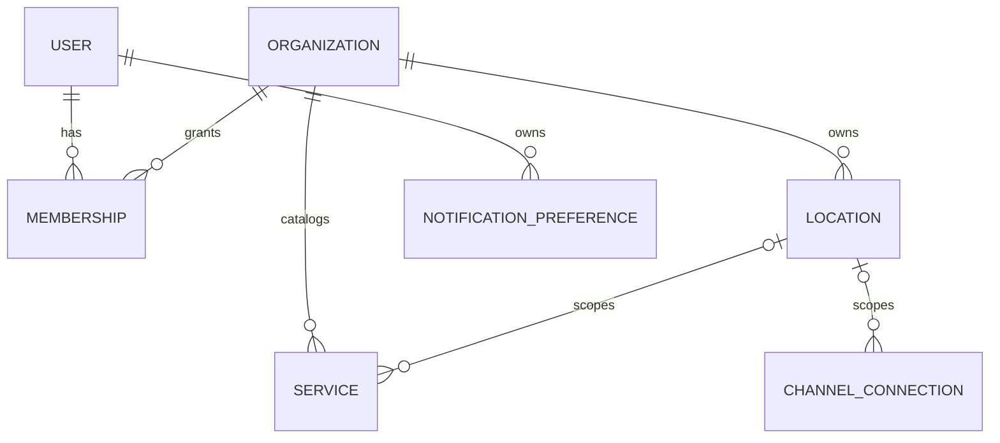
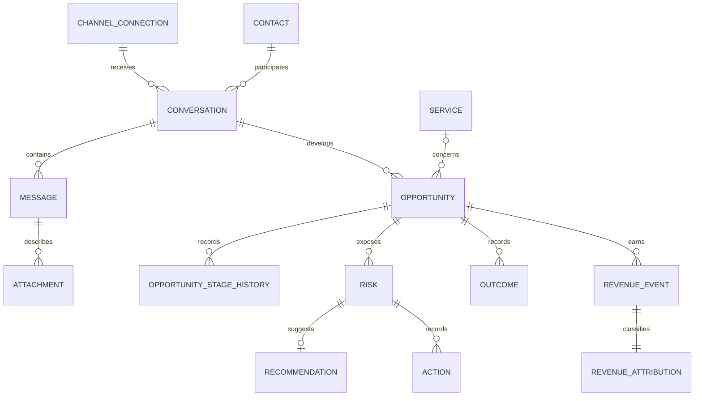

# Сущности и типы фронтенда

Этот документ фиксирует форму данных, которую frontend получает и отправляет
через HTTP. Полные machine-readable ограничения находятся в
[OpenAPI](../../contracts/openapi/openapi.yaml), семантика — в
[backend API](../backend/04-api.md). Ниже приведены все browser-facing модели,
их связи и правила безопасного отображения.

<a id="notation"></a>
## 1. Нотация и общие правила

В таблицах `T?` означает, что поле может отсутствовать в JSON, `T | null` —
поле присутствует, но может содержать `null`. Эти состояния не взаимозаменяемы.
Поля без отметки обязательны в ответе текущего OpenAPI, если рядом явно не
зафиксирован runtime-разрыв.

| Тип | Представление | Правило frontend |
|---|---|---|
| ID | UUID string | непрозрачный идентификатор; не сокращать в запросах |
| DateTime | RFC 3339 string | парсить как instant, показывать в timezone организации |
| Date | `YYYY-MM-DD` | календарная дата организации, не UTC-день браузера |
| ClockTime | `HH:MM` | время в timezone организации, без локальной конвертации |
| Currency | ISO 4217, 3 uppercase | не смешивать валюты; input нормализовать в uppercase |
| Money | decimal string | не преобразовывать в IEEE-754 `number`; `null` не равен нулю |
| Cursor | opaque string | не разбирать, не конструировать, передавать как получен |
| Confidence | decimal `0..1` | форматировать как процент только на уровне view model |
| Free text | UTF-8 string | выводить как текст; запрещён `v-html` для API-данных |

Все request objects закрыты для неизвестных полей, а обычное JSON-тело
ограничено 64 KiB. Пустой PATCH запрещён. Полный список ошибок находится в
[каталоге API](03-api.md#error-model).

<a id="relationships"></a>
## 2. Карта связей

Tenant и конфигурация:



Операционный и денежный контекст:



`Conversation`, `Opportunity` и `Risk` нельзя объединять по принципу «одна
активная запись». История допускает несколько возможностей в переписке,
несколько рисков на возможность и несколько действий/исходов.

<a id="auth-tenant"></a>
## 3. Пользователь, сессия и tenant

### 3.1. User и MembershipSummary

| Модель | Поля |
|---|---|
| `User` | `id`, `email`, `displayName`, `status: ACTIVE \| DISABLED`, `createdAt`, `updatedAt` |
| `MembershipSummary` | `tenantId`, `organizationName`, `role: OWNER \| MANAGER` |
| `AuthResponse` | `user` |
| `AuthMeResponse` | `user`, `memberships[]` |

Opaque session существует только в cookie `lidradar_session` (`HttpOnly`,
`SameSite=Strict`). В модели нет access/refresh token. Пустой `memberships[]`
означает, что авторизованный пользователь должен создать организацию или
принять код приглашения; два и более membership требуют явного выбора tenant.

### 3.2. Auth requests

| Модель | Обязательные поля | Ограничения |
|---|---|---|
| `RegisterRequest` | `email`, `password`, `displayName` | email ≤254; password 12..1024; displayName 1..200 |
| `LoginRequest` | `email`, `password` | email ≤254; password 1..1024 |

Пароль существует только в памяти формы до завершения запроса и никогда не
попадает в URL, store, telemetry или storage.

### 3.3. Команда и приглашения

| Модель | Поля |
|---|---|
| `Membership` | `id`, `tenantId`, `userId`, `role`, `status: ACTIVE \| INVITED \| DISABLED`, `revokedAt?`, `createdAt`, `updatedAt` |
| `Member` | `membershipId`, `userId`, `email`, `displayName`, `role`, `status`, `revokedAt: DateTime \| null`, `createdAt`, `updatedAt` |
| `Invitation` | `id`, `role`, `note: string \| null`, `status: PENDING \| ACCEPTED \| REVOKED \| EXPIRED`, `createdBy`, `createdAt`, `expiresAt`, nullable `acceptedAt`, `acceptedBy`, `revokedAt`, `revokedBy` |
| `IssuedInvitation` | `invitation`, `code` (43 символа `[A-Za-z0-9_-]`; показывается один раз) |
| `UpdateMemberRoleRequest` | `role` |
| `CreateInvitationRequest` | `role`, `note? \| null` (≤500, не раскрывается принимающему) |
| `AcceptInvitationRequest` | `code` |
| `AcceptedInvitation` | `membership: MembershipSummary` |

Приглашение не привязано к email; код передаёт владелец. `DISABLED` участник
остаётся в списке (на него ссылаются факты) и может быть восстановлен новым
кодом. Последний активный OWNER не понижается и не отзывается.

### 3.4. Onboarding

`OnboardingStatus`: `complete`, `nextStep: ORGANIZATION | LOCATION | SERVICES |
CHANNEL | TELEGRAM_LINK | null`, `steps[5] {key, required, done}`, `facts
{activeLocations, locationsWithSchedule, activeServices, connections,
liveConnections, telegramLinked}`, `computedAt`. Статус выводится сервером из
данных и является источником истины для resume; `TELEGRAM_LINK` необязателен и
считается по текущему пользователю.

<a id="organization-location"></a>
## 4. Организация, точки и график

### 4.1. Organization

`Organization`: `id`, `name`, `defaultTimezone` (IANA), `defaultCurrency`,
`status: ACTIVE | SUSPENDED | ARCHIVED`, `createdAt`, `updatedAt`.

Requests:

- `CreateOrganizationRequest`: `name` 1..200, `defaultTimezone`,
  `defaultCurrency?` (default `RUB`);
- `UpdateOrganizationRequest`: минимум одно из `name?`,
  `defaultTimezone?`, `defaultCurrency?`.

Смена timezone влияет на календарные окна analytics и на часы уведомлений;
смена валюты не конвертирует исторические суммы.

### 4.2. Location и BusinessHour

`Location`: `id`, `name`, `timezone`, `responseThresholdMinutes` (`1..1440`),
`active`, `businessHours[]`, `createdAt`, `updatedAt`.

`BusinessHour`: `weekday` (`1` понедельник … `7` воскресенье), `closed`,
`opensAt?`, `closesAt?`. Для закрытого дня время не отправляется; для рабочего
дня обе границы обязательны и `opensAt < closesAt`. Ночные интервалы одним
днём не моделируются.

| Request | Поля |
|---|---|
| `CreateLocationRequest` | `name`, `timezone`, `responseThresholdMinutes?` (default 45) |
| `UpdateLocationRequest` | хотя бы одно: `name?`, `timezone?`, `responseThresholdMinutes?`, `active?` |
| `BusinessHoursRequest` | `timezone`, ровно семь элементов `days[]`, по одному weekday |

Замена графика атомарна: frontend всегда отправляет полную неделю, а не diff.

<a id="service"></a>
## 5. Каталог услуг

`ServiceCatalogItem`:

| Поле | Тип | Смысл |
|---|---|---|
| `id` | UUID | услуга |
| `locationId` | UUID \| null | `null` — применима ко всей организации |
| `name` | string | исходное имя |
| `normalizedName` | string | read-only нормализованное имя |
| `priceFrom`, `priceTo` | Money string \| null | неизвестная граница не равна 0 |
| `currency` | Currency | валюта обеих границ |
| `active` | boolean | soft-deleted услуга остаётся в истории |
| `createdAt`, `updatedAt` | DateTime | аудит |

`CreateServiceCatalogItemRequest` требует только `name`; допускает
`locationId? | null`, `priceFrom? | null`, `priceTo? | null`, `currency?`.
`UpdateServiceCatalogItemRequest` допускает те же изменяемые поля и `active?`.
Если заданы обе цены, `priceFrom <= priceTo`. `DELETE` переводит `active=false`;
реактивация выполняется PATCH.

<a id="integrations"></a>
## 6. Интеграции

Enums:

- `ConnectorProvider`: `TEST`, `IMPORT`, `GENERIC_WEBHOOK`,
  `CONNECTED_BUSINESS_BOT`;
- `ConnectionStatus`: `ACTIVE`, `DEGRADED`, `ERROR`, `DISCONNECTED`;
- `ConnectorCapability`: `CAN_RECEIVE_MESSAGES`, `CAN_SEND_MESSAGES`,
  `CAN_IMPORT_HISTORY`, `CAN_RECEIVE_EDITS`, `CAN_RECEIVE_DELETES`,
  `CAN_RECEIVE_ATTACHMENTS`, `CAN_IDENTIFY_CONTACT`.

`ChannelConnection`: `id`, `locationId: UUID | null`, `provider`, `name`,
`status`, `capabilities[]`, nullable timestamps `lastEventAt`, `lastSuccessAt`,
`lastErrorAt`, nullable `lastErrorCode`, `createdAt`, `updatedAt`.

`ConnectionHealth`: тот же persisted health subset плюс `checkedAt`. У
`GET …/health` это время чтения сохранённого состояния; `HealthCheck =
{health, verification: REMOTE | LOCAL}` из `POST …/health/check` говорит, был
ли выполнен живой опрос провайдера (`REMOTE`, результат сохранён) или показан
сохранённый статус (`LOCAL`).

`ConnectChannelRequest`: `name`, optional `webhookSecret?` (16..256; без него
секрет выпускает сервер), optional `locationId | null`; `botToken?` допустим и
обязателен только для `CONNECTED_BUSINESS_BOT`. Ответ connect —
`ConnectedChannel = ChannelConnection + webhookSecret: string | null`: секрет
присутствует один раз, только если его выпустил сервер для провайдера без
удалённой регистрации. Secrets write-only и после отправки удаляются из формы
(решение ADR 0045, GAP-API-010 закрыт).

<a id="conversation"></a>
## 7. Контакт, переписка и сообщение

### 7.1. Contact и Conversation

`Contact`: `id`, nullable `displayName`, `phoneNormalized`, `emailNormalized`,
`createdAt`, `updatedAt`. Fallback-подпись: displayName → masked phone → masked
email → «Без имени»; полный телефон/email показывается только в явно
разрешённом контексте.

`Conversation`:

- `id`, nullable `locationId`, `connectionId`, `contactId`, `externalId`;
- `status: ACTIVE | ARCHIVED`;
- nullable `firstMessageAt`, `lastMessageAt`, `lastMessageDirection`;
- `revision >= 0`, `createdAt`, `updatedAt`.

`ConversationDetail` содержит `conversation`, `contact`, `channel`
(`ChannelSummary`: `connectionId`, `provider`, `name`, `status`) и
`externalLink`. Страница списка содержит `ConversationListItem[]`:

| Поле | Содержимое |
|---|---|
| `conversation` | `Conversation` |
| `contact` | `ContactSummary`: `id`, `displayName: string \| null` |
| `channel` | `ChannelSummary` |
| `lastMessage` | `MessagePreview \| null`: `id`, `direction`, `type`, `preview: string \| null` (≤140, пробелы нормализованы), `sentAt`; удалённые у поставщика сообщения не показываются |
| `activeRisks` | `count`, `maxSeverity: RiskSeverity \| null` |
| `externalLink` | `ExternalLink`: `url: string \| null`, `kind: TELEGRAM_USER \| null`, `unavailableReason: PROVIDER_UNSUPPORTED \| IDENTITY_UNKNOWN \| null` |

`ExternalLink.url` строит только сервер по разрешённой схеме (`tg://user?id=…`);
UI открывает его как есть и никогда не собирает ссылку из `externalId`.

### 7.2. Message и Attachment

Enums: `direction = INCOMING | OUTGOING | SYSTEM`; `type = TEXT | IMAGE |
VOICE | AUDIO | VIDEO | DOCUMENT | OTHER`.

`Message`: `id`, `conversationId`, `connectionId`, `externalId`, `direction`,
`type`, nullable `text`, nullable `senderExternalId`, nullable
`replyToMessageId`, `sentAt`, `receivedAt`, nullable `providerDeletedAt`,
`metadata` object, `createdAt`.

`Attachment`: `id`, `messageId`, `objectKey`, nullable `mimeType`,
`sizeBytes`, nullable `sha256`, nullable `providerFileId`, `createdAt`.
Это только метаданные: browser-facing download URL отсутствует. В фикстурах
объект по `objectKey` намеренно может отсутствовать; UI показывает
«Вложение недоступно», а не бесконечный loader.

`MessageView = { message, attachments[] }`. `ConversationPage` и
`MessagePage` имеют `items[]` и `nextCursor: string | null`. Сообщения приходят
от новых к старым; UI визуально раскладывает их по возрастанию внутри уже
загруженного окна, не меняя семантику курсора.

<a id="opportunity"></a>
## 8. Opportunity и этапы

`Opportunity`: `id`, `conversationId`, nullable `serviceId`, `stage`, nullable
`estimatedAmount`, nullable `estimatedAmountConfidence`, `currency`,
`openedAt`, nullable `closedAt`, `createdAt`, `updatedAt`.

`OpportunityStageHistory`: `id`, `opportunityId`, nullable `fromStage`,
`toStage`, `source: RULE | AI | USER | IMPORT`, nullable `confidence`, nullable
`aiRunId`, nullable `actorUserId`, `createdAt`.

Активный порядок:

```text
NEW → ENGAGED → QUALIFYING → PRICE_SENT → WAITING_CUSTOMER
    → WAITING_BUSINESS → BOOKING_INTENT → BOOKED
```

Правила перехода:

| Из | Разрешено |
|---|---|
| любой active stage | тот же stage (идемпотентно), любой следующий active stage, `LOST` |
| `BOOKED` | `WON` или `LOST` |
| `WON`, `LOST` | `ARCHIVED` |
| `ARCHIVED` | нет переходов |

Назад и переоткрытие закрытой возможности запрещены. UI предлагает только
разрешённые цели, но окончательное решение принимает backend. Ошибка
`INVALID_STAGE_TRANSITION` не должна оптимистично менять состояние.

<a id="risk"></a>
## 9. Risk и Radar read model

Enums:

- type: `NO_RESPONSE`, `BOOKING_NOT_CONFIRMED`, `PROMISE_NOT_FULFILLED`,
  `CUSTOMER_SILENT_AFTER_PRICE`, `FOLLOW_UP_CANDIDATE`;
- severity: `LOW`, `MEDIUM`, `HIGH`, `CRITICAL`;
- status: `OPEN`, `ACKNOWLEDGED`, `ACTED`, `RESOLVED`, `FALSE_POSITIVE`,
  `IGNORED`, `EXPIRED`;
- source runtime: `RULE`, `HYBRID`, `MANUAL`.

Активные статусы: `OPEN`, `ACKNOWLEDGED`, `ACTED`; остальные терминальные.

`Risk`: `id`, `opportunityId`, `locationId`, `type`, `severity`, `status`,
`source: RULE | HYBRID | MANUAL`, optional `confidence`, optional `aiRunId`,
`policyVersion`, `triggerMessageId`, `reasonCode`, `reason`, `detectedAt`,
`dueAt`, `updatedAt`, optional timestamps `acknowledgedAt`, `actedAt`,
`resolvedAt`.

`RiskDetail` — композиция; все ключи присутствуют всегда, `null` означает
«связи нет» или «владеющий модуль ещё не создал запись» (GAP-CONTRACT-002 и
GAP-API-004 закрыты, ADR 0044):

| Поле | Тип | Содержимое |
|---|---|---|
| `risk` | `Risk` | обязательный |
| `opportunity` | `RadarOpportunity \| null` | `id`, `stage`, `locationId`, `serviceId: UUID \| null`, `potentialRevenue: Money \| null`, `currency` |
| `conversation` | `RadarConversation \| null` | `id`, `contactId`, `lastMessage: MessagePreview \| null` |
| `contact` | `ContactSummary \| null` | `id`, `displayName: string \| null` |
| `service` | `RadarService \| null` | `id`, `name`, `active` — снимок каталога, виден и MANAGER |
| `channel` | `ChannelSummary \| null` | `connectionId`, `provider`, `name`, `status` |
| `externalLink` | `ExternalLink` | `url`, `kind`, `unavailableReason` (см. § 7) |
| `recommendation` | `RadarRecommendation \| null` | `id`, `text` |
| `actions` | массив | сокращённые `id`, `type`, `createdAt` |
| `outcome` | `RadarOutcome \| null` | сокращённые `id`, `type`, `createdAt` |
| `revenue` | `RadarRevenue \| null` | `currency`, `potential`, `confirmedRecovered` |

Денежные поля карточки видит любой обладатель `risks.read`, включая MANAGER;
OWNER-only остаются только организационные итоги (`/revenue/confirmed-recovered`,
`/analytics/*`). Vehicle/предмет обращения отдельным полем не моделируется:
контекст даёт `service.name`, `reason` и `lastMessage.preview`.

`RadarSummary`: `openRisks`, `criticalRisks`, `potentialRevenue`,
`confirmedRecoveredRevenue`. Все четыре значения принадлежат одному snapshot;
SSE требует полного refetch, а не локального `+1/-1`.

<a id="feedback"></a>
## 10. Feedback и precision

`RiskVerdict = TRUE_POSITIVE | FALSE_POSITIVE`.

Причины false positive: `CUSTOMER_ALREADY_BOOKED`,
`CUSTOMER_ALREADY_ANSWERED`, `NOT_A_LEAD`, `CUSTOMER_REJECTED`,
`WRONG_INTERPRETATION`, `OTHER`.

`RiskFeedbackRequest`: `verdict`, `reason?`, `note?` (≤1000). Для
`FALSE_POSITIVE` причина обязательна. Ответ `RiskFeedback` содержит `id`,
`riskId`, `opportunityId`, `actorId`, `verdict`, optional `reason`, `note`,
snapshot `context`, `datasetEligible`, `createdAt`. `datasetEligible` отражает
согласие в момент записи и не меняется задним числом.

`RiskFeedbackContext`: type, severity, status, source, policyVersion, optional
aiRunId, triggerMessageId, opportunityStage, detectedAt.

`RiskPrecisionReport`: `from`, `to`, `minimumCoverage`, `items[]`. Каждый
`RiskPrecisionItem`: `riskType`, `totalRisks`, `withFeedback`, `truePositives`,
`falsePositives`, nullable `precision`, nullable `falsePositiveRate`,
`coverageRate`, `reliable`. Nullable метрика показывается как «Недостаточно
данных», не `0%`; `reliable=false` требует визуальной пометки.

<a id="money-loop"></a>
## 11. Recommendation, Action, Outcome и Revenue

`Recommendation`: `id`, `riskId`, `text`, `source: TEMPLATE`, `createdAt`.
Она создаётся лениво и может отсутствовать до команды ensure.

`Action`: `id`, `riskId`, `actorId`, `type`, optional `note`, `createdAt`.
Типы: `OPEN_CONVERSATION`, `COPY_REPLY`, `MARK_CONTACTED`, `CALL`,
`SEND_MESSAGE`, `OTHER`.

`Outcome`: `id`, `opportunityId`, `actorId`, `status`, optional `note`,
`createdAt`. Статусы: `RESPONDED`, `BOOKED`, `PAID`, `LOST`, `THINKING`,
`NOT_A_LEAD`.

Action и Outcome append-only. Outcome `PAID` не создаёт деньги и не заменяет
явное Revenue confirmation.

`ConfirmRevenueRequest`: `amount`, `currency`, `attributionType`, optional
`riskId`, `actionId`, `outcomeId`. Attribution:

| Тип | Требования |
|---|---|
| `RECOVERED` | Risk, Action и Outcome обязательны; одна tenant/opportunity; Action и Outcome существуют до revenue; окно не более 30 дней |
| `ORGANIC` | ссылки необязательны; не считается возвращённой выручкой |
| `UNKNOWN` | ссылки необязательны; причина возврата не доказана |

На opportunity допустима только одна атрибуция `RECOVERED`; последующие
платежи фиксируются `ORGANIC`. `RevenueEvent`: `id`, `opportunityId`, `amount`,
`currency`, `status: CONFIRMED`, `source: USER_CONFIRMED`, `confirmedBy`,
`confirmedAt`. `RevenueAttribution`: `id`, `revenueEventId`, `opportunityId`,
`type`, optional `riskId/actionId/outcomeId`, `createdAt`.
`RevenueConfirmation = { revenue, attribution }`; `Money = { amount, currency }`.

<a id="notifications"></a>
## 12. Telegram пользователя и настройки уведомлений

`TelegramLinkToken`: `startUrl`, `expiresAt`. URL открывается через обычную
ссылку с `rel="noopener noreferrer"`; истёкший token нельзя переиспользовать.
`TelegramLinkStatus`: `linked`, optional `linkedAt` (поле допустимо только при
`linked=true`).

`NotificationPreference` существует по каждому из пяти RiskType и содержит:
`minimumSeverity`, `deliveryMode: IMMEDIATE | DIGEST | DISABLED`,
`inAppEnabled`, `telegramEnabled`, `quietHoursEnabled`, nullable
`quietHoursStart/End`, `digestTime`, `timezone`, `isDefault`, nullable
`updatedAt`.

`NotificationPreferenceRequest` содержит те же изменяемые поля без riskType и
timezone. При `quietHoursEnabled=true` обе границы обязательны и различны;
`end < start` означает интервал через полночь. `DELETE` возвращает конкретный
тип риска к backend default. Настройки принадлежат текущему user в tenant и
доступны OWNER и MANAGER.

<a id="privacy"></a>
## 13. ML consent

`MLConsentStatus`: `scope: DATASETS`, `active`, `consent: MLConsent | null`.
Активный `MLConsent` содержит `id`, `scope`, `grantedBy`, `grantedAt`;
отозванная историческая запись дополнительно имеет `revokedBy`, `revokedAt`.
Consent добровольный, отзыв не удаляет audit history. Чтение разрешено члену,
изменение — OWNER.

<a id="analytics"></a>
## 14. Analytics

`AnalyticsSummary`:

| Раздел | Поля |
|---|---|
| `period` | `fromDate`, `toDate`, `timezone`, UTC-интервал `[from, to)` |
| `messages` | `total`, `incoming`, `outgoing`, `conversations` |
| `opportunities` | `created`, `booked`, `won`, `lost` |
| `risks` | `detected`, `acted`, `resolved`, `falsePositive`, `byType[]` для всех пяти типов |
| `outcomes` | `booked`, `paid`, `lost` |
| `revenue` | `currency`, `potential`, `confirmed`, `confirmedRecovered`, `confirmedPayments` |

Окно задаётся inclusive датами организации, но backend возвращает точные UTC
границы `[from, to)`. `potential` — оценка открытых возможностей, не выручка.

| Раздел | Поля |
|---|---|
| `series[]` | по одной `AnalyticsDailyPoint` на каждую дату окна: `date`, `incoming`, `outgoing`, `risksDetected`, `confirmed`, `confirmedRecovered`, `payments`; дни без данных заполнены нулями |
| `attribution[3]` | `AnalyticsAttributionSplit`: `type: RECOVERED \| ORGANIC \| UNKNOWN`, `amount`, `count` — всегда три строки в этом порядке |

`PaymentPage` (`GET /analytics/payments`): `period`, `items: Payment[]`,
`nextCursor: string | null`. `Payment`: `eventId`, `opportunityId`,
`conversationId`, `contactId`, nullable `contactDisplayName`, nullable
`serviceName`, `amount`, `currency`, `attribution`, nullable `riskId`,
`confirmedBy`, `confirmedAt`. Строки приходят во всех валютах — каждая
форматируется со своей `currency`; возвратов в модели нет (GAP-API-007 закрыт).

<a id="admin-entities"></a>
## 15. Platform admin read models

Admin-модели не tenant-scoped и никогда не смешиваются с cache обычного
workspace.

| Модель | Поля |
|---|---|
| `PlatformAdmin` | `id`, `userId`, optional `email/displayName`, nullable `grantedBy`, `grantedAt`, optional `revokedBy/revokedAt`, `note` |
| `AdminOrganization` | `id`, `name`, `timezone`, `currency`, `status`, `createdAt`, `members`, `locations`, `connections`, `openRisks`, `messagesLast24h` |
| `AdminConnection` | `id`, `tenantId`, `tenantName`, `provider`, `name`, `status`, nullable `locationId/lastEventAt/lastSuccessAt/lastErrorAt/lastErrorCode`, `rawEventsPending`, `rawEventsFailed` |
| `AdminLifecycleCounts` | `pending`, `processing`, `retry`, `dead`, `expiredLeases` |
| `AdminQueueStats` | `checkedAt`, `jobs`, `outbox`, `aiJobs`, `deliveries`, `scheduledOverdue`, `deadUnhandled` |
| `AdminJob` | `id`, `tenantId`, `type`, `dedupKey`, `status`, `priority`, `availableAt`, `attemptCount`, `maxAttempts`, nullable `leasedBy/leaseUntil/lastErrorCode/completedAt/discardedAt`, `createdAt`, `updatedAt`, safe `payload` |
| `AdminOutboxEvent` | `id`, `tenantId`, `eventType`, `aggregateType`, `aggregateId`, `status`, `attemptCount`, `maxAttempts`, nullable `lastErrorCode/completedAt/discardedAt`, `occurredAt` |
| `AdminAIJob` | `id`, `tenantId`, `conversationId`, `analysisThroughMessageId`, `status`, `modelRequirement`, `attempts`, `maxAttempts`, nullable `lastErrorCode/leasedBy/leasedAt/leaseUntil/completedAt/discardedAt`, `createdAt` |
| `AdminDelivery` | `id`, `tenantId`, `notificationId`, `kind`, `channel: IN_APP \| TELEGRAM`, `status`, `attempt`, nullable `failureCode/attemptedAt/discardedAt`, `createdAt` |
| `AdminDeadLetters` | arrays `jobs`, `outbox`, `aiJobs`, `deliveries` |
| `AdminAINode` | `id`, `name`, `status`, nullable `modelVersion/lastHeartbeatAt/revokedAt`, `availableSlots`, `inflight`, `tenants[]`, `createdAt` |
| `AdminAIRun` | `id`, `tenantId`, `jobId`, `nodeId`, `conversationId`, `status`, `applicationStatus`, `modelVersion`, `promptVersion`, `schemaVersion`, nullable `errorCode/validationError/completedAt/durationMs`, `startedAt` |
| `AdminSemanticFact` | `type`, JSON `value`, `confidence`, `trusted`, evidence message ids |
| `AdminConversationSummary` | `tenantId`, `conversationId`, `revision`, `analysisThroughMessageId`, `modelVersion`, `promptVersion`, `schemaVersion`, `aiRunId`, `updatedAt`, `facts[]`, `trustedFacts`, `weakFacts` |
| `AdminTenantUsage` | `tenantId`, `name`, `messages`, `rawEvents`, `jobs`, `aiJobs`, `aiRuns`, `aiRunsApplied`, `aiRunsRejected`, `aiRunsStale`, `aiRunSeconds`, `risks`, `notifications`, `deliveries` |
| `AdminUsageReport` | UTC `from`, `to`, `tenants[]` |
| `AdminTrace` | metadata-only chain: message, jobs, AI jobs/runs, nullable semantic result, risks, notifications/deliveries, actions, outcomes, revenue |

`AdminQueueStats.aiJobs` раскрывает `pending`, `leased`, `running`, `retry`,
`dead`, `nodesReady`; `deliveries` — `pending`, `processing`, `retry`, `dead`.
`AdminTrace.message` содержит `id`, `tenantId`, `conversationId`, `connectionId`,
`direction`, `type`, `externalId`, `sentAt`, `receivedAt`. В trace:

- risk row: `id`, `opportunityId`, `type`, `severity`, `status`, `source`,
  `policyVersion`, optional `aiRunId`, `detectedAt`, optional `resolvedAt`;
- notification row: `id`, `userId`, `kind`, optional `riskId`, `dedupKey`,
  `createdAt`, `deliveries[]`;
- action row: `id`, `riskId`, `type`, `actorId`, `createdAt`;
- outcome row: `id`, `opportunityId`, `status`, `actorId`, `createdAt`;
- revenue row: `eventId`, `opportunityId`, `amount`, `currency`, `status`,
  nullable `attribution/riskId`, `confirmedAt`.

Queue status enums:

- Job: `PENDING | PROCESSING | RETRY | SUCCEEDED | DEAD`;
- Outbox: `PENDING | PROCESSING | RETRY | PUBLISHED | DEAD`;
- AI job: `PENDING | LEASED | RUNNING | SUCCEEDED | RETRY | DEAD`;
- AI node: `OFFLINE | READY | REVOKED`;
- AI run: `RUNNING | SUCCEEDED | FAILED`;
- application status: `PENDING | APPLIED | STALE | REJECTED`.

Admin trace намеренно не содержит текста сообщения, prompt или сырого ответа
модели. UI не должен пытаться восстановить их из иных endpoint.

<a id="non-browser"></a>
## 16. Не предназначенные для frontend модели

`WebhookReceipt`, `AINodeHeartbeatRequest`, `AIJobClaim`, `AIJobStarted`,
`AIJobCompleteRequest` и `AIJobFailedRequest` входят в общий OpenAPI, но
предназначены connector/AI worker, а не браузеру. Generated client должен
позволять исключить эти операции из публичного facade; UI не хранит и не
показывает webhook secret, AI prompt или raw output.

<a id="view-model-rules"></a>
## 17. Правила view model

- Enum преобразуется в локализованную подпись через исчерпывающий mapping;
  неизвестное значение показывается безопасно и отправляется в telemetry без
  падения всего экрана.
- Сумма форматируется только вместе с currency; разные валюты не суммируются.
- `null` amount, metric или timestamp показывает «Нет данных»/«Не указано».
- Relative time сопровождается абсолютным временем в tooltip/accessible name.
- `reason`, message `text`, note, contact name и semantic fact value считаются
  недоверенным содержимым.
- ID используются для навигации и поддержки, но не как человекочитаемые имена.
- Terminal Risk визуально неизменяем; доступные команды определяются status и
  разрешениями, а не только наличием кнопки в макете.

<a id="schema-index"></a>
## 18. Индекс покрытия OpenAPI schemas

Индекс нужен для contract review: каждое именованное schema текущего OpenAPI
либо описано выше, либо явно исключено из browser facade.

| Группа | Именованные schemas |
|---|---|
| Общая ошибка | `Error` |
| Auth | `User`, `RegisterRequest`, `LoginRequest`, `AuthResponse`, `MembershipSummary`, `AuthMeResponse` |
| Tenant | `Organization`, `CreateOrganizationRequest`, `UpdateOrganizationRequest`, `BusinessHour`, `Location`, `LocationList`, `CreateLocationRequest`, `UpdateLocationRequest`, `BusinessHoursRequest`, `MLConsent`, `MLConsentStatus`, `Membership`, `Member`, `MemberList`, `UpdateMemberRoleRequest`, `InvitationStatus`, `Invitation`, `InvitationList`, `CreateInvitationRequest`, `IssuedInvitation`, `AcceptInvitationRequest`, `AcceptedInvitation`, `OnboardingStep`, `OnboardingFacts`, `OnboardingStatus` |
| Catalog | `ServiceCatalogItem`, `ServiceCatalogList`, `NullableCatalogPrice`, `CreateServiceCatalogItemRequest`, `UpdateServiceCatalogItemRequest` |
| Integrations | `ConnectorProvider`, `ConnectionStatus`, `ConnectorCapability`, `ChannelConnection`, `ChannelConnectionList`, `ConnectionHealth`, `ConnectChannelRequest`, `ConnectedChannel`, `HealthCheck` |
| Conversations | `Contact`, `ContactSummary`, `ChannelSummary`, `ExternalLink`, `MessagePreview`, `ActiveRisks`, `ConversationStatus`, `MessageDirection`, `MessageType`, `Conversation`, `ConversationListItem`, `ConversationDetail`, `ConversationPage`, `Message`, `Attachment`, `MessageView`, `MessagePage` |
| Opportunities | `OpportunityStage`, `OpportunityStageSource`, `Opportunity`, `OpportunityStageHistory`, `OpportunityDetail`, `ChangeOpportunityStageRequest` |
| Risk/Radar | `RiskStatus`, `RiskSeverity`, `RiskType`, `Risk`, `RadarOpportunity`, `RadarConversation`, `RadarService`, `RadarRecommendation`, `RadarAction`, `RadarOutcome`, `RadarRevenue`, `RiskDetail`, `RadarSummary` |
| Feedback | `RiskVerdict`, `RiskFeedbackReason`, `RiskFeedbackRequest`, `RiskFeedbackContext`, `RiskFeedback`, `RiskPrecisionItem`, `RiskPrecisionReport` |
| Notifications | `TelegramLinkToken`, `TelegramLinkStatus`, `NotificationDeliveryMode`, `ClockTime`, `NotificationPreferenceRequest`, `NotificationPreference`, `NotificationPreferenceList` |
| Corrective/Revenue | `ActionType`, `OutcomeStatus`, `Recommendation`, `Action`, `Outcome`, `Money`, `ConfirmRevenueRequest`, `RevenueEvent`, `RevenueAttribution`, `RevenueConfirmation` |
| Analytics | `AnalyticsPeriod`, `AnalyticsMessages`, `AnalyticsOpportunities`, `AnalyticsRiskCounters`, `AnalyticsRiskType`, `AnalyticsRisks`, `AnalyticsOutcomes`, `AnalyticsRevenue`, `AnalyticsDailyPoint`, `AnalyticsAttributionSplit`, `AnalyticsSummary`, `Payment`, `PaymentPage` |
| Admin | `PlatformAdmin`, `AdminOrganization`, `AdminConnection`, `AdminLifecycleCounts`, `AdminQueueStats`, `AdminJob`, `AdminOutboxEvent`, `AdminAIJob`, `AdminDelivery`, `AdminDeadLetters`, `AdminAINode`, `AdminAIRun`, `AdminSemanticFact`, `AdminConversationSummary`, `AdminTenantUsage`, `AdminUsageReport`, `AdminTrace` |
| Machine-only, исключены | `WebhookReceipt`, `AINodeHeartbeatRequest`, `AIJobClaim`, `AIJobStarted`, `AIJobCompleteRequest`, `AIJobFailedRequest` |
