# Карты последовательностей

Диаграммы задают порядок запросов и границы ответственности. Они не заменяют
[каталог API](03-api.md) и [правила блоков](04-feature-blocks.md), а связывают
их в исполнимые сценарии.

## 1. Общая карта frontend-потока

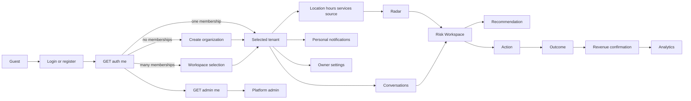
```mermaid
flowchart LR
  Guest[Guest] --> Auth[Login or register]
  Auth --> Me[GET auth me]
  Me -->|no memberships| Org[Create organization]
  Me -->|one membership| Tenant[Selected tenant]
  Me -->|many memberships| Select[Workspace selection]
  Org --> Tenant
  Select --> Tenant
  Tenant --> Setup[Location hours services source]
  Setup --> Radar[Radar]
  Tenant --> Conversations[Conversations]
  Radar --> Risk[Risk Workspace]
  Conversations --> Risk
  Risk --> Recommendation[Recommendation]
  Risk --> Action[Action]
  Action --> Outcome[Outcome]
  Outcome --> Revenue[Revenue confirmation]
  Revenue --> Analytics[Analytics]
  Tenant --> Preferences[Personal notifications]
  Tenant --> OwnerSettings[Owner settings]
  Me --> AdminCheck[GET admin me]
  AdminCheck --> Admin[Platform admin]
```

## 2. Boot, session и выбор tenant

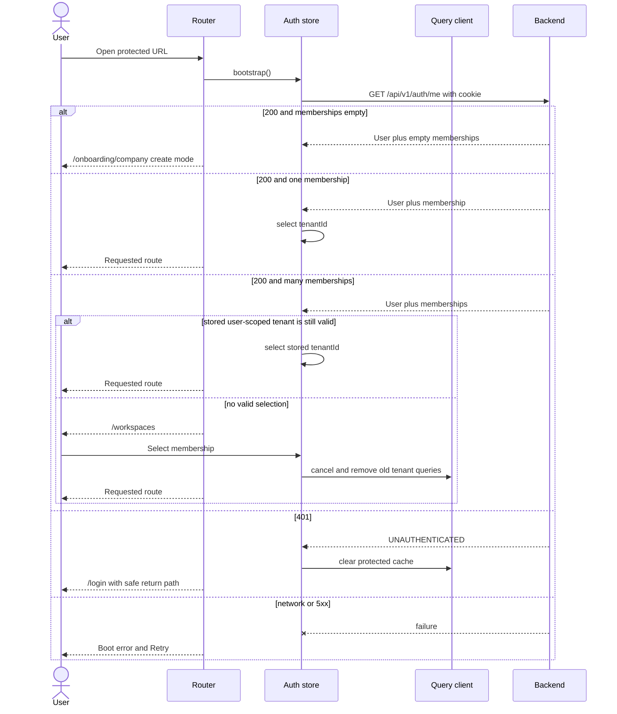
```mermaid
sequenceDiagram
  actor U as User
  participant R as Router
  participant A as Auth store
  participant Q as Query client
  participant API as Backend

  U->>R: Open protected URL
  R->>A: bootstrap()
  A->>API: GET /api/v1/auth/me with cookie
  alt 200 and memberships empty
    API-->>A: User plus empty memberships
    R-->>U: /onboarding/company create mode
  else 200 and one membership
    API-->>A: User plus membership
    A->>A: select tenantId
    R-->>U: Requested route
  else 200 and many memberships
    API-->>A: User plus memberships
    alt stored user-scoped tenant is still valid
      A->>A: select stored tenantId
      R-->>U: Requested route
    else no valid selection
      R-->>U: /workspaces
      U->>A: Select membership
      A->>Q: cancel and remove old tenant queries
      R-->>U: Requested route
    end
  else 401
    API-->>A: UNAUTHENTICATED
    A->>Q: clear protected cache
    R-->>U: /login with safe return path
  else network or 5xx
    API--xA: failure
    R-->>U: Boot error and Retry
  end
```

Смена tenant всегда выполняет `abort old stream/requests → убрать старые данные
с экрана → установить проверенный membership → загрузить новый route`.

## 3. Login и rate limit

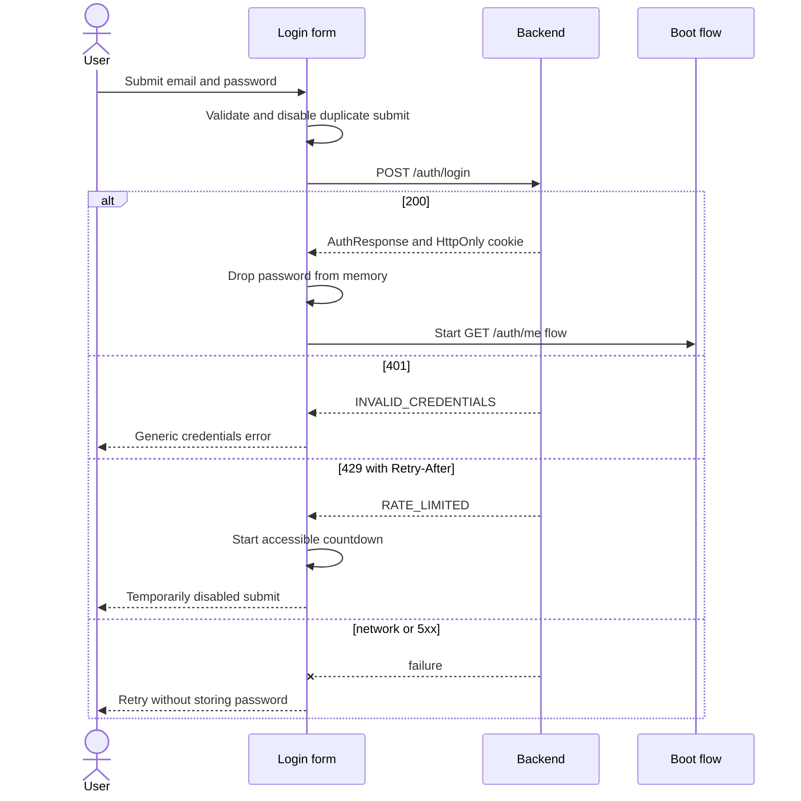
```mermaid
sequenceDiagram
  actor U as User
  participant F as Login form
  participant API as Backend
  participant B as Boot flow

  U->>F: Submit email and password
  F->>F: Validate and disable duplicate submit
  F->>API: POST /auth/login
  alt 200
    API-->>F: AuthResponse and HttpOnly cookie
    F->>F: Drop password from memory
    F->>B: Start GET /auth/me flow
  else 401
    API-->>F: INVALID_CREDENTIALS
    F-->>U: Generic credentials error
  else 429 with Retry-After
    API-->>F: RATE_LIMITED
    F->>F: Start accessible countdown
    F-->>U: Temporarily disabled submit
  else network or 5xx
    API--xF: failure
    F-->>U: Retry without storing password
  end
```

## 4. Создание и восстановление onboarding

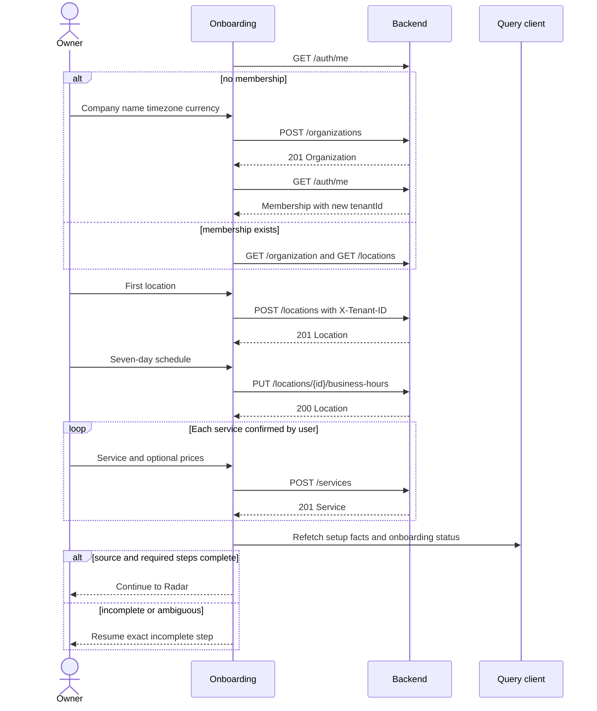
```mermaid
sequenceDiagram
  actor U as Owner
  participant UI as Onboarding
  participant API as Backend
  participant Q as Query client

  UI->>API: GET /auth/me
  alt no membership
    U->>UI: Company name timezone currency
    UI->>API: POST /organizations
    API-->>UI: 201 Organization
    UI->>API: GET /auth/me
    API-->>UI: Membership with new tenantId
  else membership exists
    UI->>API: GET /organization and GET /locations
  end
  U->>UI: First location
  UI->>API: POST /locations with X-Tenant-ID
  API-->>UI: 201 Location
  U->>UI: Seven-day schedule
  UI->>API: PUT /locations/{id}/business-hours
  API-->>UI: 200 Location
  loop Each service confirmed by user
    U->>UI: Service and optional prices
    UI->>API: POST /services
    API-->>UI: 201 Service
  end
  UI->>Q: Refetch setup facts and onboarding status
  alt source and required steps complete
    UI-->>U: Continue to Radar
  else incomplete or ambiguous
    UI-->>U: Resume exact incomplete step
  end
```

До появления server onboarding status последний выбор остаётся заблокирован
[GAP-API-009](08-readiness-gaps.md#gap-api-009); frontend не сохраняет
«завершено» как единственную истину в localStorage.

## 5. Radar, pagination и SSE

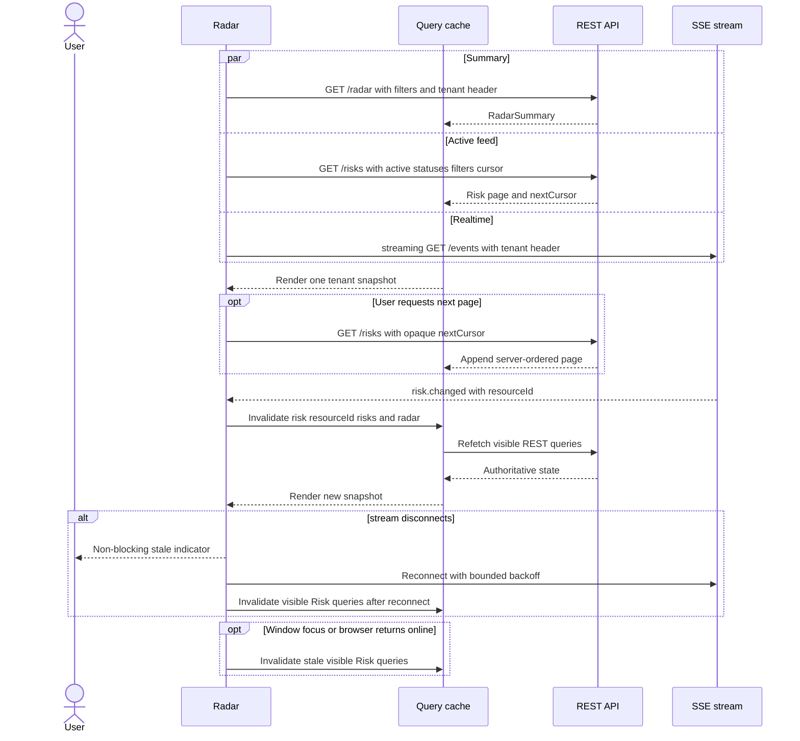
```mermaid
sequenceDiagram
  actor U as User
  participant UI as Radar
  participant Q as Query cache
  participant API as REST API
  participant S as SSE stream

  par Summary
    UI->>API: GET /radar with filters and tenant header
    API-->>Q: RadarSummary
  and Active feed
    UI->>API: GET /risks with active statuses filters cursor
    API-->>Q: Risk page and nextCursor
  and Realtime
    UI->>S: streaming GET /events with tenant header
  end
  Q-->>UI: Render one tenant snapshot
  opt User requests next page
    UI->>API: GET /risks with opaque nextCursor
    API-->>Q: Append server-ordered page
  end
  S-->>UI: risk.changed with resourceId
  UI->>Q: Invalidate risk resourceId risks and radar
  Q->>API: Refetch visible REST queries
  API-->>Q: Authoritative state
  Q-->>UI: Render new snapshot
  alt stream disconnects
    UI-->>U: Non-blocking stale indicator
    UI->>S: Reconnect with bounded backoff
    UI->>Q: Invalidate visible Risk queries after reconnect
  end
  opt Window focus or browser returns online
    UI->>Q: Invalidate stale visible Risk queries
  end
```

Summary и list могут завершиться независимо. Ошибка одного блока не стирает
успешный другой, но UI помечает snapshot частичным.

## 6. Risk Workspace и Money Loop

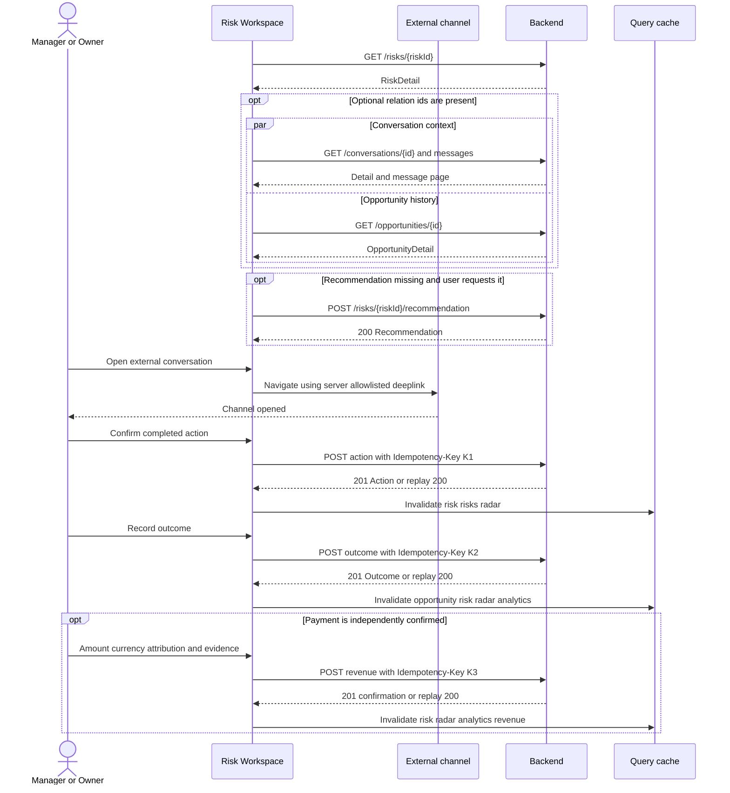
```mermaid
sequenceDiagram
  actor U as Manager or Owner
  participant UI as Risk Workspace
  participant EXT as External channel
  participant API as Backend
  participant Q as Query cache

  UI->>API: GET /risks/{riskId}
  API-->>UI: RiskDetail
  opt Optional relation ids are present
    par Conversation context
      UI->>API: GET /conversations/{id} and messages
      API-->>UI: Detail and message page
    and Opportunity history
      UI->>API: GET /opportunities/{id}
      API-->>UI: OpportunityDetail
    end
  end
  opt Recommendation missing and user requests it
    UI->>API: POST /risks/{riskId}/recommendation
    API-->>UI: 200 Recommendation
  end
  U->>UI: Open external conversation
  UI->>EXT: Navigate using server allowlisted deeplink
  EXT-->>U: Channel opened
  U->>UI: Confirm completed action
  UI->>API: POST action with Idempotency-Key K1
  API-->>UI: 201 Action or replay 200
  UI->>Q: Invalidate risk risks radar
  U->>UI: Record outcome
  UI->>API: POST outcome with Idempotency-Key K2
  API-->>UI: 201 Outcome or replay 200
  UI->>Q: Invalidate opportunity risk radar analytics
  opt Payment is independently confirmed
    U->>UI: Amount currency attribution and evidence
    UI->>API: POST revenue with Idempotency-Key K3
    API-->>UI: 201 confirmation or replay 200
    UI->>Q: Invalidate risk radar analytics revenue
  end
```

При timeout K1/K2/K3 и body сохраняются в памяти draft; новый key до
однозначного результата запрещён. Action не записывается автоматически только
из-за клика по несуществующему/небезопасному deeplink.

## 7. Feedback и каскад false positive

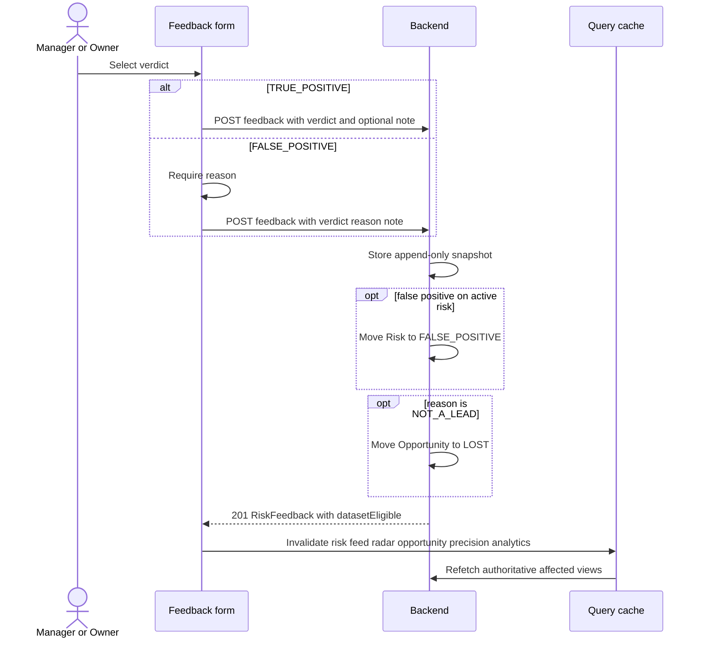
```mermaid
sequenceDiagram
  actor U as Manager or Owner
  participant UI as Feedback form
  participant API as Backend
  participant Q as Query cache

  U->>UI: Select verdict
  alt TRUE_POSITIVE
    UI->>API: POST feedback with verdict and optional note
  else FALSE_POSITIVE
    UI->>UI: Require reason
    UI->>API: POST feedback with verdict reason note
  end
  API->>API: Store append-only snapshot
  opt false positive on active risk
    API->>API: Move Risk to FALSE_POSITIVE
  end
  opt reason is NOT_A_LEAD
    API->>API: Move Opportunity to LOST
  end
  API-->>UI: 201 RiskFeedback with datasetEligible
  UI->>Q: Invalidate risk feed radar opportunity precision analytics
  Q->>API: Refetch authoritative affected views
```

## 8. Cursor messages с сохранением scroll

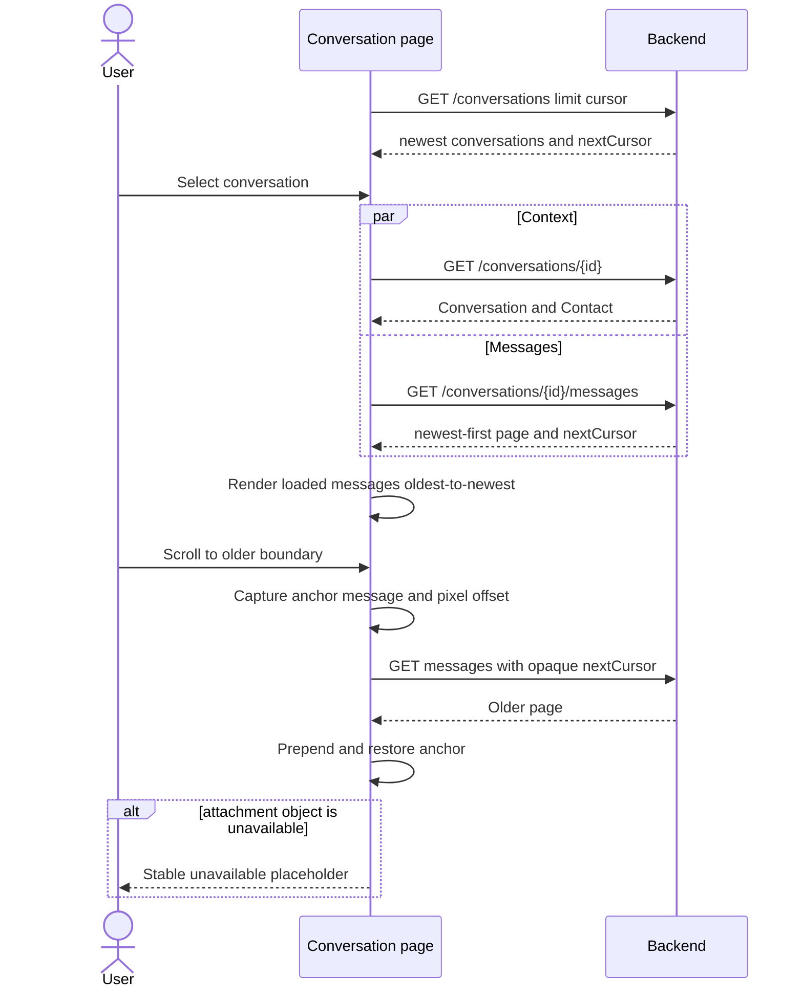
```mermaid
sequenceDiagram
  actor U as User
  participant UI as Conversation page
  participant API as Backend

  UI->>API: GET /conversations limit cursor
  API-->>UI: newest conversations and nextCursor
  U->>UI: Select conversation
  par Context
    UI->>API: GET /conversations/{id}
    API-->>UI: Conversation and Contact
  and Messages
    UI->>API: GET /conversations/{id}/messages
    API-->>UI: newest-first page and nextCursor
  end
  UI->>UI: Render loaded messages oldest-to-newest
  U->>UI: Scroll to older boundary
  UI->>UI: Capture anchor message and pixel offset
  UI->>API: GET messages with opaque nextCursor
  API-->>UI: Older page
  UI->>UI: Prepend and restore anchor
  alt attachment object is unavailable
    UI-->>U: Stable unavailable placeholder
  end
```

Смена conversation отменяет старые requests и очищает выбранную detail-area до
прихода новых данных, чтобы не смешать контакт и сообщения.

## 9. Личная Telegram-привязка

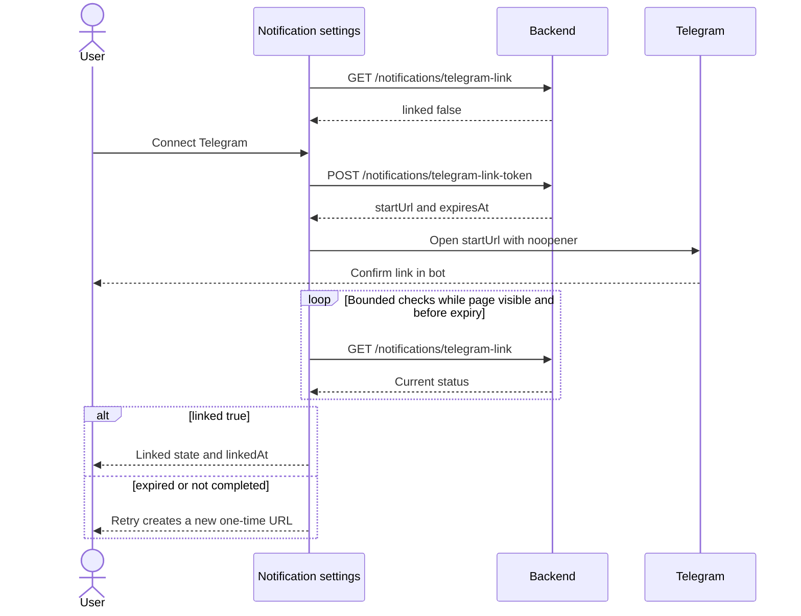
```mermaid
sequenceDiagram
  actor U as User
  participant UI as Notification settings
  participant API as Backend
  participant TG as Telegram

  UI->>API: GET /notifications/telegram-link
  API-->>UI: linked false
  U->>UI: Connect Telegram
  UI->>API: POST /notifications/telegram-link-token
  API-->>UI: startUrl and expiresAt
  UI->>TG: Open startUrl with noopener
  TG-->>U: Confirm link in bot
  loop Bounded checks while page visible and before expiry
    UI->>API: GET /notifications/telegram-link
    API-->>UI: Current status
  end
  alt linked true
    UI-->>U: Linked state and linkedAt
  else expired or not completed
    UI-->>U: Retry creates a new one-time URL
  end
```

Business source integration не участвует в этом сценарии.

## 10. Полная замена notification preference

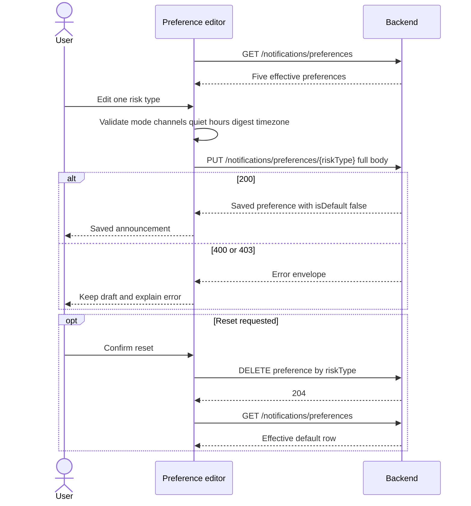
```mermaid
sequenceDiagram
  actor U as User
  participant UI as Preference editor
  participant API as Backend

  UI->>API: GET /notifications/preferences
  API-->>UI: Five effective preferences
  U->>UI: Edit one risk type
  UI->>UI: Validate mode channels quiet hours digest timezone
  UI->>API: PUT /notifications/preferences/{riskType} full body
  alt 200
    API-->>UI: Saved preference with isDefault false
    UI-->>U: Saved announcement
  else 400 or 403
    API-->>UI: Error envelope
    UI-->>U: Keep draft and explain error
  end
  opt Reset requested
    U->>UI: Confirm reset
    UI->>API: DELETE preference by riskType
    API-->>UI: 204
    UI->>API: GET /notifications/preferences
    API-->>UI: Effective default row
  end
```

## 11. Подключение и отключение source integration

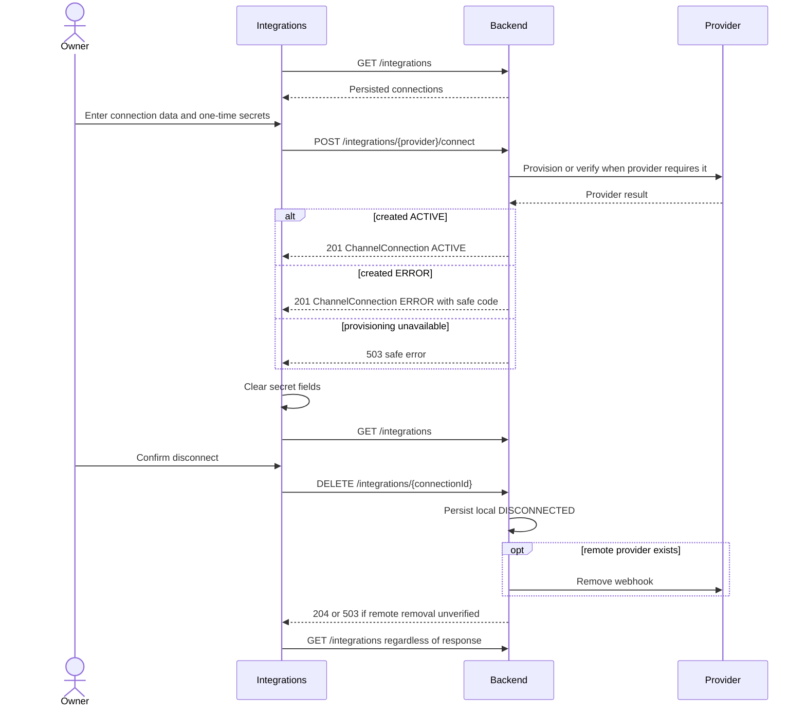
```mermaid
sequenceDiagram
  actor O as Owner
  participant UI as Integrations
  participant API as Backend
  participant P as Provider

  UI->>API: GET /integrations
  API-->>UI: Persisted connections
  O->>UI: Enter connection data and one-time secrets
  UI->>API: POST /integrations/{provider}/connect
  API->>P: Provision or verify when provider requires it
  P-->>API: Provider result
  alt created ACTIVE
    API-->>UI: 201 ChannelConnection ACTIVE
  else created ERROR
    API-->>UI: 201 ChannelConnection ERROR with safe code
  else provisioning unavailable
    API-->>UI: 503 safe error
  end
  UI->>UI: Clear secret fields
  UI->>API: GET /integrations
  O->>UI: Confirm disconnect
  UI->>API: DELETE /integrations/{connectionId}
  API->>API: Persist local DISCONNECTED
  opt remote provider exists
    API->>P: Remove webhook
  end
  API-->>UI: 204 or 503 if remote removal unverified
  UI->>API: GET /integrations regardless of response
```

## 12. Analytics period

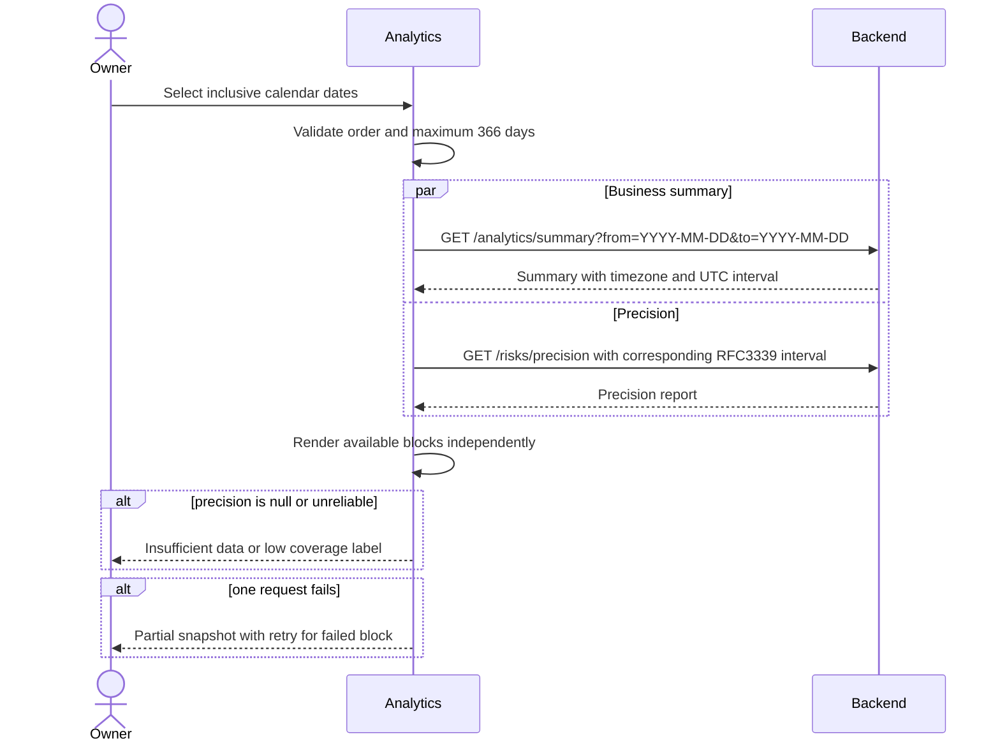
```mermaid
sequenceDiagram
  actor O as Owner
  participant UI as Analytics
  participant API as Backend

  O->>UI: Select inclusive calendar dates
  UI->>UI: Validate order and maximum 366 days
  par Business summary
    UI->>API: GET /analytics/summary?from=YYYY-MM-DD&to=YYYY-MM-DD
    API-->>UI: Summary with timezone and UTC interval
  and Precision
    UI->>API: GET /risks/precision with corresponding RFC3339 interval
    API-->>UI: Precision report
  end
  UI->>UI: Render available blocks independently
  alt precision is null or unreliable
    UI-->>O: Insufficient data or low coverage label
  end
  alt one request fails
    UI-->>O: Partial snapshot with retry for failed block
  end
```

Frontend не синтезирует дневной ряд из итогов. Преобразование date→instant для
precision покрывается DST-тестами timezone организации.

## 13. Admin guard и recovery command

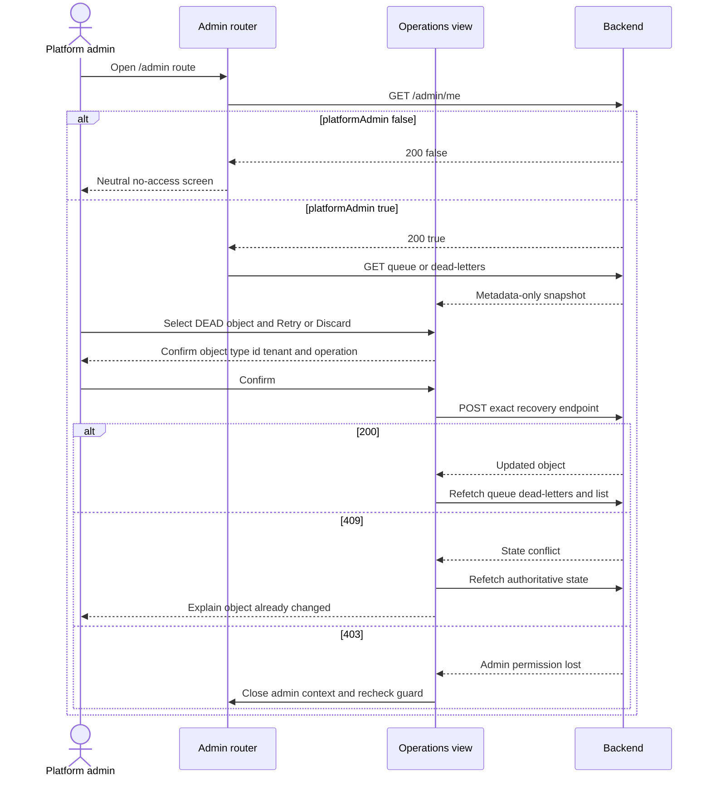
```mermaid
sequenceDiagram
  actor A as Platform admin
  participant R as Admin router
  participant UI as Operations view
  participant API as Backend

  A->>R: Open /admin route
  R->>API: GET /admin/me
  alt platformAdmin false
    API-->>R: 200 false
    R-->>A: Neutral no-access screen
  else platformAdmin true
    API-->>R: 200 true
    R->>API: GET queue or dead-letters
    API-->>UI: Metadata-only snapshot
    A->>UI: Select DEAD object and Retry or Discard
    UI-->>A: Confirm object type id tenant and operation
    A->>UI: Confirm
    UI->>API: POST exact recovery endpoint
    alt 200
      API-->>UI: Updated object
      UI->>API: Refetch queue dead-letters and list
    else 409
      API-->>UI: State conflict
      UI->>API: Refetch authoritative state
      UI-->>A: Explain object already changed
    else 403
      API-->>UI: Admin permission lost
      UI->>R: Close admin context and recheck guard
    end
  end
```

## 14. Единый порядок при mutation failure

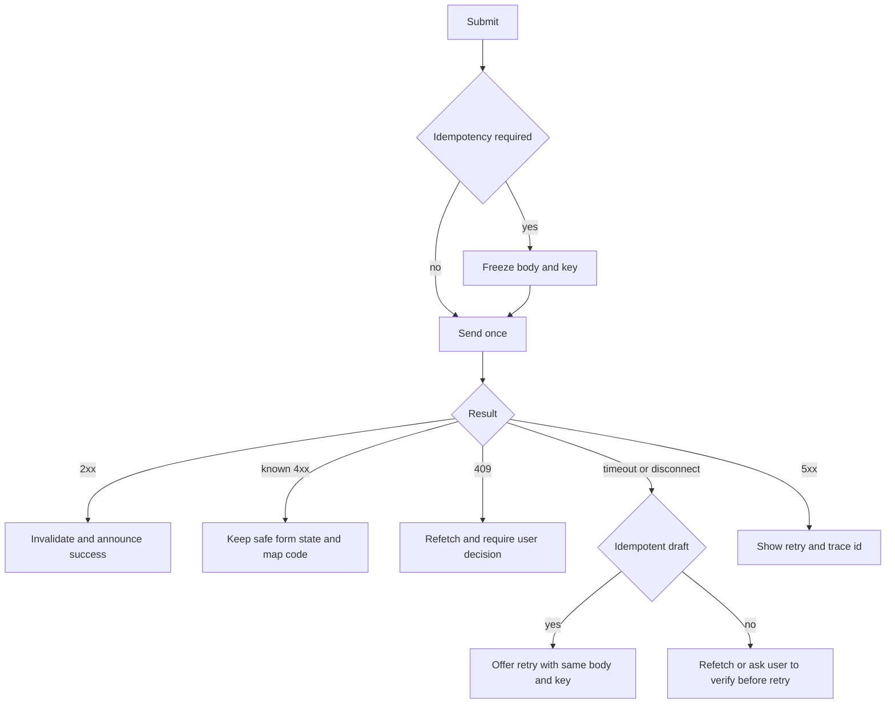
```mermaid
flowchart TD
  Submit[Submit] --> Idem{Idempotency required}
  Idem -->|yes| Draft[Freeze body and key]
  Idem -->|no| Request[Send once]
  Draft --> Request
  Request --> Result{Result}
  Result -->|2xx| Success[Invalidate and announce success]
  Result -->|known 4xx| Known[Keep safe form state and map code]
  Result -->|409| Conflict[Refetch and require user decision]
  Result -->|timeout or disconnect| Unknown{Idempotent draft}
  Unknown -->|yes| RetrySame[Offer retry with same body and key]
  Unknown -->|no| Verify[Refetch or ask user to verify before retry]
  Result -->|5xx| ServerError[Show retry and trace id]
```

Эта схема обязательна для всех feature-команд; конкретная invalidation приведена
в [архитектуре](01-architecture.md#query-invalidation) и
[каталоге API](03-api.md).
