# Готовность и реестр разрывов

Срез выполнен 14 сентября 2026 года по runtime, OpenAPI, backend docs/tests и
локальному пакету макетов. Реестр запрещает скрытые предположения: если экрану
не хватает данных или решения, это prerequisite, а не повод для N+1, hardcode
или фиктивного client-side результата.

## 1. Приоритет и статус

| Приоритет | Значение |
|---|---|
| P0 | блокирует безопасный transport или основной MVP loop; закрыть до feature integration |
| P1 | блокирует обязательный экран/роль или делает показанные данные некорректными |
| P2 | не блокирует безопасное ядро, но нужен для полной UX/quality приёмки |

| Статус | Значение |
|---|---|
| `OPEN` | контракт/решение отсутствует |
| `READY_FOR_FIX` | причина и целевой результат ясны, можно брать prerequisite |
| `DECISION_REQUIRED` | требуется product/security/design решение до кода |
| `CLOSED` | runtime, OpenAPI, docs, tests и frontend adapter согласованы |

Закрытие gap требует доказательства по всем затронутым источникам, а не только
изменения текста этого файла.

## 2. Матрица блоков

| Блок | Сейчас | Что можно делать | Что нельзя принимать |
|---|---|---|---|
| Transport/generated API | заблокирован P0 | wrapper/error/idempotency design | стабильную генерацию и tenant operations |
| Login | API+desktop design готовы | полный login | registration/workspace visual acceptance |
| Onboarding | частично | company/location/hours/services forms | надёжный resume/completion и production source flow |
| Radar | частично | shell, summary, honest empty/error | полную active feed/card |
| Risk Workspace | частично | command plumbing, базовый read | целевой context и visual acceptance |
| Conversations | частично | detail/messages cursor | целевой list/search/risk filter/deeplink |
| Integrations | decision required | persisted list/health states | безопасный production connect/live check |
| Personal notifications | API готов | link/preferences | owner-only placement без решения |
| Company/location/services | API+desktop design почти готовы | формы/списки | service dialogs/mobile acceptance |
| Team | заблокирован | shell/story only | production data/actions |
| Privacy | API готов | behavior | visual acceptance |
| Revenue | API готов | idempotent dialog/command | создание RECOVERED без evidence |
| Analytics | частично | текущие aggregate cards/precision | chart/payment list/attribution split из макета |
| SSE | runtime готов, schema неполна | lifecycle/parser | generated tenant-safe stream без contract fix |
| Admin | API готов | data/command implementation | visual acceptance |

## 3. Contract gaps

### GAP-CONTRACT-001 — обязательный tenant header пропущен у Risk/SSE

**P0 · READY_FOR_FIX.** Backend API docs требуют `X-Tenant-ID` для всех
tenant-scoped paths, runtime handler читает tenant, но OpenAPI не объявляет
parameter у `GET /radar`, `GET /risks`, `GET /risks/{riskId}`, acknowledge,
resolve и `GET /events`.

**Риск.** Generated methods не принимают tenant; ручное добавление по features
легко пропустить и создаёт неверный контракт безопасности.

**Нужно.** Добавить shared `TenantId` parameter ко всем шести paths, contract
tests на browser endpoint classification. **Safe interim:** единый transport
interceptor добавляет tenant ко всем операциям из allowlist; ни один feature не
добавляет header вручную. Удалить workaround после schema fix.
**Владелец:** backend/API contract + frontend transport.

### GAP-CONTRACT-002 — Risk/runtime nullability и enum расходятся со схемой

**P0 · READY_FOR_FIX.** Runtime/fixtures используют `Risk.source=MANUAL`, а
OpenAPI Risk разрешает только `RULE|HYBRID`. Go `risk/application.Detail`
отдаёт `opportunity`, `conversation`, recommendation/outcome/revenue как
`omitempty`, но OpenAPI требует первые две. Runtime list сериализует конец
страниц как `nextCursor:null`, тогда как часть prose backend docs описывает
отсутствующее поле.

**Нужно.** Добавить `MANUAL`; согласовать optional/nullable/omitted форму всех
RiskDetail relations; закрепить `nextCursor: string|null` во всех схемах и
тексте; fixtures/contract tests на каждую форму. **Safe interim:** один adapter
принимает runtime superset/optional fields с runtime validation и telemetry,
без `as any` в components. **Владелец:** backend/API contract.

### GAP-API-003 — нельзя корректно запросить всю active Risk feed

**P0 · READY_FOR_FIX.** Radar считает active `OPEN|ACKNOWLEDGED|ACTED`.
`GET /risks` принимает только один `status`; без него возвращает и четыре
terminal statuses. Client-side filtering paginated страниц даёт пустые/неполные
страницы и неверный cursor UX.

**Нужно.** Зафиксировать один из server contracts: повторяемый `status`,
`status[]=...` либо semantic `active=true`; одинаковые filters у list/summary,
deterministic ordering/cursor tests. **Safe interim:** отдельные status views
могут запросить один статус, но единая active feed не готова.
**Владелец:** Risk backend/API.

### GAP-API-004 — Risk card/workspace не получает контекст из макета

**P1 · READY_FOR_FIX.** `RiskDetail` содержит только contactId, сокращённую
Conversation, stage/location/potential и serviceId даже отсутствует в
`RadarOpportunity`. Макет требует contact display name, service/vehicle,
channel, message preview, точное waiting/due context и primary external action.

**Нужно.** Утвердить enriched Radar read model с устойчивыми snapshot/display
полями и provenance; list/detail должны быть пригодны без N+1. Решить, что
vehicle — semantic fact, service field или display-only derived fact. **Safe
interim:** показывать только reason/type/severity/time/amount, реально пришедшие
от API; ID не выдавать за имя. **Владелец:** product + Risk read model.

### GAP-API-005 — conversation list не поддерживает целевой список

**P1 · READY_FOR_FIX.** List возвращает только `Conversation`: нет Contact,
preview, channel display и active-risk flag. Query не поддерживает search или
«С риском». Локальный поиск по одной загруженной странице вводит в заблуждение;
detail per row создаёт N+1.

**Нужно.** Enriched `ConversationListItem` и server filters/search с явно
определёнными полями, normalization, ordering и cursor stability. Уточнить
поведение archive/location/channel. **Safe interim:** технический список по
времени/ID без search/risk filter не соответствует макету и не принимается как
готовый экран. **Владелец:** Conversation/Risk read model + product.

### GAP-API-006 — отсутствует безопасный deeplink во внешний диалог

**P1 · DECISION_REQUIRED.** Product boundary требует отвечать в Telegram, но
Conversation API не возвращает allowlisted URL, а `externalId` непрозрачен и не
может становиться URL. Endpoint отправки сообщений намеренно отсутствует.

**Нужно.** Provider-aware backend field/endpoint: nullable safe URL плюс
availability/reason, allowlisted schemes/domains и lifecycle semantics. Решить,
когда записывать `OPEN_CONVERSATION`. **Safe interim:** disabled CTA с
объяснением; нельзя конструировать `t.me` URL в browser. **Владелец:** product +
connector/security.

### GAP-API-007 — Analytics API уже макета

**P1 · READY_FOR_FIX.** API отдаёт один aggregate snapshot, но лист 07 показывает
суточный series, список последних подтверждений и полное разделение
`RECOVERED|ORGANIC|UNKNOWN`. Эти данные нельзя восстановить из totals.

**Нужно.** Согласовать response extension или отдельные paginated endpoints:
bucket timezone/date, zero filling, attribution amounts/counts, payment rows,
refund semantics, limits/cursor. Обновить OpenAPI/docs/tests. **Safe interim:**
реализовать только cards/by-type/precision и скрыть неподдержанные sections,
явно считая это partial screen. **Владелец:** Analytics/Revenue backend + product.

### GAP-API-008 — нет HTTP API команды

**P1 · DECISION_REQUIRED.** Макет имеет members/roles/actions; backend
application layer содержит AddMember, но public routes, list schema, invitation
lifecycle, role update/revoke отсутствуют.

**Нужно.** Product/security contract для list, invite/add, change role, revoke,
pending/expired invite, disabled user, last OWNER, self-change, audit и
email-enumeration. Затем routes/OpenAPI/tests. **Safe interim:** route скрыт или
явно «Функция недоступна»; `/auth/me` не является списком команды.
**Владелец:** tenant/auth backend + product/security.

### GAP-API-009 — нет авторитетного onboarding completion/resume state

**P1 · DECISION_REQUIRED.** Наличие Organization/Location/Service не определяет,
обязателен ли source, можно ли skip Telegram и какой шаг пользователь завершил.
LocalStorage не годится как источник истины между устройствами/users.

**Нужно.** Утвердить required steps, skip rules и server status (или полностью
детерминированное правило из read models), включая existing tenant migration.
**Safe interim:** forms доступны как settings, а автоматический resume/redirect
не заявляется. **Владелец:** product + tenant backend.

### GAP-API-010 — source connect и health требуют security/UX решения

**P0 · DECISION_REQUIRED.** Current connect принимает webhook secret и для
`CONNECTED_BUSINESS_BOT` bot token из browser; runbook рекомендует безопасную
provisioning boundary. Health GET читает persisted state, но макетная кнопка
«Проверить связь» предполагает активный probe.

**Нужно.** Security review: допустим ли one-time browser token submit либо нужен
server-side OAuth/provisioning flow; кто генерирует webhook secret; redaction и
retry. Отдельно определить live probe endpoint/async status или переименовать
UI в «Обновить состояние». **Safe interim:** TEST/IMPORT для local demo,
persisted health с честной подписью; production secret form не выпускать.
**Владелец:** integration/security/product.

### GAP-UX-011 — notification settings ошибочно выглядят OWNER-only

**P1 · DECISION_REQUIRED.** Runtime позволяет любому active member управлять
собственной Telegram link/preferences, но макет размещает экран внутри
владельческих настроек и формулирует общие каналы как настройки компании.

**Нужно.** Утвердить IA/copy: «Мои уведомления», доступ OWNER+MANAGER; отдельно
показать business source (OWNER). Подтвердить отсутствие tenant-wide preference.
**Safe interim:** отдельный personal route/navigation item для обеих ролей.
**Владелец:** product/design.

### GAP-API-012 — Manager не может получить имя услуги для Risk

**P1 · READY_FOR_FIX.** `GET /services` требует `service.manage` (OWNER), Manager
имеет `risks.read/manage`, а Risk read model не содержит service name/id.
Следовательно, целевой Risk context для основной операционной роли недоступен.

**Нужно.** Добавить safe service snapshot/display fields в Risk read model либо
отдельное `service.read` permission/endpoint с обоснованной видимостью. Не
расширять Manager до catalog manage. **Safe interim:** не показывать услугу
Manager, но экран неполон. **Владелец:** permissions + Risk read model.

### GAP-API-013 — нет browser feed in-app уведомлений

**P2 · DECISION_REQUIRED.** Preferences содержат `inAppEnabled`, admin trace
видит notifications/deliveries, но browser endpoint чтения/прочтения in-app
notifications отсутствует. Макеты не содержат полноценный notification center.

**Нужно.** Либо явно определить in-app как будущую возможность и скрыть toggle,
либо добавить list/read/unread contract и дизайн. **Safe interim:** не обещать
in-app центр; значение preference можно редактировать только с product copy,
что канал пока не визуализируется. **Владелец:** product/notifications.

### GAP-API-016 — видимость денег у Manager не согласована между permissions

**P1 · DECISION_REQUIRED.** Manager не имеет `revenue.read`/`analytics.read`, но
имеет `risks.read` и `revenue.confirm`; Radar summary и RiskDetail через
`risks.read` могут вернуть potential/confirmedRecovered amounts.

**Нужно.** Явно закрепить field-level policy: какие суммы видит Manager в Radar
и Risk, либо скорректировать read model/permissions. Добавить role contract
tests и product copy. **Safe interim:** отображать только полученные composite
fields, не запрашивать OWNER-only revenue summary; не использовать client role
для сокрытия уже пришедшего поля как security control. **Владелец:** product +
authorization/Risk backend.

### GAP-CONTRACT-017 — documented Revenue conflict уже runtime semantics

**P2 · READY_FOR_FIX.** OpenAPI description для revenue `409` говорит только об
idempotency key mismatch, но backend docs/runtime также имеют
`RECOVERED_ALREADY_ATTRIBUTED`. Generated documentation не подсказывает UI
различить исправимый attribution conflict.

**Нужно.** Описать оба codes/examples в OpenAPI и contract tests. **Safe
interim:** общий error mapper уже знает backend-documented code и предлагает
выбрать `ORGANIC` только по явному решению пользователя. **Владелец:** Revenue
API contract.

### GAP-CONTRACT-019 — `active` при создании Location принимается и игнорируется

**P2 · READY_FOR_FIX.** Backend prose перечисляет optional `active?` в create,
общий runtime decoder принимает поле, но `createLocation` не передаёт его в
application service и новая точка всегда active. OpenAPI справедливо не
объявляет поле, однако три источника расходятся, а неизвестное ожидание клиента
не отклоняется.

**Нужно.** Выбрать один контракт: убрать `active` из create decoder/prose и
требовать отдельный PATCH либо реализовать/описать create value. Предпочтение
для MVP — всегда active при create и strict reject лишнего поля. **Safe
interim:** frontend не отправляет `active` при POST и меняет его только PATCH.
**Владелец:** Tenant API contract.

### GAP-RELIABILITY-020 — SSE может потерять сигнал без resync marker

**P1 · DECISION_REQUIRED.** SSE намеренно не имеет replay, PostgreSQL NOTIFY
best-effort, а заполненный buffer подписчика молча отбрасывает signal. Текущий
client узнаёт о потере только при разрыве/reconnect; живое соединение может
оставить долгий Radar snapshot устаревшим.

**Нужно.** Утвердить freshness SLA и один механизм: закрывать slow subscriber,
посылать `resync.required`, давать monotonic revision либо выполнять
low-frequency REST safety refetch. Также описать runtime `503 UNAVAILABLE` при
неинициализированном hub в OpenAPI/error registry. **Safe interim:** refetch on
window focus/online/manual refresh и явное время snapshot; SSE остаётся только
ускорителем. **Владелец:** reliability/Risk backend + frontend.

### GAP-CONTRACT-021 — named Action/Outcome permissions не являются runtime gate

**P2 · DECISION_REQUIRED.** Role map объявляет `action.manage` и
`outcome.manage`, но corrective service проверяет `risks.manage` для
Recommendation, Action и Outcome. Сегодня OWNER/MANAGER имеют все эти права,
поэтому расхождение скрыто, но будущая роль получит неоднозначный доступ.

**Нужно.** Выбрать единый permission contract и удалить неиспользуемые constants
либо применять отдельные gates; синхронизировать docs и authorization tests.
**Safe interim:** frontend считает фактическим gate `risks.manage`, но не
кодирует permission inheritance самостоятельно. **Владелец:** authorization +
Corrective backend.

## 4. Design gaps

### GAP-DESIGN-014 — отсутствуют обязательные desktop states

**P1 · DECISION_REQUIRED.** Локальный v0.2 bundle содержит 16 листов, но
ссылается на внешний Product UI v0.1 без доступного URL/export. Нет основного
Radar, полного Risk Workspace, registration/workspaces, service dialogs,
privacy, admin и многих terminal/conflict states.

**Нужно.** Передать Figma URL с точными node IDs либо добавить versioned local
exports; согласовать перечень из [карты макетов](06-design-map.md#missing-designs),
data-field mapping и states. **Safe interim:** primitives/shell и листы v0.2;
заблокированные pages не проходят visual acceptance по догадке.
**Владелец:** product design.

### GAP-DESIGN-015 — нет responsive/mobile спецификации

**P1 · DECISION_REQUIRED.** Все product screens 1440×1024; SVG не содержит
constraints/auto-layout. Не определены navigation drawer, conversations
list→detail, Risk action order, tables/dialogs на narrow viewport.

**Нужно.** Утвердить 320/375/768 layouts и overflow/focus behavior для всех P0
flows. **Safe interim:** semantic reflow rules из quality docs, но pixel/UX
acceptance остаётся открытой. **Владелец:** product design + frontend.

### GAP-DESIGN-018 — нет единого mapping текущих UI examples

**P2 · READY_FOR_FIX.** Product UI v0.1 расходится по примеру Дмитрия
(Audi/полировка против BMW/керамика), а v0.2 содержит демонстрационные числа,
которые не равны runtime fixtures.

**Нужно.** Один design fixture/story dataset с явной пометкой demo и
непротиворечивыми связями IDs/amounts/dates; не использовать его как E2E
backend expectation. **Safe interim:** production никогда не hardcode examples.
**Владелец:** design + frontend stories.

## 5. Рекомендуемый порядок закрытия

```mermaid
flowchart TD
  C001[GAP CONTRACT 001 tenant headers] --> Transport[Generated transport]
  C002[GAP CONTRACT 002 risk schema] --> Transport
  C003[GAP API 003 active filter] --> Radar[Radar feed]
  C004[GAP API 004 risk context] --> Radar
  C012[GAP API 012 service visibility] --> C004
  C016[GAP API 016 manager money policy] --> C004
  C005[GAP API 005 list model] --> Conversations[Conversation list]
  C006[GAP API 006 deeplink] --> RiskLoop[Risk action loop]
  C007[GAP API 007 analytics] --> Analytics[Full analytics]
  C008[GAP API 008 team] --> Team[Team settings]
  C009[GAP API 009 onboarding state] --> Onboarding[Resumable onboarding]
  C010[GAP API 010 secure connect] --> Integrations[Production integrations]
  R020[GAP RELIABILITY 020 SSE resync] --> Radar
  D014[GAP DESIGN 014 desktop states] --> Radar
  D014 --> RiskLoop
  D015[GAP DESIGN 015 responsive] --> Acceptance[Cross route acceptance]
```

Valid OpenAPI/tenant/schema — первая волна. После неё независимы read models,
analytics, team, onboarding, integration security и design tracks. Frontend
feature не меняет статус `OPEN` сам по себе.

## 6. Checklist закрытия gap

1. Принято product/security решение там, где статус `DECISION_REQUIRED`.
2. Runtime реализует согласованную семантику и permissions.
3. OpenAPI отражает headers, params, optional/null, enums, success/error codes.
4. Backend docs и fixtures обновлены в том же изменении.
5. Есть positive, validation, auth, tenant isolation и role tests.
6. Generated frontend client обновлён без ручного patch.
7. Временный adapter/workaround удалён либо ограничен новым отдельным gap.
8. Feature tests и sequence/invalidation docs обновлены.
9. Макет имеет доступную versioned ссылку/export и необходимые states.
10. Этот реестр получает `CLOSED`, дату и ссылку на commit/decision.
