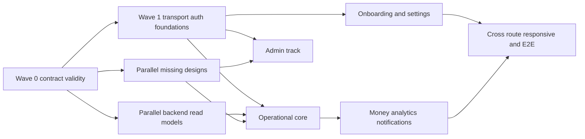

# Frontend backlog LidRadar MVP

Backlog нарезан на задачи по **2–4 рабочих дня**, где один день — **10–12
часов**, включая реализацию, review fixes, tests и документацию. Ни одна карточка
не предполагает скрытой доработки scaffold, package setup, deployment или общей
test infrastructure: пользователь подтвердил, что эта база уже существует.

Оценка — верхняя граница одной карточки, не календарный план команды. Если при
уточнении задача перестаёт помещаться в 48 часов, её делят до начала разработки,
сохраняя самостоятельный проверяемый результат.

## 1. Правила выполнения

Статусы:

- `READY` — можно брать при выполненных зависимостях;
- `BLOCKED` — сначала закрыть перечисленные задачи/gaps;
- `DECISION` — первый deliverable включает явное product/security/design
  решение; implementation не начинается без него.

Обязательное для каждой карточки:

1. Прочитать все три типа ссылок: backend, frontend и макет/visual gap.
2. Не менять runtime contract из frontend-задачи без отдельной API-карточки.
3. Выполнить acceptance и указанные проверки, а также общий
   [Definition of Done](07-quality.md#definition-of-done).
4. При изменении API обновить OpenAPI, backend docs/tests, generated client и
   затронутые frontend docs одним согласованным набором изменений.
5. Demo values макета не считать API fixtures.

## 2. Волны и параллельность

API/design prerequisites могут идти параллельно после LR-API-001. Frontend
карточка с `BLOCKED` не превращается в `READY`, пока dependency не принята по
runtime + contract + design, где это указано.

## 3. Contract и backend prerequisites

### LR-API-001 — Воспроизводимая TypeScript-генерация API

**Статус:** `READY` · **Оценка:** 2 дня, 20–24 ч · **Зависимости:** нет.

**Ссылки:** [Backend: OpenAPI и CI](../../contracts/openapi/openapi.yaml),
[Frontend: contract checks](07-quality.md#contract-tests),
[Макет: основы не зависят от demo API](mockups/svg/16-osnovy-interfeisa.svg).

**Текст задачи.** Подключить фактическую TypeScript client generation к уже
проходящей Redocly-проверке как CI check. Генератор и версия берутся из
существующего frontend baseline; generated output не редактируется вручную.

**Приёмка.** Redocly и выбранный TypeScript generator проходят; повторная
генерация даёт zero diff; изменение operation/schema ломает check до
осознанного обновления generated output.

**Проверки.** Parse, Redocly lint, generation, frontend typecheck, deliberate
invalid-spec negative test.

### LR-API-002 — Tenant headers во всех Risk и SSE операциях

**Статус:** `BLOCKED` · **Оценка:** 2 дня, 20–24 ч · **Зависимости:** LR-API-001.

**Ссылки:** [Backend: tenant contract](../backend/04-api.md),
[Frontend: transport](03-api.md#transport-contract),
[Макет: Radar](mockups/svg/14-radar-bez-riskov.svg).

**Текст задачи.** Добавить shared `X-Tenant-ID` parameter к Radar, Risk detail/
list/acknowledge/resolve и events, сверить полный browser route inventory с
runtime и добавить contract test, который не допускает tenant-scoped operation
без header.

**Приёмка.** Generated signatures принимают tenantId; runtime behavior не
изменён; временный frontend allowlist workaround можно удалить;
GAP-CONTRACT-001 закрыт.

**Проверки.** OpenAPI lint/generation, route classification test, tenant missing/
invalid/foreign integration tests.

### LR-API-003 — Согласовать Risk enum, optional relations и cursor

**Статус:** `BLOCKED` · **Оценка:** 2 дня, 20–24 ч · **Зависимости:** LR-API-001.

**Ссылки:** [Backend: Radar/Risk API](../backend/04-api.md),
[Frontend: Risk entities](02-entities.md#risk),
[Макет: Radar state](mockups/svg/14-radar-bez-riskov.svg).

**Текст задачи.** Привести OpenAPI и prose к runtime: добавить `MANUAL`,
зафиксировать отсутствующие/nullable relations `RiskDetail`, единый
`nextCursor: string|null`; добавить примеры и tests каждой формы.

**Приёмка.** Generated strict types принимают реальные fixtures без `any`;
adapter различает отсутствие связи и error; GAP-CONTRACT-002 закрыт.

**Проверки.** Schema examples, MANUAL fixture, orphan/partial relation fixtures,
first/middle/last cursor page.

### LR-BE-004 — Server-side фильтр полной active Risk feed

**Статус:** `BLOCKED` · **Оценка:** 3 дня, 30–36 ч · **Зависимости:** LR-API-001.

**Ссылки:** [Backend: risks list/summary](../backend/04-api.md),
[Frontend: Radar block](04-feature-blocks.md#block-radar),
[Макет: пустой Radar](mockups/svg/14-radar-bez-riskov.svg).

**Текст задачи.** Утвердить и реализовать multi-status или semantic active
filter для `/risks`, применить те же business filters к `/radar`, сохранить
server priority и cursor stability.

**Приёмка.** Одна paginated query возвращает ровно `OPEN|ACKNOWLEDGED|ACTED`;
terminal rows не попадают; summary/list filters согласованы; GAP-API-003 закрыт.

**Проверки.** Mixed-status database integration, pagination boundaries,
location/severity/type combinations, invalid/duplicate status.

### LR-BE-005 — Enriched Risk read model и политика видимости

**Статус:** `DECISION` · **Оценка:** 4 дня, 40–48 ч · **Зависимости:** LR-API-003.

**Ссылки:** [Backend: data modules](../backend/03-modules.md),
[Frontend: Risk Workspace](04-feature-blocks.md#block-risk-workspace),
[Макет: missing core designs](06-design-map.md#missing-designs).

**Текст задачи.** Согласовать и добавить в list/detail snapshot поля, нужные
операционной карточке: contact label, service/vehicle provenance, channel,
preview, waiting/due context и безопасные action capabilities. Одновременно
зафиксировать видимость service и money для MANAGER без выдачи catalog manage.

**Приёмка.** Radar list строится без N+1; OWNER/MANAGER field-level contract
явен; unknown/null provenance честно моделируется; GAP-API-004, GAP-API-012 и
GAP-API-016 закрыты либо разделены на принятые меньшие gaps.

**Проверки.** Role/tenant isolation, null contact/service/vehicle, long content,
money currency, query plan/no-N+1, OpenAPI generation.

### LR-BE-006 — Enriched conversation list, search и risk filter

**Статус:** `DECISION` · **Оценка:** 4 дня, 40–48 ч · **Зависимости:** LR-API-001.

**Ссылки:** [Backend: Conversations API](../backend/04-api.md),
[Frontend: dialogs block](04-feature-blocks.md#block-conversations),
[Макет: Диалоги](mockups/svg/06-dialogi.svg).

**Текст задачи.** Ввести `ConversationListItem` с contact label, safe preview,
channel/location и active-risk marker; добавить server search и risk-only
filter с определённой normalization, ordering и cursor semantics.

**Приёмка.** Целевой list не делает detail calls per row; search/filter работают
на всём tenant dataset; cursor остаётся непрозрачным/stable; GAP-API-005 закрыт.

**Проверки.** Empty/long/null/deleted text, Cyrillic search, mixed risk status,
cursor after filters, tenant isolation, large fixture/query count.

### LR-BE-007 — Безопасный внешний deeplink переписки

**Статус:** `DECISION` · **Оценка:** 3 дня, 30–36 ч · **Зависимости:** LR-API-001.

**Ссылки:** [Backend: connector boundaries](../backend/03-modules.md),
[Frontend: conversations API](03-api.md#conversations-api),
[Макет: CTA Telegram](mockups/svg/06-dialogi.svg).

**Текст задачи.** Определить provider-aware nullable deeplink/capability и
safe-unavailable reason, построенные backend-ом с allowlisted scheme/domain.
Зафиксировать момент, когда клик может быть подтверждён как Action
`OPEN_CONVERSATION`.

**Приёмка.** Browser не конструирует URL из `externalId`; unsupported provider
возвращает честный unavailable state; redirect не допускает open redirect;
GAP-API-006 закрыт.

**Проверки.** Allowlist, malformed/foreign IDs, unsupported/disconnected
connection, tenant isolation, security tests external URL.

### LR-BE-008 — Analytics time series и attribution breakdown

**Статус:** `DECISION` · **Оценка:** 4 дня, 40–48 ч · **Зависимости:** LR-API-001.

**Ссылки:** [Backend: Analytics API](../backend/04-api.md),
[Frontend: analytics entity/block](02-entities.md#analytics),
[Макет: Аналитика](mockups/svg/07-analitika.svg).

**Текст задачи.** Расширить analytics contract временными buckets в timezone
организации и totals/counts по `RECOVERED|ORGANIC|UNKNOWN`; определить zero
filling, refund/currency semantics и предел 366 дней.

**Приёмка.** Chart строится только из server buckets; суммы атрибуций сверяются
с confirmed total по утверждённому правилу; DST и empty period определены.

**Проверки.** DST/UTC boundaries, zero days, mixed attribution, currency,
366/367-day limits, aggregate invariants, OpenAPI generation.

### LR-BE-009 — Paginated список подтверждений выручки

**Статус:** `DECISION` · **Оценка:** 3 дня, 30–36 ч · **Зависимости:** LR-API-001.

**Ссылки:** [Backend: revenue/analytics](../backend/04-api.md),
[Frontend: revenue and analytics API](03-api.md#revenue-api),
[Макет: таблица аналитики](mockups/svg/07-analitika.svg).

**Текст задачи.** Добавить OWNER-only read model последних RevenueEvent с
attribution, opportunity/contact-safe label, amount/currency/time и cursor;
определить, как представлены refunds/corrections, не выдавая PII сверх экрана.

**Приёмка.** Макетная таблица получает реальные rows без объединения currencies
и N+1; access policy и cursor задокументированы; вместе с LR-BE-008 закрывает
GAP-API-007.

**Проверки.** Role/tenant isolation, multiple payments, one recovered rule,
null attribution links, ordering/cursor, empty and large datasets.

### LR-BE-010 — Team list и приглашение/добавление участника

**Статус:** `DECISION` · **Оценка:** 4 дня, 40–48 ч · **Зависимости:** LR-API-001.

**Ссылки:** [Backend: tenant/auth modules](../backend/03-modules.md),
[Frontend: Team block](04-feature-blocks.md#block-team),
[Макет: Команда](mockups/svg/12-komanda.svg).

**Текст задачи.** Утвердить invitation lifecycle и реализовать OWNER-only list
и invite/add API: identity fields, role/status, pending/expired, audit, safe
поведение для неизвестного/существующего email.

**Приёмка.** `/auth/me` не переиспользуется как team list; enumeration risk
закрыт; repeated invite semantics определены; OpenAPI/docs/tests добавлены.

**Проверки.** OWNER/MANAGER, same/foreign tenant, existing/new/disabled user,
duplicate/pending/expired invite, email case normalization.

### LR-BE-011 — Team role change и revoke

**Статус:** `BLOCKED` · **Оценка:** 3 дня, 30–36 ч · **Зависимости:** LR-BE-010.

**Ссылки:** [Backend: authorization/security](../backend/08-security.md),
[Frontend: permission matrix](01-architecture.md#permissions),
[Макет: Команда](mockups/svg/12-komanda.svg).

**Текст задачи.** Добавить idempotent role update и revoke с audit, защитой
последнего active OWNER, self-demotion/revoke policy и session/membership
revocation behavior.

**Приёмка.** Нельзя оставить tenant без OWNER; отозванный участник теряет
доступ на следующем запросе/stream; conflicts машинно различимы;
GAP-API-008 закрыт.

**Проверки.** Last owner, two owners, self action, concurrent change, disabled/
revoked membership, active session/SSE, foreign tenant.

### LR-BE-012 — Авторитетный onboarding progress

**Статус:** `DECISION` · **Оценка:** 3 дня, 30–36 ч · **Зависимости:** LR-API-001.

**Ссылки:** [Backend: organization/location/service API](../backend/04-api.md),
[Frontend: onboarding block](04-feature-blocks.md#block-onboarding),
[Макет: настройка компании](mockups/svg/02-nastroika-kompanii.svg).

**Текст задачи.** Определить mandatory/optional/skip steps и реализовать
server-derived onboarding status/resume для existing/new tenant, включая
source readiness и migration уже созданных организаций.

**Приёмка.** Reload/другое устройство открывает тот же незавершённый шаг;
Manager не меняет owner setup; completion не зависит от localStorage;
GAP-API-009 закрыт.

**Проверки.** Zero/partial/full tenant, skipped optional Telegram, disconnected
source, existing migration, concurrent owner setup.

### LR-BE-013 — Безопасный production provisioning интеграции

**Статус:** `DECISION` · **Оценка:** 4 дня, 40–48 ч · **Зависимости:** LR-API-001.

**Ссылки:** [Backend: security](../backend/08-security.md),
[Frontend: integration block](04-feature-blocks.md#block-integrations),
[Макет: Интеграции](mockups/svg/08-integracii.svg).

**Текст задачи.** Провести security decision по bot token/webhook secret и
реализовать выбранный one-time/OAuth/server provisioning flow с redaction,
bounded retry, audit и safe error codes. Не менять TEST/IMPORT determinism.

**Приёмка.** Secret не возвращается/логируется/попадает в URL; refresh не
повторяет secret submit; partial provisioning имеет восстанавливаемый status;
production часть GAP-API-010 закрыта.

**Проверки.** Secret redaction, Origin/role/tenant, provider failure/timeouts,
duplicate connect, at-rest/response audit, disconnect compensation.

### LR-BE-014 — Live probe или честный persisted-health contract

**Статус:** `DECISION` · **Оценка:** 2 дня, 20–24 ч · **Зависимости:** LR-BE-013.

**Ссылки:** [Backend: integrations API](../backend/04-api.md),
[Frontend: integration sequence](05-sequence-map.md#sequence-integration),
[Макет: кнопка проверки](mockups/svg/08-integracii.svg).

**Текст задачи.** Выбрать: добавить bounded active health probe с
async/synchronous semantics или нормативно переименовать UI в refetch
persisted state. Зафиксировать `checkedAt`, remote timeout и rate limit.

**Приёмка.** Кнопка больше не обещает непроизведённую проверку; safe status
отличает local persisted и remote verified; GAP-API-010 закрыт полностью.

**Проверки.** Active/degraded/error/disconnected, provider timeout, repeated
click/rate limit, hidden page polling absence.

### LR-BE-015 — Notification in-app capability decision

**Статус:** `DECISION` · **Оценка:** 2 дня, 20–24 ч · **Зависимости:** LR-API-001.

**Ссылки:** [Backend: notifications API](../backend/04-api.md),
[Frontend: notification block](04-feature-blocks.md#block-notifications),
[Макет: Уведомления](mockups/svg/11-nastroiki-uvedomlenii.svg).

**Текст задачи.** Решить scope `inAppEnabled`: скрыть/пометить будущим в MVP
или определить list/unread/read API и notification-center design. Документировать
влияние preference без обещания несуществующего UI.

**Приёмка.** API, copy и навигация не противоречат друг другу;
GAP-API-013 закрыт принятой scope-фиксацией или новыми отдельными tasks.

**Проверки.** Preference default/save/reset и product acceptance decision.

### LR-API-016 — Полный контракт Revenue 409

**Статус:** `BLOCKED` · **Оценка:** 2 дня, 20–24 ч · **Зависимости:** LR-API-001.

**Ссылки:** [Backend: revenue API](../backend/04-api.md),
[Frontend: Revenue block](04-feature-blocks.md#block-revenue-dialog),
[Макет: оплата](mockups/svg/13-podtverzhdenie-oplaty.svg).

**Текст задачи.** Добавить в OpenAPI examples/descriptions для
`IDEMPOTENCY_CONFLICT` и `RECOVERED_ALREADY_ATTRIBUTED`, не меняя существующие
domain rules, и закрепить response-code contract tests.

**Приёмка.** Generated error mapping позволяет различить два конфликта; docs и
runtime совпадают; GAP-CONTRACT-017 закрыт.

**Проверки.** Same-key/same-body replay, same-key/different-body, second
RECOVERED, allowed subsequent ORGANIC.

### LR-API-017 — Location create и corrective permission alignment

**Статус:** `DECISION` · **Оценка:** 2 дня, 20–24 ч · **Зависимости:** LR-API-001.

**Ссылки:** [Backend: tenant/permission contract](../backend/04-api.md),
[Frontend: permissions and Location](02-entities.md#organization-location),
[Макет: первоначальная точка](mockups/svg/02-nastroika-kompanii.svg).

**Текст задачи.** Убрать расхождение `active` при create Location и выбрать
единый gate для Recommendation/Action/Outcome: `risks.manage` либо отдельные
named permissions. Синхронизировать runtime, OpenAPI, prose и role tests.

**Приёмка.** POST Location не молча игнорирует принятый input; permissions не
содержат скрытого неиспользуемого обещания; GAP-CONTRACT-019 и 021 закрыты.

**Проверки.** Create с/без active по выбранному контракту, PATCH active,
OWNER/MANAGER и synthetic future-role authorization, OpenAPI generation.

### LR-BE-018 — Гарантированный resync после потерянного SSE signal

**Статус:** `DECISION` · **Оценка:** 3 дня, 30–36 ч · **Зависимости:** LR-API-002.

**Ссылки:** [Backend: SSE semantics](../backend/04-api.md),
[Frontend: realtime architecture](01-architecture.md#realtime),
[Макет: stale state](mockups/svg/15-sostoianiia.svg).

**Текст задачи.** Зафиксировать freshness SLA и реализовать resync contract для
silent NOTIFY/subscriber-buffer loss: close slow client, explicit marker,
revision либо согласованный safety refetch. Описать SSE `503` и safe code.

**Приёмка.** Живое соединение не может оставлять Radar бесконечно stale без
observable recovery path; frontend знает, когда выполнить full refetch;
GAP-RELIABILITY-020 закрыт.

**Проверки.** Переполнение 16 signals, lost NOTIFY, reconnect/resync, multiple
API instances, 503, tenant isolation, bounded load/backoff.

## 4. Design prerequisites

### LR-DS-001 — Основной Radar и полный Risk Workspace

**Статус:** `DECISION` · **Оценка:** 4 дня, 40–48 ч · **Зависимости:** LR-BE-005.

**Ссылки:** [Backend: Risk API](../backend/04-api.md),
[Frontend: Radar/Risk blocks](04-feature-blocks.md#block-radar),
[Макет: список отсутствующих листов](06-design-map.md#missing-designs).

**Текст задачи.** Передать versioned Figma nodes/local exports заполненного
Radar и Risk Workspace для всех active/terminal statuses, commands, missing
relations, money loop, errors, loading и stale state; сопоставить каждое
значение с утверждённым API field.

**Приёмка.** Нет противоречивого Дмитрий/Audi/BMW примера; все actions имеют
permission/pending/error; SVG/PNG или Figma node IDs доступны из repo/task.

**Проверки.** Product/backend/frontend review, content overflow, OWNER/MANAGER,
null/unknown, visual state inventory.

### LR-DS-002 — Недостающие формы, settings и admin desktop states

**Статус:** `DECISION` · **Оценка:** 4 дня, 40–48 ч · **Зависимости:** LR-BE-010,
LR-BE-012, LR-BE-013.

**Ссылки:** [Backend: browser API inventory](../backend/04-api.md),
[Frontend: routes](01-architecture.md#routes),
[Макет: missing designs](06-design-map.md#missing-designs).

**Текст задачи.** Спроектировать registration/workspace selection, onboarding
resume/source form, service dialogs, Team confirmations, Privacy и admin
overview/recovery/trace desktop states с error/conflict/permission variants.

**Приёмка.** Каждый route/action из scope имеет frame/node, field-to-contract
mapping, copy и focus outcome; unsupported API feature не изображён рабочим.

**Проверки.** Cross-functional review, all enums/states, long/empty values,
destructive confirmations, local export/link availability.

### LR-DS-003 — Responsive спецификация P0 workflows

**Статус:** `BLOCKED` · **Оценка:** 4 дня, 40–48 ч · **Зависимости:** LR-DS-001,
LR-DS-002.

**Ссылки:** [Backend: API boundaries](../backend/04-api.md),
[Frontend: responsive rules](07-quality.md#responsive),
[Макет: desktop foundations](mockups/svg/16-osnovy-interfeisa.svg).

**Текст задачи.** Утвердить 320/375/768 layouts для login/onboarding/Radar/Risk/
Conversations/revenue/settings/admin: navigation, split-to-route, section order,
table overflow, dialogs, sticky actions, keyboard/focus and long copy.

**Приёмка.** Figma nodes/exports и annotations покрывают все P0 states; нет
page-wide horizontal scroll или скрытого primary action; GAP-DESIGN-015 закрыт.

**Проверки.** Design QA на 320/375/768/200% zoom, keyboard order, safe areas,
content stress.

### LR-DS-004 — IA личных уведомлений и единый story dataset

**Статус:** `DECISION` · **Оценка:** 2 дня, 20–24 ч · **Зависимости:** LR-BE-015.

**Ссылки:** [Backend: notification permissions](../backend/04-api.md),
[Frontend: notification entities](02-entities.md#notifications),
[Макет: notification settings](mockups/svg/11-nastroiki-uvedomlenii.svg).

**Текст задачи.** Перенести/переименовать экран как «Мои уведомления» для
OWNER+MANAGER, отдельно оставить business source OWNER-only, и выпустить единый
непротиворечивый demo dataset для stories без привязки к backend fixtures.

**Приёмка.** Role navigation/copy согласованы; demo links/amounts/dates не
расходятся; GAP-UX-011 и GAP-DESIGN-018 закрыты.

**Проверки.** OWNER/MANAGER journey review, copy review, data relationship audit.

## 5. Frontend foundation, auth и settings

### LR-FE-001 — Generated API facade и transport

**Статус:** `BLOCKED` · **Оценка:** 4 дня, 40–48 ч · **Зависимости:** LR-API-001,
LR-API-002, LR-API-003.

**Ссылки:** [Backend: OpenAPI](../../contracts/openapi/openapi.yaml),
[Frontend: HTTP client](01-architecture.md#api-client),
[Макет: interface states](mockups/svg/15-sostoianiia.svg).

**Текст задачи.** Подключить существующую генерацию к browser facade,
central fetch transport с credentials/tenant/request id/AbortSignal, strict
ApiError, 204 handling и исключением webhook/internal operations. Добавить
query-key factories и runtime-safe adapter boundary.

**Приёмка.** Features не вызывают raw fetch/generated internals; tenant нельзя
забыть; unknown/malformed errors безопасны; generation zero-diff.

**Проверки.** Unit transport/error, contract generation, tenant/public/admin
classification, abort, non-JSON error, typecheck/build.

### LR-FE-002 — Design tokens и shared UI states

**Статус:** `READY` · **Оценка:** 4 дня, 40–48 ч · **Зависимости:** нет.

**Ссылки:** [Backend: error semantics](../backend/04-api.md),
[Frontend: component map](06-design-map.md#component-map),
[Макет: основы](mockups/svg/16-osnovy-interfeisa.svg).

**Текст задачи.** Перенести tokens в существующую theme system и реализовать
минимальные Button/Input/Money/Badge/Alert/Skeleton/Empty/Error/Stale/Dialog
primitives со всеми состояниями, keyboard и live-region behavior.

**Приёмка.** Нет дублированных hardcoded semantic colors/spacing; API text
escaped; focus/disabled/loading/error доступны; demo screen не копируется как
production bitmap.

**Проверки.** Component tests, axe, keyboard/focus, visual stories, long/null/
unknown content, 200% zoom.

### LR-FE-003 — Session, tenant selection и route guards

**Статус:** `BLOCKED` · **Оценка:** 4 дня, 40–48 ч · **Зависимости:** LR-FE-001.

**Ссылки:** [Backend: auth/tenant API](../backend/04-api.md),
[Frontend: boot contract](01-architecture.md#session-tenant-boot),
[Макет: access states](mockups/svg/15-sostoianiia.svg).

**Текст задачи.** Реализовать `/auth/me` boot, user-scoped validated tenant
selection, zero/one/many memberships, role guards, safe switch/logout cache and
SSE cleanup, return route и network-vs-401 states.

**Приёмка.** Старые tenant data никогда не показываются в новом context;
spoofed persisted ID удаляется; нет 401-refresh loop; direct forbidden route
нейтрален.

**Проверки.** Integration/E2E zero-one-many membership, stale selection,
switch during request, 401/403/5xx, logout unknown result, cache inspection.

### LR-FE-004 — Login и rate-limit UX

**Статус:** `BLOCKED` · **Оценка:** 3 дня, 30–36 ч · **Зависимости:** LR-FE-001,
LR-FE-002, LR-FE-003.

**Ссылки:** [Backend: Auth API](../backend/04-api.md),
[Frontend: Auth block](04-feature-blocks.md#block-auth),
[Макет: Вход](mockups/svg/01-vhod.svg).

**Текст задачи.** Реализовать login form, безопасный password reveal,
credential-neutral errors, duplicate-submit lock и `Retry-After` countdown,
после success передав управление общему boot.

**Приёмка.** Email existence не раскрывается; password не персистится; reload
не обходит countdown UX; network error не выдаётся за invalid credentials.

**Проверки.** Form/component/E2E success, 400/401/403/429/5xx, Enter/double
click, screen reader labels/live messages, visual comparison.

### LR-FE-005 — Registration и workspace selection

**Статус:** `BLOCKED` · **Оценка:** 3 дня, 30–36 ч · **Зависимости:** LR-FE-003,
LR-DS-002.

**Ссылки:** [Backend: register/me](../backend/04-api.md),
[Frontend: shell/auth blocks](04-feature-blocks.md#block-shell),
[Макет: отсутствующие auth screens](06-design-map.md#missing-designs).

**Текст задачи.** Реализовать register с ограничениями контракта и
`/workspaces` для 2+ memberships: accessible selection, сохранение только
user-scoped tenant id, safe return path и переключение без утечки cache.

**Приёмка.** Registration success идёт через `/auth/me`; zero membership — в
create organization; selection не принимает ID вне memberships.

**Проверки.** 201/400/403/409/429, long names, one/many/stale membership,
keyboard/visual/narrow, XSS-like names.

### LR-FE-006 — App shell и permission-aware navigation

**Статус:** `BLOCKED` · **Оценка:** 3 дня, 30–36 ч · **Зависимости:** LR-FE-002,
LR-FE-003, LR-DS-004.

**Ссылки:** [Backend: role permissions](../backend/04-api.md),
[Frontend: routes and permissions](01-architecture.md#routes),
[Макет: company settings shell](mockups/svg/09-nastroiki-kompanii.svg).

**Текст задачи.** Собрать sidebar/header/workspace switcher, OWNER/MANAGER nav,
личный notification item и route-level access states. Admin entry проверяет
отдельный `/admin/me`, а не tenant role.

**Приёмка.** Manager не видит owner settings, но видит personal notifications;
hidden nav не заменяет server guard; current tenant/route доступны screen reader.

**Проверки.** Role matrices, direct URL 403/404, keyboard drawer/sidebar,
long org names, switch/logout, visual desktop/narrow.

### LR-FE-007 — Onboarding company/location и resume

**Статус:** `BLOCKED` · **Оценка:** 4 дня, 40–48 ч · **Зависимости:** LR-BE-012,
LR-API-017, LR-FE-003, LR-FE-006.

**Ссылки:** [Backend: organization/location API](../backend/04-api.md),
[Frontend: onboarding sequence](05-sequence-map.md#sequence-onboarding),
[Макет: компания](mockups/svg/02-nastroika-kompanii.svg).

**Текст задачи.** Реализовать создание Organization, обязательный refetch
membership, выбор tenant, создание первой Location и server-driven resume без
дубликатов после reload/network retry.

**Приёмка.** Частично созданные данные восстанавливаются; currency/timezone
семантика явна; Manager не редактирует owner onboarding; unknown result
проверяется чтением до повторного create.

**Проверки.** Empty/partial/existing tenant, reload на каждом шаге, duplicate/
timeout, invalid timezone/threshold, role loss, visual/a11y.

### LR-FE-008 — Редактор семидневного графика

**Статус:** `BLOCKED` · **Оценка:** 3 дня, 30–36 ч · **Зависимости:** LR-FE-002,
LR-FE-007.

**Ссылки:** [Backend: business hours](../backend/04-api.md),
[Frontend: organization/location entities](02-entities.md#organization-location),
[Макет: Рабочее время](mockups/svg/03-rabochee-vremia.svg).

**Текст задачи.** Реализовать редактор ровно семи weekdays с open/closed,
HH:MM, timezone и response threshold; отправлять атомарный full PUT и защищать
dirty draft при смене route/location.

**Приёмка.** Нет duplicate/missing weekdays; closed day не несёт hidden time;
invalid interval отмечен у поля; success обновляет Location snapshot.

**Проверки.** Weekday mapping/locales, all closed/mixed, invalid/equal/overnight,
1/1440 threshold, server 400/403/404, keyboard/zoom.

### LR-FE-009 — Услуги onboarding и settings CRUD

**Статус:** `BLOCKED` · **Оценка:** 4 дня, 40–48 ч · **Зависимости:** LR-FE-002,
LR-FE-007, LR-DS-002.

**Ссылки:** [Backend: services API](../backend/04-api.md),
[Frontend: service entity/block](02-entities.md#service),
[Макет: настройки услуг](mockups/svg/10-nastroiki-uslug.svg).

**Текст задачи.** Реализовать list active/inactive, create/edit dialog,
organization/location scope, exact nullable price range, soft deactivate и
reactivate. Onboarding сохраняет каждую подтверждённую строку независимо.

**Приёмка.** `null` не становится 0; decimal не проходит через float;
deactivated history сохранена; failure одной строки не удаляет предыдущие.

**Проверки.** Price/currency matrix, null bounds, comma normalization, location
404, duplicate/validation, deactivate idempotency/reactivate, visual/a11y.

### LR-FE-010 — Company и Locations settings

**Статус:** `BLOCKED` · **Оценка:** 4 дня, 40–48 ч · **Зависимости:** LR-FE-006,
LR-FE-008.

**Ссылки:** [Backend: tenant settings API](../backend/04-api.md),
[Frontend: company settings block](04-feature-blocks.md#block-settings-company),
[Макет: Компания и график](mockups/svg/09-nastroiki-kompanii.svg).

**Текст задачи.** Реализовать OWNER forms organization/location create/edit/
active, selected-location business hours и warnings при timezone/currency
change. Независимые sections имеют отдельные loading/error/draft states.

**Приёмка.** Partial failure не стирает соседний section; historical money не
обещает conversion; route leave защищает draft; refetch предотвращает stale
overwrite.

**Проверки.** OWNER/MANAGER, empty/multiple locations, PATCH validation/404,
timezone/currency invalidations, concurrent refetch, visual/narrow/a11y.

### LR-FE-011 — Integrations list, connect, health и disconnect

**Статус:** `BLOCKED` · **Оценка:** 4 дня, 40–48 ч · **Зависимости:** LR-BE-013,
LR-BE-014, LR-FE-006.

**Ссылки:** [Backend: integrations API](../backend/04-api.md),
[Frontend: integration block](04-feature-blocks.md#block-integrations),
[Макет: Интеграции](mockups/svg/08-integracii.svg).

**Текст задачи.** Реализовать OWNER connection cards, capabilities/health
states, утверждённый secure provisioning flow, one-time secret form cleanup,
disconnect confirmation и обязательный refetch после 204/503.

**Приёмка.** Persisted и remote-verified health не смешаны; `ERROR` после 201
показан как созданная проблемная connection; secret отсутствует в store/log/DOM
после submit.

**Проверки.** All provider/status/capability variants, 201 ACTIVE/ERROR, 503,
disconnect compensation, secret scan, role/tenant, visual/a11y.

### LR-FE-012 — Личная Telegram-привязка

**Статус:** `BLOCKED` · **Оценка:** 3 дня, 30–36 ч · **Зависимости:** LR-FE-006,
LR-DS-004.

**Ссылки:** [Backend: Telegram link API](../backend/04-api.md),
[Frontend: Telegram sequence](05-sequence-map.md#sequence-telegram),
[Макет: Telegram onboarding](mockups/svg/05-podkliuchenie-telegram.svg).

**Текст задачи.** Реализовать status, выпуск одноразовой startUrl, safe external
open, bounded visible-tab checks до expiry/manual retry и unlink confirmation
для OWNER/MANAGER; не смешивать с source connection.

**Приёмка.** Token не персистится; expiry требует новый token; Telegram IDs не
раскрываются; unlink не отключает business integration.

**Проверки.** Linked/unlinked/expired, popup blocked, hidden/visible polling,
204/400/403/network, rel/scheme security, role/tenant, visual/a11y.

### LR-FE-013 — Личные notification preferences

**Статус:** `BLOCKED` · **Оценка:** 4 дня, 40–48 ч · **Зависимости:** LR-BE-015,
LR-FE-012, LR-DS-004.

**Ссылки:** [Backend: preferences API](../backend/04-api.md),
[Frontend: preferences sequence](05-sequence-map.md#sequence-preferences),
[Макет: Уведомления](mockups/svg/11-nastroiki-uvedomlenii.svg).

**Текст задачи.** Реализовать пять risk-type rows, full PUT editor, reset to
default, severity/mode/channels, timezone-aware digest/quiet hours и link
dependency. In-app control следует принятому LR-BE-015 scope.

**Приёмка.** `isDefault` различим; overnight interval корректен; одна mutation
не блокирует остальные строки; Manager имеет личный доступ без owner controls.

**Проверки.** Five enums/defaults, full-body assertion, invalid/equal/overnight
hours, unlink Telegram, PUT/DELETE errors, concurrent rows, visual/a11y.

## 6. Frontend operational core и Money Loop

### LR-FE-014 — Enriched Conversations list

**Статус:** `BLOCKED` · **Оценка:** 4 дня, 40–48 ч · **Зависимости:** LR-BE-006,
LR-FE-001, LR-FE-006.

**Ссылки:** [Backend: Conversations API](../backend/04-api.md),
[Frontend: Conversations block](04-feature-blocks.md#block-conversations),
[Макет: Диалоги](mockups/svg/06-dialogi.svg).

**Текст задачи.** Реализовать cursor list с enriched rows, debounced server
search, risk filter, URL-synced filters и stable pagination. При смене filter/
tenant cursor сбрасывается, прежние данные не маскируют новый запрос.

**Приёмка.** Нет N+1; поиск не ограничен загруженной страницей; contact/preview/
risk null states честны; next-page error не стирает уже загруженные rows.

**Проверки.** Empty/filter-empty, search normalization/race/abort, cursor,
large fixture, long/deleted preview, OWNER/MANAGER, visual/narrow/a11y.

### LR-FE-015 — Conversation detail и cursor messages

**Статус:** `BLOCKED` · **Оценка:** 4 дня, 40–48 ч · **Зависимости:** LR-FE-014,
LR-BE-007.

**Ссылки:** [Backend: messages API](../backend/04-api.md),
[Frontend: messages sequence](05-sequence-map.md#sequence-conversations),
[Макет: выбранный диалог](mockups/svg/06-dialogi.svg).

**Текст задачи.** Реализовать Conversation+Contact detail, newest-first cursor
fetch с chronological render/prepend scroll anchor, all message types, deleted
and missing-attachment states и safe external CTA. In-app composer отсутствует.

**Приёмка.** Быстрое переключение не смешивает данные; старые страницы не
прыгают; raw externalId не становится URL; unsupported content не выдумывается.

**Проверки.** Switch/abort, empty/messages pages, scroll anchor, directions/
types/reply/deleted, fixture missing object, deeplink allowlist, narrow route/back.

### LR-FE-016 — Radar summary, filters и active feed

**Статус:** `BLOCKED` · **Оценка:** 4 дня, 40–48 ч · **Зависимости:** LR-BE-004,
LR-BE-005, LR-DS-001, LR-FE-001, LR-FE-006.

**Ссылки:** [Backend: Radar API](../backend/04-api.md),
[Frontend: Radar sequence](05-sequence-map.md#sequence-radar),
[Макет: Radar empty](mockups/svg/14-radar-bez-riskov.svg).

**Текст задачи.** Реализовать parallel summary/active cursor feed, shared URL
filters, server priority, enriched cards и distinct loading/zero/filter-empty/
partial-error/stale/page-error states.

**Приёмка.** Никакого client filtering terminal pages; potential и confirmed
recovered различимы; error не показывает нули; Manager field policy соблюдена.

**Проверки.** All filters/statuses/severity/types, summary-list partial results,
cursor, empty vs disconnected, money/null/long content, roles, visual/a11y.

### LR-FE-017 — SSE lifecycle и REST invalidation

**Статус:** `BLOCKED` · **Оценка:** 3 дня, 30–36 ч · **Зависимости:** LR-API-002,
LR-BE-018, LR-FE-001, LR-FE-003, LR-FE-016.

**Ссылки:** [Backend: events contract](../backend/04-api.md),
[Frontend: SSE API](03-api.md#sse-api),
[Макет: stale/error states](mockups/svg/15-sostoianiia.svg).

**Текст задачи.** Реализовать один streaming-fetch SSE client на tenant:
incremental parser, 20s comments, AbortSignal, known event invalidation,
backoff+jitter, online/visibility/session/switch lifecycle и full refetch после
reconnect.

**Приёмка.** SSE не пишет business cache; duplicate/unknown event безопасны;
старый stream закрыт до switch; offline не блокирует REST/manual refresh.

**Проверки.** Chunk boundaries/multiline/comments/buffer cap, 401/403, disconnect/
reconnect, visibility/online, tenant switch, duplicate events, invalidation keys.

### LR-FE-018 — Risk Workspace read composition

**Статус:** `BLOCKED` · **Оценка:** 4 дня, 40–48 ч · **Зависимости:** LR-BE-005,
LR-BE-007, LR-DS-001, LR-FE-015, LR-FE-016.

**Ссылки:** [Backend: Risk detail](../backend/04-api.md),
[Frontend: Risk Workspace block](04-feature-blocks.md#block-risk-workspace),
[Макет: missing Risk Workspace](06-design-map.md#missing-designs).

**Текст задачи.** Собрать route из RiskDetail, optional Conversation messages и
Opportunity history; разделить independent loading/errors, terminal read-only,
external CTA, recommendation/action/outcome/revenue history и audit times.

**Приёмка.** Missing relation не равна page error; нет service/contact fiction;
404 нейтрален; money/provenance и unsupported actions честны; deep link safe.

**Проверки.** Full/partial/orphan detail, terminal statuses, 404/403, relation
request failure, long/null/unknown fields, role policy, visual/narrow/a11y.

### LR-FE-019 — Acknowledge, resolve и Risk feedback

**Статус:** `BLOCKED` · **Оценка:** 4 дня, 40–48 ч · **Зависимости:** LR-FE-018.

**Ссылки:** [Backend: Risk commands/feedback](../backend/04-api.md),
[Frontend: feedback sequence](05-sequence-map.md#sequence-feedback),
[Макет: Risk command states](06-design-map.md#missing-designs).

**Текст задачи.** Реализовать idempotent acknowledge/resolve, feedback form
TRUE/FALSE, mandatory false-positive reason/note и предупреждение для
`NOT_A_LEAD`; применить полную invalidation без optimistic cascade.

**Приёмка.** Команды исчезают/disabled по authoritative status; повтор безопасен;
feedback datasetEligible отображается только как audit fact; LOST cascade
приходит после refetch.

**Проверки.** Every active/terminal state, double submit/race/SSE, all reasons,
validation/404/permission loss, cascade, precision/analytics invalidation, a11y.

### LR-FE-020 — Recommendation и корректирующий Action

**Статус:** `BLOCKED` · **Оценка:** 3 дня, 30–36 ч · **Зависимости:** LR-FE-018,
LR-API-017, LR-FE-001.

**Ссылки:** [Backend: corrective actions](../backend/04-api.md),
[Frontend: Money Loop sequence](05-sequence-map.md#sequence-risk-action),
[Макет: Risk Workspace states](06-design-map.md#missing-designs).

**Текст задачи.** Реализовать ensure recommendation create-or-get, copy/open
flows и explicit confirmation создания immutable Action с type/note и
idempotency draft. Не записывать OPEN_CONVERSATION при failed/blocked navigation.

**Приёмка.** Recommendation не выдаётся за AI; Action replay различим от нового
только технически, но не дублируется; timeout повторяет K1/body; history refetch.

**Проверки.** Existing/new recommendation, all ActionType, copy/open failure,
201/200/timeouts/409, changed body new key, XSS-like text/note, role/a11y.

### LR-FE-021 — Opportunity history, stage и Outcome

**Статус:** `BLOCKED` · **Оценка:** 4 дня, 40–48 ч · **Зависимости:** LR-FE-018,
LR-API-017, LR-FE-001.

**Ссылки:** [Backend: Opportunity API](../backend/04-api.md),
[Frontend: Opportunity entity](02-entities.md#opportunity),
[Макет: Risk Workspace states](06-design-map.md#missing-designs).

**Текст задачи.** Реализовать immutable stage timeline, список только
разрешённых next stages, non-optimistic PATCH и append-only Outcome form с
status/note/idempotency; `PAID` объясняет отдельное подтверждение Revenue.

**Приёмка.** Backward/reopen/premature WON не предлагаются; 409 refetch-ит;
Outcome K2/body безопасно replay; history source/confidence/null отображаются.

**Проверки.** Full transition matrix, same-stage, concurrent 409, all outcomes,
201/200/timeout/key conflict, PAID without revenue, roles/visual/a11y.

### LR-FE-022 — Идемпотентное подтверждение Revenue

**Статус:** `BLOCKED` · **Оценка:** 4 дня, 40–48 ч · **Зависимости:** LR-API-016,
LR-FE-020, LR-FE-021, LR-DS-001.

**Ссылки:** [Backend: revenue API](../backend/04-api.md),
[Frontend: Revenue block](04-feature-blocks.md#block-revenue-dialog),
[Макет: Подтверждение оплаты](mockups/svg/13-podtverzhdenie-oplaty.svg).

**Текст задачи.** Реализовать dialog exact amount/currency/attribution и
evidence selection; RECOVERED только с Risk+Action+Outcome этой opportunity;
K3/body survives unknown result; conflicts не меняют attribution автоматически.

**Приёмка.** PAID не создаёт Revenue; success показывает formal attribution;
second RECOVERED предлагает осознанный ORGANIC path; duplicate payment исключён.

**Проверки.** Decimal limits, each attribution, missing/foreign/mismatched/
older-than-30d evidence, 201/200/timeouts/both 409, invalidations, roles/a11y.

### LR-FE-023 — Analytics текущих агрегатов и precision

**Статус:** `BLOCKED` · **Оценка:** 4 дня, 40–48 ч · **Зависимости:** LR-FE-001,
LR-FE-002, LR-FE-006.

**Ссылки:** [Backend: analytics/precision](../backend/04-api.md),
[Frontend: analytics block](04-feature-blocks.md#block-analytics),
[Макет: Аналитика](mockups/svg/07-analitika.svg).

**Текст задачи.** Реализовать OWNER date range, aggregate cards/by-risk-type и
precision как независимые queries; показать response period/timezone,
potential/confirmed/recovered provenance и nullable/unreliable metric states.

**Приёмка.** Нет client-invented chart/payment rows; partial failure честен;
нулевой denominator не даёт 0%; range max 366 и DST semantics соблюдены.

**Проверки.** Default/custom/invalid range, 366/367, DST, zero data, nullable/
unreliable precision, partial API errors, currency, Manager 403, visual/a11y.

### LR-FE-024 — Analytics series, attribution и payments table

**Статус:** `BLOCKED` · **Оценка:** 4 дня, 40–48 ч · **Зависимости:** LR-BE-008,
LR-BE-009, LR-FE-023.

**Ссылки:** [Backend: analytics/revenue API](../backend/04-api.md),
[Frontend: Analytics API](03-api.md#analytics-api),
[Макет: график и таблица](mockups/svg/07-analitika.svg).

**Текст задачи.** Добавить server-bucket chart, attribution breakdown и cursor
payments table; timezone/zero buckets/currency/refund semantics брать только из
утверждённого contract, filters связывать с тем же календарным периодом.

**Приёмка.** Totals и rows имеют provenance; chart не интерполирует пропуски без
contract; currencies не смешаны; table pagination/error независимы.

**Проверки.** Empty/sparse/DST series, breakdown invariants, refund cases,
payment cursor/page error, long labels/amounts, visual responsive table/chart.

## 7. Frontend team, privacy, admin и завершение

### LR-FE-025 — Team list и invite

**Статус:** `BLOCKED` · **Оценка:** 4 дня, 40–48 ч · **Зависимости:** LR-BE-010,
LR-DS-002, LR-FE-006.

**Ссылки:** [Backend: tenant authorization](../backend/08-security.md),
[Frontend: Team block](04-feature-blocks.md#block-team),
[Макет: Команда](mockups/svg/12-komanda.svg).

**Текст задачи.** Реализовать OWNER-only member/invitation list, status/role/
audit display и invite/add form по утверждённому contract; generic email errors
не раскрывают account state сверх разрешённого.

**Приёмка.** Current user и pending/expired/disabled states различимы; Manager
не получает данные; duplicate invite обрабатывается по server code, без
локального synthetic member.

**Проверки.** List empty/data/error, invite all lifecycle cases, email
normalization/enumeration copy, 403/409, long identities, visual/narrow/a11y.

### LR-FE-026 — Team role и revoke controls

**Статус:** `BLOCKED` · **Оценка:** 3 дня, 30–36 ч · **Зависимости:** LR-BE-011,
LR-FE-025.

**Ссылки:** [Backend: security and role rules](../backend/08-security.md),
[Frontend: permission matrix](01-architecture.md#permissions),
[Макет: Team actions](mockups/svg/12-komanda.svg).

**Текст задачи.** Добавить role change/revoke confirmations с точным
member/email/impact, last-owner/self rules, pending lock и authoritative refetch;
при revoke текущего user безопасно завершать tenant context.

**Приёмка.** UI не позволяет очевидную потерю последнего OWNER; race 409 не
заявляет success; hidden controls не заменяют backend authorization.

**Проверки.** Last/two owner, self/other, concurrent role, revoke current
session, 403/404/409, focus restore, destructive copy, audit update.

### LR-FE-027 — Privacy и ML consent

**Статус:** `BLOCKED` · **Оценка:** 3 дня, 30–36 ч · **Зависимости:** LR-DS-002,
LR-FE-006.

**Ссылки:** [Backend: ML consent API](../backend/04-api.md),
[Frontend: privacy block](04-feature-blocks.md#block-privacy),
[Макет: privacy отсутствует](06-design-map.md#missing-designs).

**Текст задачи.** Реализовать read status для member и grant/revoke controls
для OWNER с ясным DATASETS scope, audit fields, explicit confirmation и честным
текстом об отзыве/сохранении истории.

**Приёмка.** `active=false, consent=null` нормально; repeated grant/revoke
идемпотентны; Manager видит status без action; copy не обещает незаявленное
удаление данных.

**Проверки.** Active/inactive, 201/200/204, role/permission loss, mutation race,
null/audit dates, visual/narrow/a11y/copy review.

### LR-FE-028 — Admin guard, overview и read catalogs

**Статус:** `BLOCKED` · **Оценка:** 4 дня, 40–48 ч · **Зависимости:** LR-FE-001,
LR-FE-002, LR-FE-003, LR-DS-002.

**Ссылки:** [Backend: Platform Admin API](../backend/04-api.md),
[Frontend: Admin block](04-feature-blocks.md#block-admin),
[Макет: admin отсутствует](06-design-map.md#missing-designs).

**Текст задачи.** Реализовать separate admin route/cache/guard и read views
admins, organizations, connections, queue и jobs с URL filters, timestamps,
safe IDs/statuses, bounded limit и permission-lost state.

**Приёмка.** Tenant role не даёт admin; false `/admin/me` не раскрывает data;
нет сырого payload/PII сверх contract; filters/stale/empty/error явны.

**Проверки.** Non-admin/admin/revoked, each catalog state/filter/limit, unknown
statuses, long IDs/names, partial errors, metadata sanitization, visual/a11y.

### LR-FE-029 — Admin dead letters и recovery commands

**Статус:** `BLOCKED` · **Оценка:** 4 дня, 40–48 ч · **Зависимости:** LR-FE-028.

**Ссылки:** [Backend: queues/recovery](../backend/04-api.md),
[Frontend: admin sequence](05-sequence-map.md#sequence-admin),
[Макет: admin confirmations отсутствуют](06-design-map.md#missing-designs).

**Текст задачи.** Реализовать dead-letter tabs и одиночные retry/discard/replay
commands для Job/Outbox/AI Job/Delivery с exact object confirmation, pending
lock, 409 refetch и invalidation queue/dead/list.

**Приёмка.** Нет bulk или optimistic removal; command доступна только
подходящему DEAD object; 409 объясняет remote state change; audit timestamps
показываются после refetch.

**Проверки.** Each object/action, 200/403/404/409/network, double submit,
permission revoked, confirmation focus/copy, invalidation, metadata safety.

### LR-FE-030 — Admin AI nodes/runs, usage, summary и trace

**Статус:** `BLOCKED` · **Оценка:** 4 дня, 40–48 ч · **Зависимости:** LR-FE-028.

**Ссылки:** [Backend: admin observability API](../backend/04-api.md),
[Frontend: admin entities](02-entities.md#admin-entities),
[Макет: admin отсутствует](06-design-map.md#missing-designs).

**Текст задачи.** Реализовать nodes/runs filters, conversation semantic facts,
usage period/report и message trace timeline. Показывать trust/evidence и
metadata-only chain, никогда не пытаться получить message text/prompt/raw model
output.

**Приёмка.** Date/range/filters валидны; semantic `value` безопасно сериализован
с bounded display; trace различает отсутствующий segment и error; secrets/PII
не появляются.

**Проверки.** All node/run/application statuses, weak/trusted facts, 30/366-day
usage, zero tenants, trace full/partial/404, malicious JSON value, role loss.

### LR-FE-031 — Cross-route responsive и accessibility hardening

**Статус:** `BLOCKED` · **Оценка:** 4 дня, 40–48 ч · **Зависимости:** LR-DS-003 и
все frontend route tasks в release scope.

**Ссылки:** [Backend: error/permission semantics](../backend/04-api.md),
[Frontend: accessibility/responsive](07-quality.md#accessibility),
[Макет: responsive prerequisite](06-design-map.md#missing-designs).

**Текст задачи.** Провести единый reflow/keyboard/screen-reader pass P0 routes,
реализовать approved drawer/list-detail/table/dialog behavior, focus/live
regions/reduced motion и исправить обнаруженные cross-component regressions.

**Приёмка.** 320/375/768/1024/1440 и 200% zoom не скрывают content/action;
keyboard complete; axe critical/serious zero; conversations/risk/admin flows
соответствуют approved narrow designs.

**Проверки.** Automated axe/visual matrix, keyboard, VoiceOver или NVDA smoke,
long Russian/email/amount/UUID, reduced motion, offline/error/pending overlays.

### LR-FE-032 — Реальный E2E fixture suite MVP

**Статус:** `BLOCKED` · **Оценка:** 4 дня, 40–48 ч · **Зависимости:** LR-FE-017,
LR-FE-022, LR-FE-024, LR-FE-031 и все включённые route tasks.

**Ссылки:** [Backend: frontend runbook](../runbooks/frontend-development.md),
[Frontend: critical E2E](07-quality.md#e2e-critical),
[Макет: UI states](mockups/svg/15-sostoianiia.svg).

**Текст задачи.** Собрать deterministic browser suite против `make
frontend-up`: empty/small/large users, OWNER/MANAGER, session/tenant switch,
Radar/Risk/Money Loop, conversation cursor, notification/integration supported
flows и выбранные admin cases. Credentials читаются без вывода в logs.

**Приёмка.** Suite не зависит от реального Telegram/AI/network; данные чисто
восстанавливаются documented fixture command; failed screenshot/trace не
содержит password/message secrets; critical P0 paths стабильны.

**Проверки.** Три fixture profiles, repeat run, parallel isolation где
поддерживается, retry disabled для deterministic assertions, CI artifact audit.

### LR-FE-033 — Performance, telemetry и release audit

**Статус:** `BLOCKED` · **Оценка:** 3 дня, 30–36 ч · **Зависимости:** LR-FE-032.

**Ссылки:** [Backend: reliability](../backend/09-reliability.md),
[Frontend: performance/security](07-quality.md#performance),
[Макет: foundations](mockups/svg/16-osnovy-interfeisa.svg).

**Текст задачи.** Проверить route lazy loading/cache bounds/large fixture/N+1,
включить safe operation-level telemetry и провести release audit permissions,
PII/secrets, error copy, CSP-compatible behavior и generated-client drift.

**Приёмка.** Нет N+1 в lists, бесконечного cache/SSE reconnect или admin bundle
в critical boot; telemetry содержит только operation/status/code/trace/template;
все открытые P0/P1 gaps либо закрыты, либо явно исключают release scope.

**Проверки.** Existing bundle/performance budgets, large fixture profiling,
network request counts, memory/switch/logout, secret/PII scan, production build,
contract generation zero-diff.

## 8. Release slice и критерий полноты

Минимальный end-to-end MVP slice нельзя считать готовым без LR-FE-001…022,
LR-FE-031…033 и их P0/P1 prerequisites. Analytics extended, Team и Admin могут
поставляться отдельными параллельными slices только если product явно меняет
release scope; документация не считает их выполненными автоматически.

Перед планированием sprint карточки берутся по dependency order, но независимые
ветки выполняются параллельно. Внутри одной карточки запрещено «заодно» включать
следующую: найденная дополнительная работа получает отдельный ID, ссылки,
оценку 2–4 дня, acceptance и dependency.

Сводка количества:

| Трек | Карточки | Диапазон одной карточки |
|---|---:|---:|
| Contract/backend prerequisites | 18 | 2–4 дня / 20–48 ч |
| Design prerequisites | 4 | 2–4 дня / 20–48 ч |
| Frontend implementation/quality | 33 | 2–4 дня / 20–48 ч |
| **Всего** | **55** | **ни одной задачи более 4 дней** |
