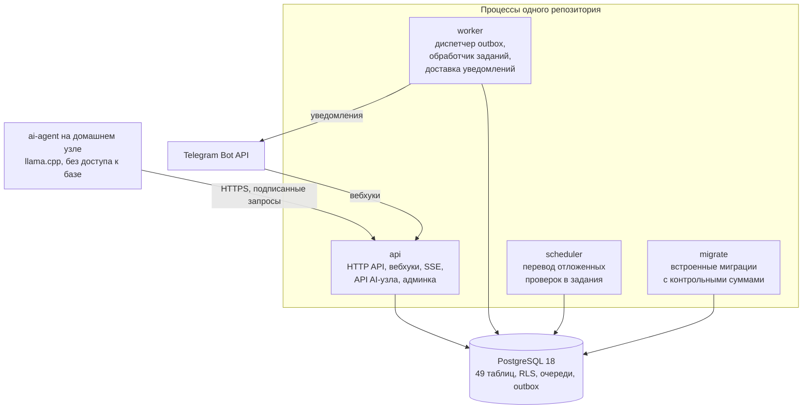
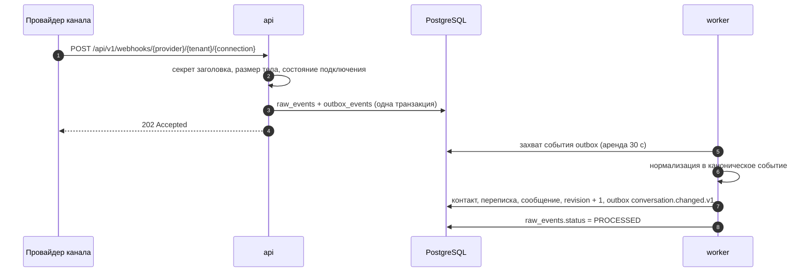
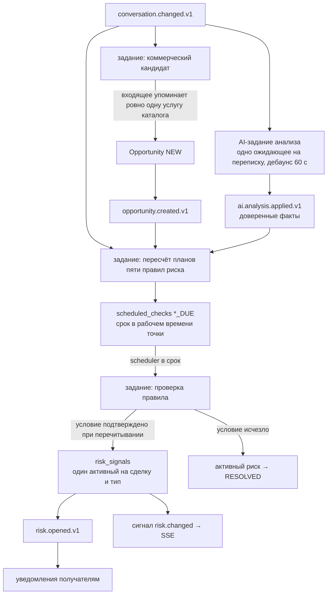
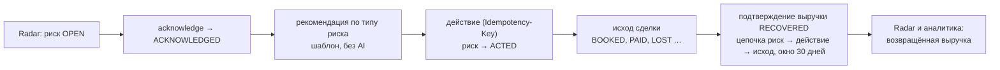
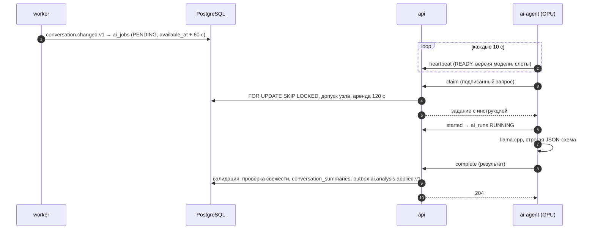

# 01 Обзор системы

## Зачем нужна система

LidRadar помогает малому бизнесу услуг (автосервис, детейлинг, салон,
мастерская) не терять деньги в переписках с клиентами. Система не продаёт и
не отвечает клиенту сама. Она наблюдает за переписками, находит коммерческие
возможности и риски их потери, вовремя сообщает об этом людям и фиксирует,
что было сделано и сколько денег вернулось.

Границы продукта закреплены явно: никаких автоответов клиенту, автономных
AI-продаж, полноценной CRM или BI-системы, биллинга, иерархии филиалов и
отдельного мобильного приложения. Эти запреты защищают архитектуру: система
остаётся одним монолитом поверх PostgreSQL и доказывает один сквозной
сценарий — возврат денег из переписки.

## Действующие лица

| Кто | Что делает в системе |
|---|---|
| Владелец организации (OWNER) | настраивает организацию, точки и часы работы, каталог услуг, каналы, состав участников, ML-согласие; видит аналитику и точность рисков; делает всё, что делает менеджер |
| Менеджер (MANAGER) | работает с Radar: читает переписки, подтверждает и закрывает риски, фиксирует действия и исходы, подтверждает выручку, настраивает личные уведомления |
| Клиент бизнеса | пишет в мессенджер; для системы он источник входящих сообщений, никаких аккаунтов и уведомлений у него нет |
| Провайдер канала | Telegram Connected Business Bot или произвольная система через универсальный вебхук; доставляет события и повторяет их при сбоях |
| Домашний AI-узел | GPU-машина с llama.cpp и агентом; забирает задания анализа и возвращает семантические факты |
| Платформенный администратор | смотрит очереди, каналы, узлы и трассы всех организаций, чинит мёртвые элементы; не имеет доступа к текстам переписок |

## Из чего состоит система

Все процессы собираются из одного кода и делят модули, но не память:
очереди, расписания, идемпотентность и журнал событий живут в PostgreSQL.
Поэтому любой процесс можно перезапустить или запустить в нескольких
экземплярах, не теряя принятую работу.

## Ключевые понятия за одну минуту

- **Организация** — граница всех данных; у каждой строки есть `tenant_id`, а
  PostgreSQL сам не отдаёт чужие строки (Row Level Security).
- **Переписка** — канонический диалог с контактом, собранный из событий
  канала; у неё есть номер ревизии, который растёт только при фактическом
  изменении.
- **Сделка (Opportunity)** — коммерческая возможность внутри переписки с
  этапами от `NEW` до `WON`/`LOST`; появляется, когда клиент упоминает
  услугу из каталога.
- **Риск** — сигнал, что сделку можно потерять: пять типов, четыре уровня
  важности, детерминированные правила в рабочем времени точки.
- **Radar** — экран активных рисков с серверным порядком приоритета.
- **Действие, исход, выручка** — неизменяемые факты о реакции людей и
  результате; выручка `RECOVERED` требует полной цепочки риск → действие →
  исход.
- **Уведомление** — логический факт «надо сообщить», отдельно от попыток
  доставки в Telegram или в приложение; получатель настраивает режим, порог,
  тихие часы и сводку.
- **AI** — асинхронный анализ переписки на домашнем узле; результат —
  факты с уверенностью, которые читают те же правила риска.

Полный список терминов — на странице [02 Глоссарий](02%20Глоссарий.md).

## Сквозные сценарии

### Входящее сообщение

Провайдер получает ответ до любой интерпретации: событие сохранено как есть.
Повтор того же события безопасен на каждом шаге — сырое событие
дедуплицируется по внешнему идентификатору, каноническое применение
идемпотентно, ревизия не растёт без фактического изменения.

### От сообщения к сделке и риску

Каждое правило хранит в проверке только идентификаторы и перечитывает
состояние в момент выполнения, поэтому опоздавшее задание не применяет
устаревший снимок. Пороги считаются в рабочем времени точки: ночь и выходные
не засчитываются менеджеру как молчание.

### Реакция человека и деньги

Все три факта — действие, исход, выручка — неизменяемы на уровне базы,
защищены ключом идемпотентности и попадают в аудит. Ответ бизнеса в
переписке закрывает риск `NO_RESPONSE` автоматически через ту же цепочку
событий.

### Асинхронный AI

AI никогда не пишет в сделки, риски или переписки напрямую. Он даёт факты
(`BOOKING_INTENT`, `BUSINESS_COMMITMENT`, `PRICE_MENTIONED`,
`FOLLOW_UP_CANDIDATE`) с уверенностью; доверенными считаются факты с
уверенностью не ниже 0,85, и только их читают правила. Устаревший результат
(переписка изменилась во время анализа) помечается `STALE` и не применяется.

### Обратная связь и аналитика

Менеджер ставит вердикт риску: `TRUE_POSITIVE` или `FALSE_POSITIVE` с
причиной. Вердикты хранятся навсегда вместе со снимком риска; ложное
срабатывание закрывает риск, причина «не лид» переводит сделку в `LOST`.
Точность по типам за окно обнаружения показывает, каким правилам можно
доверять (надёжной считается оценка при покрытии вердиктами не ниже 50 %).
Сводка аналитики считает сообщения, сделки, риски, исходы и деньги за
календарные даты в часовом поясе организации.

## Что система гарантирует

| Гарантия | Как обеспечена |
|---|---|
| Внешнее событие не теряется | сохраняется до обработки в одной транзакции с намерением обработать |
| Событие или задание выполняется хотя бы раз | очередь в PostgreSQL с арендой 30 с и повторами; павший процесс ничего не держит |
| Повтор безопасен | ключи дедупликации и уникальные ограничения на каждом шаге цепочки |
| Организации изолированы | фильтр в коде, составные внешние ключи с `tenant_id`, RLS в базе |
| Правила детерминированы | бизнес-состояние не зависит ни от AI, ни от Telegram |
| Журналы неизменяемы | действия, исходы, выручка, вердикты, аудит защищены триггерами |
| Деньги точны | десятичные типы и строки, никакой двоичной плавающей точки |

## Чего система не обещает

- Ровно одной обработки: повторы возможны и безопасны.
- Доставки уведомления при длительном отказе Telegram: после пяти попыток
  доставка помечается мёртвой, риск остаётся в Radar.
- Синхронного результата AI: очередь и узел могут отставать, семантические
  риски ждут.
- Хранения двоичных вложений: пока хранятся только метаданные.
