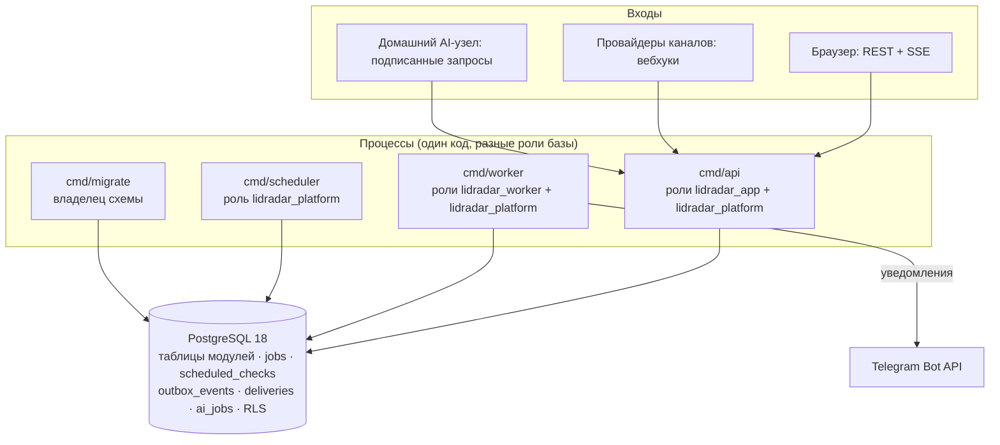
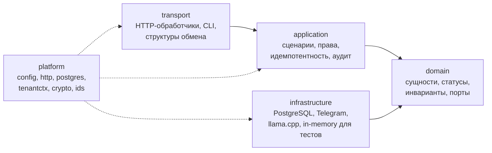
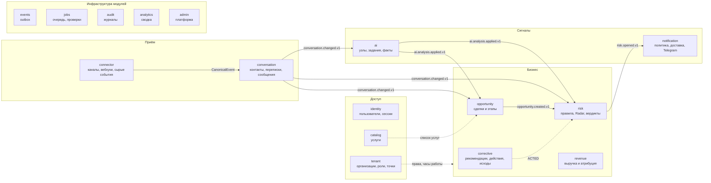
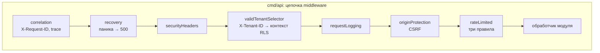

# 03 Архитектура

## Форма системы

LidRadar — **модульный монолит на Go**. Один репозиторий и один Go-модуль
собираются в несколько независимых процессов, которые делят код модулей, но
не делят память: всё долговременное состояние, очереди, расписания,
идемпотентность и журнал событий живут в **PostgreSQL — единственном
источнике истины**. Кэшей, брокеров сообщений и поисковых индексов нет по
решению, а не по забывчивости: они появились бы только через принятый ADR с
измеренной потребностью.

### Технологический базис

| Область | Выбор | Почему |
|---|---|---|
| Язык | Go 1.26, статические бинарники в `alpine`, без CGO | один образ на процесс, предсказуемая эксплуатация |
| HTTP | стандартный `net/http` и маршрутизатор `chi` | минимум зависимостей, прозрачные middleware |
| База | PostgreSQL 18, драйвер `pgx` v5, SQL без ORM | инварианты и очереди выражаются средствами базы |
| Деньги | десятичный тип `decimal`, суммы в API — строки | ни одной операции с плавающей точкой над деньгами |
| Идентификаторы и время | UUIDv7, `TIMESTAMPTZ` в UTC | сортируемые ключи, единое время |
| JSONB | только расширяемые данные: сырые события, метаданные, факты | бизнес-поля всегда колонки с ограничениями |
| Пароли | Argon2id | стойкость к перебору на GPU |
| Логи | `slog`, JSON, корреляция запросов | машинно читаемые журналы без секретов |
| Контракт API | OpenAPI 3.1, проверяется в CI | фронтенд и бэкенд работают от одного файла |
| Развёртывание | Docker Compose, один `Dockerfile` с аргументом `COMMAND` | одинаковая сборка для всех процессов |

Прямых внешних зависимостей Go всего четыре: `chi`, `pgx`, `decimal`,
`x/crypto`. Метрик Prometheus и трассировки OpenTelemetry пока нет;
наблюдаемость строится на структурированных логах, ежеминутном событии
состояния очередей и административной панели.

### Явные запреты MVP

GraphQL, WebSocket, Redis, Kafka, NATS, Kubernetes, Elasticsearch,
ClickHouse, микросервисы, Telegram-userbot и MTProto-сессии, автономные
AI-продажи и автоответы клиенту, полноценные CRM, BI и биллинг, иерархия
прав по филиалам, отдельное мобильное приложение. Обязательные
альтернативы: REST + OpenAPI, SSE только как сигнал инвалидации, PostgreSQL
для очередей и outbox, модули вместо сервисов, Connected Business Bot вместо
userbot, асинхронный AI, ограниченный семантическими фактами.

## Слои модуля

Каждый бизнес-модуль состоит из четырёх пакетов с жёстким направлением
зависимостей. Правила проверяет инструмент `archcheck` в CI: сборка с
нарушением не проходит.

| Слой | Может зависеть от | Не может |
|---|---|---|
| `domain` | только стандартная библиотека и `decimal` | платформа, `net/http`, любой слой другого модуля, внешние SDK |
| `application` | `domain`, платформа, `application` других модулей через интерфейсы | `infrastructure`, `transport` |
| `infrastructure` | `domain`, платформа, драйверы | `transport` |
| `transport` | всё выше | — |
| команды `cmd/*` | всё | in-memory адаптеры `NewMemory*` (только для тестов) |

Следствие: бизнес-правила живут в `domain` и тестируются без базы,
адаптеры заменяемы, рабочие процессы никогда не запускаются на заглушках.

## Карта модулей

Сплошные стрелки — события outbox, пунктирные — вызовы через интерфейсы
уровня `application` или разрешённые прямые чтения. Полное описание каждого
модуля — на странице [04 Модули и зоны ответственности](04%20Модули%20и%20зоны%20ответственности.md).

### Общение между модулями

Правило: прямое чтение или запись данных другого модуля — архитектурное
решение с ADR, а не сокращение пути. Действующие исключения:

| Модуль | Что читает или пишет у других | Основание |
|---|---|---|
| `risk` | таблицы переписок, сделок, точек, расписаний, фактов AI, исходов, действий, выручки (только чтение) | ADR 0007, 0038 |
| `corrective` | читает риски, сделки, членства; **пишет** `risk_signals.status → ACTED` в транзакции действия | спецификация действий |
| `revenue` | читает риски, действия, исходы, сделки для проверки цепочки | спецификация выручки |
| `conversation` | блокирует `channel_connections` при приёме | ADR 0025 |
| `opportunity` | читает факты AI и сообщения-доказательства | ADR 0008 |
| `ai` | строит контекст из организаций, точек, переписок, сообщений | ADR 0008 |
| `notification` | читает организации, членства, риски, сделки, переписки, контакты | ADR 0029, 0037 |
| `analytics` | читает факты всех модулей в одной read-only транзакции | ADR 0039 |
| `admin` | читает всё; правит статусы четырёх очередей | ADR 0040 |
| `loadgen` (инструмент испытаний) | пишет все таблицы напрямую | ADR 0042 |

Всё остальное — события outbox и задания очереди с версионированными
именами (`<домен>.<событие>.v1`) и интерфейсы, которые внедряются в
композиционных корнях `cmd/*`.

## Процессы

| Процесс | Роль в системе | Пулы PostgreSQL | Особенности |
|---|---|---|---|
| `api` | HTTP API, вебхуки, SSE, API AI-узла, администрирование | `lidradar_app` для организаций, `lidradar_platform` для узла и админки | держит отдельное соединение `LISTEN` для сигналов SSE |
| `worker` | outbox → задания → обработчики; доставка уведомлений; ежеминутная диагностика очередей | `lidradar_worker` для обработчиков, `lidradar_platform` для захвата | одна горутина, три очереди по кругу, масштабируется числом процессов |
| `scheduler` | перевод просроченных проверок в задания | `lidradar_platform` | пачки по 100 |
| `migrate` | применение встроенных миграций | владелец схемы | одна транзакция под advisory-lock |
| `ai-agent` | домашний узел: pull заданий, вызов llama.cpp | без базы | только HTTPS к API |
| `platform-admin`, `ai-node-register`, `ai-node-manage`, `load-generate` | служебные CLI | владелец схемы | первый администратор и регистрация узла только отсюда |
| `ai-benchmark`, `ai-dataset-generate`, `ai-dataset-audit` | измерение и фиксация модели | без базы | пороги качества передаются явно |

Все процессы читают типизированную конфигурацию из переменных окружения и
целиком валидируют её при старте; единственная обязательная переменная —
`LIDRADAR_ENV`. Долгоживущие процессы обрабатывают `SIGINT` и `SIGTERM` и
останавливаются плавно.

## Контракты

| Контракт | Где | Что закрепляет |
|---|---|---|
| REST | `contracts/openapi/openapi.yaml` (OpenAPI 3.1) | все пути подключены к рабочему API; схемы безопасности `sessionCookie` и `aiNodeBearer` |
| Результат AI | `contracts/ai/analyze_conversation_v1.schema.json` | строгая JSON-схема; тот же валидатор у агента и бенчмарка |
| События и задания | версионированные строки в коде | `conversation.changed.v1`, `risk.opened.v1`, `risk.evaluate-no-response.v1`, … — изменение формы означает новую версию |
| Схема базы | миграции `000001…000021` с контрольными суммами | только вперёд; готовность API требует совпадения журнала |

## Политика изменений

Изменение формы системы, границ модулей, направления зависимостей, политики
источника истины или способа общения модулей требует принятого ADR до
реализации. Технологии из списка запретов не вводятся «временно». Новый
модуль, новое прямое чтение чужой таблицы, новый процесс — всегда через ADR
с измеренной потребностью, альтернативами, эксплуатационной ценой и планом
отката. Индекс решений — на странице
[13 Архитектурные решения (ADR)](13%20Архитектурные%20решения%20ADR.md).
