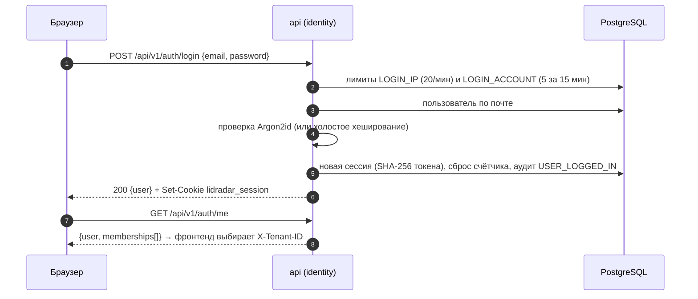
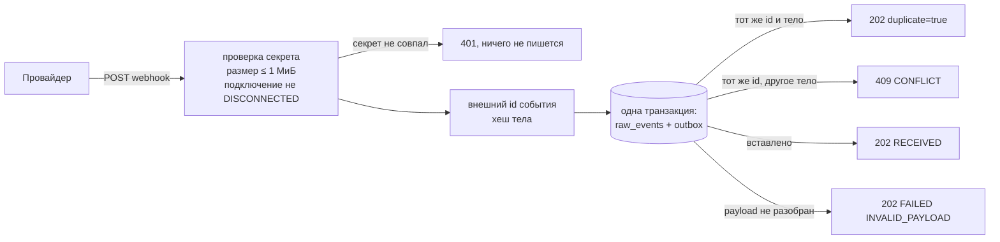
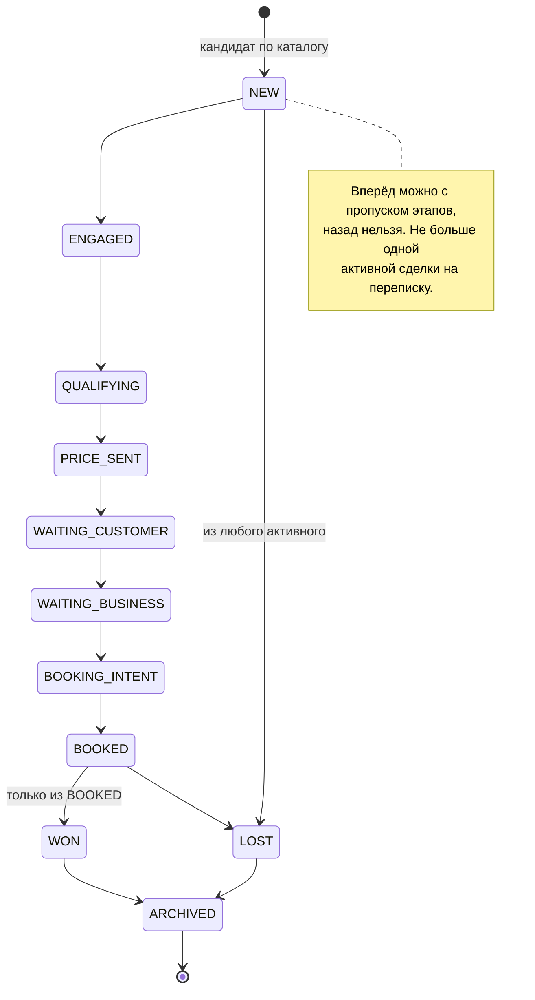
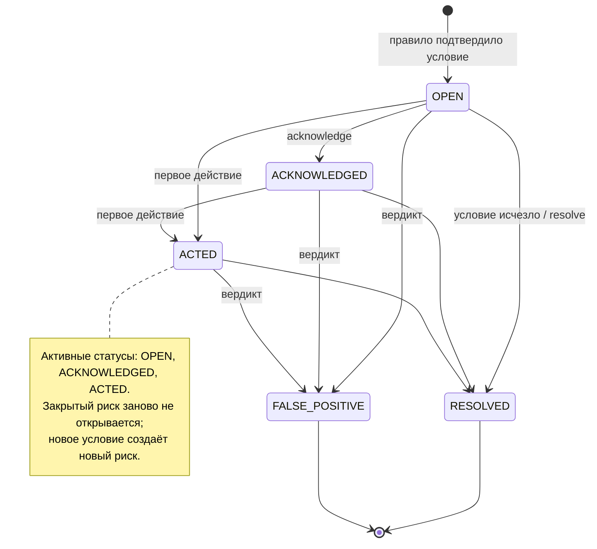
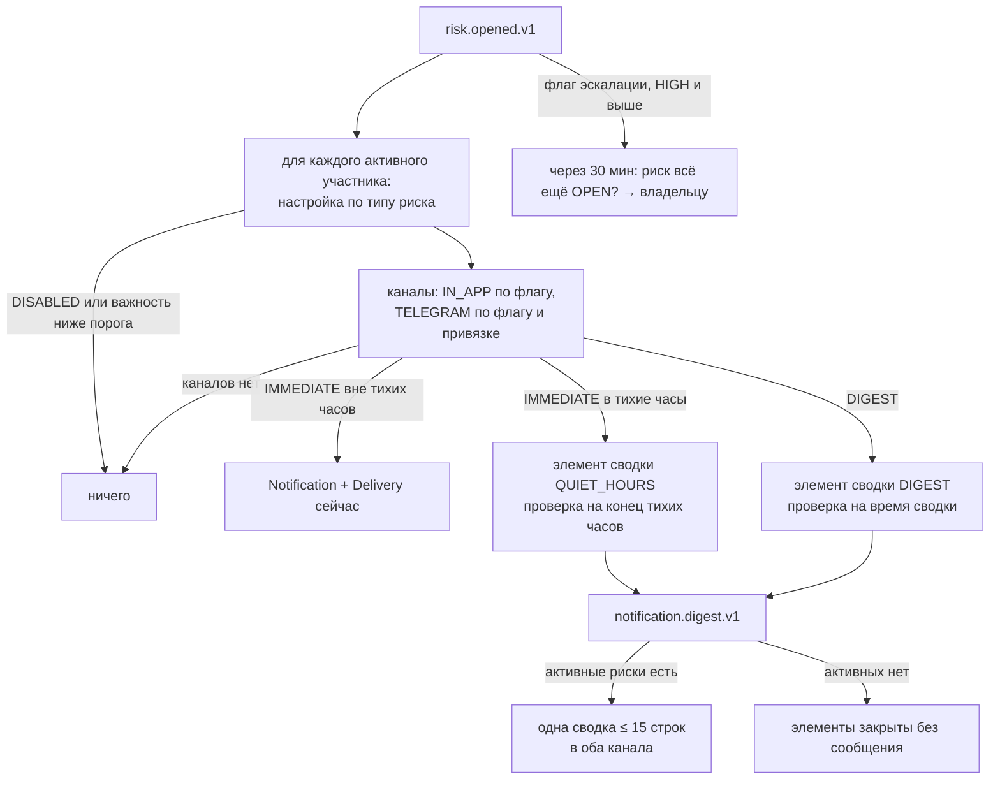

# 04 Модули и зоны ответственности

Каждый раздел описывает один модуль: чем он владеет, какие правила
закреплены в его домене, какие сценарии предоставляет, что читает у соседей
и что публикует. Общие соглашения для всех модулей:

- права проверяются до любой мутации; нужны активное членство в активной
  организации и разрешение роли;
- ошибки базы переводятся в доменные: конфликт (`409`), не найдено (`404`),
  неверный ввод (`400`); всё остальное — `500` без деталей;
- запись аудита выполняется сразу после успешного изменения, ошибка записи
  возвращается вызывающему (след обязателен);
- идентификатор организации наружу в JSON не отдаётся.

## Карта ответственности

| Модуль | Владеет | Публикует | Право |
|---|---|---|---|
| `identity` | пользователи, сессии, троттлинг входа | аудит входа | — |
| `tenant` | организации, членства, роли и разрешения, точки, часы работы, ML-согласие | — | `organization.manage`, `location.manage`, `member.manage` |
| `catalog` | каталог услуг | — | `service.manage` |
| `connector` | подключения каналов, вебхуки, сырые события, нормализация | `connector.raw-event.received.v1` | `integration.manage` |
| `conversation` | контакты, переписки, сообщения, вложения | `conversation.changed.v1` | `conversation.read` |
| `opportunity` | сделки, этапы, история переходов | `opportunity.created.v1`, `opportunity.stage_changed.v1` | `opportunity.manage` |
| `risk` | сигналы риска, правила, проверки, Radar, SSE, вердикты и точность | `risk.opened.v1`, сигналы `risk.*` | `risks.read`, `risks.manage`, `analytics.read` |
| `corrective` | рекомендации, действия, исходы, ключи идемпотентности | сигнал `risk.changed` | `risks.manage` |
| `revenue` | события выручки и атрибуции | сигнал `risk.changed` | `revenue.confirm`, `revenue.read` |
| `notification` | уведомления, доставки, политика, сводки, Telegram-привязки | — | активное членство |
| `ai` | узлы, задания, прогоны, семантические сводки | `ai.analysis.applied.v1` | секрет узла |
| `events`, `jobs` | outbox, очередь заданий, отложенные проверки | — | — |
| `analytics` | сводка показателей (без своих таблиц) | — | `analytics.read` |
| `admin` | платформенные администраторы, панели очередей, трасса | — | `PLATFORM_ADMIN` |
| `audit` | журналы аудита | — | — |

## identity — пользователи и сессии

Владеет пользователями, непрозрачными серверными сессиями и постоянным
троттлингом входа. Не владеет организациями и правами: `/auth/me` получает
членства через узкий контракт модуля `tenant`.

Правила: почта нормализуется и проверяется как адрес без имени отправителя
(≤ 254 символов); имя 1…200; пароль 12…1024 байт; сессия хранит только
SHA-256 токена; срок сессии 30 суток по умолчанию. Неизвестная почта
проходит холостое хеширование, чтобы время ответа не выдавало существование
учётной записи; неверный пароль и отключённый пользователь дают один и тот
же ответ.

| Ограничение | Предел | Окно |
|---|---|---|
| регистрация с адреса | 5 | 1 час |
| вход с адреса | 20 | 1 минута |
| неудачи по учётной записи | 5 | 15 минут, сброс при успехе |
| ротация сессии с адреса | 60 | 1 минута |

Недоступность троттлера блокирует вход, а не пропускает его. Аудит:
`USER_REGISTERED`, `USER_LOGGED_IN`, `USER_LOGGED_OUT`.

## tenant — организации, роли, точки

Владеет организациями, членствами, точками с часами работы, ML-согласием и
**единственной таблицей разрешений**, которой пользуются все модули.

| Право | OWNER | MANAGER |
|---|---|---|
| `risks.read`, `risks.manage`, `conversation.read`, `opportunity.manage`, `action.manage`, `outcome.manage`, `revenue.confirm` | да | да |
| `revenue.read`, `analytics.read`, `integration.manage`, `organization.manage`, `location.manage`, `service.manage`, `notification.manage`, `member.manage` | да | нет |

Проверка права требует членство `ACTIVE` и организацию `ACTIVE`:
приостановленная или архивная организация теряет все права разом.

Правила: организация — имя 1…200, валидная IANA-зона, валюта из трёх букв
(по умолчанию `RUB`); членство физически не удаляется, отзыв — `DISABLED` с
отметкой времени; точка — имя, зона, порог ответа 1…1440 минут (по умолчанию
45); расписание — ровно семь строк, у открытого дня `opens < closes`,
формат `HH:MM`; ML-согласие — одна область `DATASETS`, одно действующее,
история сохраняется, удаление и повторный отзыв запрещены триггером.
Создание организации требует только аутентификации и атомарно делает
создателя владельцем. Приглашений участников в модуле нет.

## catalog — каталог услуг

Владеет позициями каталога. Цена — строка вида `1200.00` (до 12 цифр и 2
знаков), хранится и возвращается точно, отсутствие цены — пусто, не ноль;
`priceFrom <= priceTo`; имя схлопывает пробелы, хранится нормализованная
форма для поиска; точка принадлежит той же организации по составному
внешнему ключу. Единственное право `service.manage` требуется и для чтения:
каталог виден только владельцу. Каталог читает модуль `opportunity` для
распознавания коммерческого кандидата.

## connector — каналы и приём событий

Владеет подключениями каналов, сырыми событиями, проверкой подлинности
вебхука, зашифрованными реквизитами, здоровьем подключения и нормализацией
провайдерского payload в канонические события. Не создаёт переписки — это
делает `conversation`; не запускает нормализацию внутри HTTP-запроса.

Провайдеры и способности: `CONNECTED_BUSINESS_BOT` (Telegram, единственный с
отправкой), `GENERIC_WEBHOOK` (без импорта истории), `TEST`, `IMPORT`.
Подключение: имя 1…200, секрет вебхука 16…256 байт (хранится SHA-256),
реквизиты Telegram шифруются AES-256-GCM и записываются в базу до сетевого
вызова `setWebhook`; ошибка регистрации у Telegram сохраняется как состояние
`ERROR/TELEGRAM_WEBHOOK_SETUP_FAILED`, а не откатывает подключение.
Отключение сначала меняет локальный статус и пишет аудит, потом удаляет
вебхук у провайдера; повтор допустим.

Нормализация (задание `connector.normalize-raw-event.v1`): уже
обработанное событие — успех без действий; служебные обновления Telegram
(`/start`, кнопки) уходят в модуль уведомлений; остальное превращается в
канонические события и применяется к переписке по одному; ошибка приёмника
оставляет сырое событие для повтора, невалидный payload помечает его
`FAILED`.

Telegram-специфика: ровно одно из полей `business_connection`,
`business_message`, `edited_business_message`, `deleted_business_messages`,
`message`, `callback_query`; идентификаторы переписки
`businessConnectionId:chatId`, сообщения `chatId:messageId`; направление
`OUTGOING`, если отправитель — бизнес; вложения — только метаданные.

## conversation — контакты, переписки, сообщения

Владеет контактами, внешними личностями, переписками, сообщениями и
метаданными вложений. Не знает провайдеров, не принимает решений о сделке
или риске, не хранит двоичные файлы.

Приём канонического события — одна транзакция: блокировка подключения →
контакт (внешняя личность под блокировкой, последняя запись побеждает по
времени) → переписка (создаётся `ACTIVE`) → сообщение (повтор идентичного
изменения ничего не меняет, расхождение содержимого — конфликт) → полная
замена вложений → пересчёт границ переписки и `revision + 1` → событие
`conversation.changed.v1` **только при фактическом изменении**. Правка
обновляет поля сообщения, удаление ставит отметку и не стирает строку.

Чтение: списки переписок и сообщений с курсорной пагинацией (`limit`
1…100, по умолчанию 50), детали переписки с контактом. Страница сообщений
вычитывается целиком, вложения загружаются одним запросом — вложенный запрос
при открытом курсоре требовал второе соединение и блокировал пул под
нагрузкой (найдено нагрузочным испытанием).

## opportunity — сделки

Владеет сделками и историей переходов. Не создаёт риски, не считает
фактическую выручку.

Кандидат создаётся заданием `opportunity.evaluate-commercial-candidate.v1`
(дедупликация по ревизии переписки): переписка активна, последнее сообщение
входящее текстовое и не удалено, пословно упоминает **ровно одну** активную
услугу каталога (общую или той же точки). Сумма ставится только при равных
`priceFrom` и `priceTo`. Доверенные факты AI двигают сделку вперёд в
порядке цена → напоминание → намерение записи (`PRICE_SENT` →
`WAITING_CUSTOMER` → `BOOKING_INTENT`), оценка обновляется только в валюте
сделки и не понижает более уверенную. Пользователь меняет этап командой
(источник `USER`, аудит `OPPORTUNITY_STAGE_CHANGED`); вердикт «не лид» по
риску переводит активную сделку в `LOST`.

## risk — правила, Radar, вердикты

Владеет сигналами риска, вердиктами, read-моделью Radar и хабом сигналов
SSE. Читает только для чтения переписки, сделки, точки, расписания, факты
AI, исходы, действия, выручку.

| Правило | Порог в рабочем времени точки | Важность | Что закрывает |
|---|---|---|---|
| `NO_RESPONSE` | порог ответа точки (по умолчанию 45 мин), `CRITICAL` от 90 мин | HIGH / CRITICAL | исходящий ответ, закрытие сделки |
| `BOOKING_NOT_CONFIRMED` | 30 мин после доверенного намерения записи на этапах от QUALIFYING до BOOKING_INTENT | CRITICAL | BOOKED, WON, LOST, ARCHIVED |
| `PROMISE_NOT_FULFILLED` | срок из текста обещания («через час», «до 18:00», «завтра», части дня; горизонт 14 дней) либо 60 мин | HIGH, только HYBRID | любое исходящее после обещания |
| `CUSTOMER_SILENT_AFTER_PRICE` | 24 ч после цены, эскалация до HIGH через 48 ч | MEDIUM / HIGH | входящее клиента, исход LOST или NOT_A_LEAD |
| `FOLLOW_UP_CANDIDATE` | 24 ч после колебания клиента | MEDIUM | входящее клиента |

Порог доверия к факту AI везде 0,85. Проверки хранят только идентификаторы,
состояние перечитывается в момент выполнения. Отсутствие семи строк
расписания или точки — постоянная ошибка (`RISK_PLAN_INVALID`), а не
круглосуточный режим по умолчанию.

Radar: сводка (активные и критические риски, потенциал в валюте
организации, возвращённая выручка — последняя не уменьшается при закрытии
рисков), список с фильтрами по статусу, точке, важности и типу, порядок
`важность ↓, намерение записи ↓, потенциал ↓, срок ↑, обнаружение ↑`, курсор
привязан к набору фильтров. Команды `acknowledge` и `resolve` идемпотентны и
пишут аудит.

Вердикты: `TRUE_POSITIVE` / `FALSE_POSITIVE` с обязательной причиной для
ложного, заметка ≤ 1000 символов, append-only со снимком риска;
`FALSE_POSITIVE` закрывает риск, `NOT_A_LEAD` переводит сделку в `LOST`;
публикуется сигнал `risk.false_positive`. Точность по типам за окно
обнаружения доступна владельцу.

## corrective — рекомендации, действия, исходы

Никогда не обращается к AI: тип риска читается из базы, шаблон
детерминирован и покрывает все пять типов.

| Тип риска | Рекомендация |
|---|---|
| `NO_RESPONSE` | Ответить клиенту сейчас. |
| `BOOKING_NOT_CONFIRMED` | Предложить клиенту конкретный свободный слот. |
| `PROMISE_NOT_FULFILLED` | Выполнить обещанное клиенту или сообщить новый точный срок. |
| `CUSTOMER_SILENT_AFTER_PRICE` | Напомнить клиенту о предложении и уточнить, остались ли вопросы. |
| `FOLLOW_UP_CANDIDATE` | Уточнить, остаётся ли услуга актуальной. |

Действия и исходы требуют `Idempotency-Key`; всё пишется одной транзакцией:
ключ, факт, перевод риска в `ACTED` (только из активных статусов), аудит.
Активное членство дополнительно проверяется в самом SQL. Журналы
неизменяемы на уровне базы.

## revenue — выручка и атрибуция

Сумма — строго положительная десятичная строка, валюта из трёх букв,
статус `CONFIRMED`, источник `USER_CONFIRMED`. Атрибуция одна на событие:
`RECOVERED` требует риск, действие и исход **той же сделки**, созданные не
позже подтверждения и не раньше чем за 30 дней (проверяется кодом и
триггером базы); `ORGANIC` и `UNKNOWN` требуют их отсутствия. Одна
`RECOVERED` на сделку — доплаты подтверждаются как `ORGANIC`. Показатель
возвращённой выручки складывает только `CONFIRMED` + `RECOVERED` в
запрошенной валюте.

## notification — уведомления и Telegram

Владеет уведомлениями, доставками, личными настройками, очередью сводок и
привязками Telegram. Логическое уведомление и попытки доставки разделены:
отказ канала никогда не меняет риск и не создаёт второй факт.

По умолчанию `DIGEST` для `CUSTOMER_SILENT_AFTER_PRICE` и
`FOLLOW_UP_CANDIDATE`, `IMMEDIATE` для остальных; тихие часы 22:00–08:00
выключены; время сводки 09:00. Доставка в Telegram — `sendMessage` с
кнопками `OPEN_RISK`, `ACKNOWLEDGE`, `SNOOZE`; отказ 429/5xx/сеть → новая
строка попытки через 5 с, 30 с, 2 мин, 10 мин, после пятой — `DEAD`.
Привязка — одноразовый код на 15 минут в ссылке `t.me/<bot>?start=…`,
`/start` только из личного чата организации, которой принадлежит код;
идентификаторы Telegram наружу не отдаются. Настройки: всегда пять записей
(включая значения по умолчанию), полная замена с аудитом
`NOTIFICATION_POLICY_CHANGED`, сброс с `NOTIFICATION_POLICY_RESET`.

## ai — очередь анализа

Полностью описан на странице [08 AI-контур](08%20AI-контур.md). Кратко:
одно ожидающее задание на переписку с дебаунсом 60 с; узел забирает задания
подписанными запросами с арендой 120 с и потолком 15 мин; результат
проходит строгую схему и проверку свежести; факты с уверенностью ≥ 0,85
становятся доверенными и читаются правилами риска и переходами сделки.

## events и jobs — outbox и очередь

Описаны на странице [07 Фоновая обработка](07%20Фоновая%20обработка.md).
Outbox: событие пишется в транзакции владельца изменения, идентичность —
его `id`, доставка как минимум один раз, нет обработчика — сразу `DEAD`.
Очередь: ключ дедупликации в паре с типом и организацией не истекает;
захват `FOR UPDATE SKIP LOCKED` с арендой 30 с; постоянные ошибки — сразу
`DEAD`, временные — по расписанию повторов. Проверки по расписанию
переводятся планировщиком в задания с тем же идентификатором и
`available_at = due_at`.

## analytics — сводка

Собственных таблиц нет. Период — календарные даты в часовом поясе
организации (по умолчанию 30 дней, максимум 366), одна транзакция
`REPEATABLE READ READ ONLY`. Метрики: сообщения, сделки по истории этапов,
риски по типам, исходы, деньги в валюте организации (потенциал активных
сделок, подтверждённая выручка, из неё `RECOVERED`, число платежей).

## admin — платформенное администрирование

Работает вне организации на платформенной роли; каждый вызов, кроме
`GET /admin/me`, требует активной строки в `platform_admins`. Read-модели:
организации со счётчиками, каналы, панель очередей, последние задания,
мёртвые элементы, AI-узлы и прогоны, семантический результат переписки,
потребление за окно, трасса «сообщение → задания → AI → риски → уведомления
→ действия → исходы → выручка». Команды `retry`/`replay` (только `DEAD`,
сброс попыток) и `discard`; каждая пишет `admin_audit_log` в той же
транзакции. Read-модели никогда не отдают тексты сообщений, промпты, сырой
вывод модели и тексты уведомлений.

## audit — журналы

`audit_log` (действия участников; актор обязан быть участником по внешнему
ключу) и `auth_audit_log` (вход, выход, регистрация; из сетевых данных
только IP). Оба append-only. Пишут: identity, tenant, connector,
opportunity, risk, corrective, revenue, notification; `catalog` аудит не
пишет.
