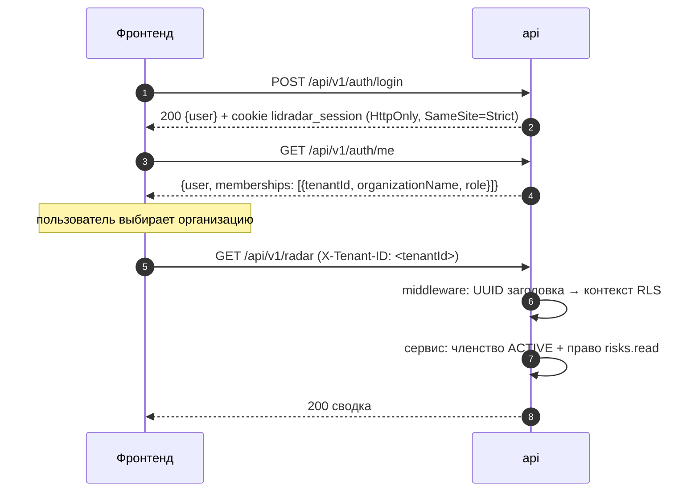

# 05 HTTP API

Нормативный контракт — файл OpenAPI 3.1 в репозитории
(`contracts/openapi/openapi.yaml`); все описанные пути подключены к рабочему
API, контракт проверяется в CI. Здесь — соглашения, которых OpenAPI не
показывает, и каталог конечных точек с правами и кодами.

## Аутентификация и выбор организации



- **Сессия** — cookie `lidradar_session`; заголовок `Authorization` для
  пользовательского API не используется. Срок 30 суток по умолчанию,
  `refresh` ротирует токен, `logout` отзывает.
- **Организация** выбирается заголовком `X-Tenant-ID`. Без него маршруты
  организации отвечают `400 TENANT_REQUIRED`, невалидный UUID → `400
  INVALID_TENANT`. Не требуют заголовка: `/health/*`, `/api/v1/auth/*`,
  создание организации, `/api/v1/admin/*`, вебхуки, API узла.
- **Права** проверяются по роли членства (полная таблица — в разделе
  04). Чужой `X-Tenant-ID` → `403 FORBIDDEN`; чужой идентификатор внутри
  своей организации → `404 NOT_FOUND` без раскрытия данных.
- **API AI-узла** (`/internal/v1/ai/*`) — `Authorization: Bearer <секрет>`
  плюс подписанные заголовки, см. раздел 08.
- **Вебхуки** — без сессии, секрет подключения в заголовке провайдера.

## Формат данных

| Правило | Как |
|---|---|
| Тело | JSON, ≤ 64 КиБ (вебхуки и API узла ≤ 1 МиБ); неизвестные поля, второе значение, `\x00` и невалидный UTF-8 → `400` |
| Деньги | строки с двумя знаками: `"1200.00"`; число вместо строки отвергается |
| Уверенность | число 0…1 с тремя знаками |
| Время | RFC 3339 в UTC; даты аналитики `YYYY-MM-DD` в часовом поясе организации |
| Идентификаторы | UUID (у новых записей UUIDv7) |
| Списки | всегда `items: []`; `nextCursor` только при наличии следующей страницы |
| Организация | `tenantId` в ответах не возвращается |

## Ошибки

Единый конверт:

```json
{"error":{"code":"INVALID_ARGUMENT","message":"Invalid request","details":{},"traceId":"7f0c…"}}
```

| HTTP | Код | Когда |
|---|---|---|
| 400 | `INVALID_ARGUMENT` | неверное тело, параметр, недопустимое значение |
| 400 | `TENANT_REQUIRED` | нет `X-Tenant-ID` на маршруте организации |
| 400 | `INVALID_TENANT` | `X-Tenant-ID` не UUID |
| 401 | `UNAUTHENTICATED` | нет или истекла сессия; узел не прошёл подпись |
| 401 | `INVALID_CREDENTIALS` | вход: неверные данные, нет пользователя, отключён |
| 401 | `WEBHOOK_UNAUTHENTICATED` | секрет вебхука не совпал |
| 403 | `FORBIDDEN` | нет права, членства или статуса администратора |
| 403 | `ORIGIN_NOT_ALLOWED` | мутация с недоверенного `Origin` |
| 404 | `NOT_FOUND` | ресурс не найден в организации |
| 404 | `ROUTE_NOT_FOUND` | нет такого маршрута |
| 405 | `METHOD_NOT_ALLOWED` | метод не поддержан |
| 409 | `CONFLICT` | конфликт состояния (дубликат, неподходящий статус очереди, чужая переписка у контакта) |
| 409 | `EMAIL_ALREADY_REGISTERED` | регистрация |
| 409 | `INVALID_STAGE_TRANSITION` | недопустимый переход этапа сделки |
| 409 | `IDEMPOTENCY_CONFLICT` | тот же `Idempotency-Key` с другим содержимым |
| 409 | `RECOVERED_ALREADY_ATTRIBUTED` | вторая атрибуция `RECOVERED` на сделку |
| 409 | `LEASE_LOST` | API узла: аренда задания потеряна |
| 413 | `PAYLOAD_TOO_LARGE` | вебхук больше 1 МиБ |
| 429 | `RATE_LIMITED` | превышен предел по адресу или учётной записи, есть `Retry-After` |
| 503 | `SERVICE_NOT_READY` | база или миграции не совпали со сборкой |
| 503 | `CONNECTOR_UNAVAILABLE` | Telegram не настроен, недоступен или подключение отключено |
| 500 | `INTERNAL_ERROR` | необработанная ошибка; единый код во всех модулях |

`message` никогда не содержит секретов, текста сообщений и деталей исключений.

## Идемпотентность и повторы

| Ситуация | Поведение |
|---|---|
| действия, исходы, выручка | обязателен `Idempotency-Key` (1…255): первая запись `201`, точный повтор `200` с сохранённым ответом, другое содержимое → `409 IDEMPOTENCY_CONFLICT`; ключ бессрочный |
| `acknowledge`, `resolve`, смена этапа, деактивация услуги, повтор ML-согласия | идемпотентны по семантике: повтор `200`/`204` |
| вебхук | повтор с тем же телом → `202` и `duplicate: true`; другое тело под тем же внешним id → `409` |

Рекомендация фронтенду: генерировать UUID ключа на каждую попытку
пользователя и повторять с тем же ключом при сетевой ошибке.

## Пагинация

Курсорная: `limit` 1…100 (по умолчанию 50), `cursor` — непрозрачная строка.
Переписки — по времени обновления, сообщения — по времени отправки, риски —
серверным порядком Radar; курсор рисков привязан к набору фильтров и с
другими фильтрами отвергается.

## Корреляция, заголовки безопасности, лимиты

- Клиент может передать `X-Request-ID` и `Traceparent`; ответ всегда несёт
  `X-Request-ID`, `traceId` попадает в конверт ошибки и в логи.
- Каждый ответ несёт `X-Content-Type-Options: nosniff`, `X-Frame-Options:
  DENY`, `Referrer-Policy: no-referrer`, `Cache-Control: no-store`,
  строгую `Content-Security-Policy`, `Permissions-Policy`; HSTS — при
  включённых Secure cookie или TLS.
- Мутации с заголовком `Origin` принимаются только с того же origin или из
  списка доверенных; иначе `403 ORIGIN_NOT_ALLOWED` (защита от CSRF в
  дополнение к `SameSite=Strict`).
- Ограничение по адресу соединения: `/api/v1/auth/*` 120 запросов в минуту,
  `/api/v1/webhooks/*` 1200, `/internal/v1/ai/*` 600; ответ `429` с
  `Retry-After`. Вход дополнительно ограничен по учётной записи.

## SSE: сигналы об изменениях

`GET /api/v1/events` (право `risks.read`) отдаёт `text/event-stream` только
как сигнал «перечитай REST», без бизнес-данных.

| Событие | Когда |
|---|---|
| `risk.changed` | открыт или обновлён риск, записано действие, подтверждена возвращённая выручка |
| `risk.acknowledged` | риск принят в работу |
| `risk.resolved` | риск закрыт |
| `risk.false_positive` | риск закрыт вердиктом о ложном срабатывании |

Тело события — `{"resourceId":"<uuid риска>"}`; комментарий-heartbeat каждые
20 с; идентификаторов событий и `Last-Event-ID` нет: после разрыва клиент
переподключается и перечитывает `GET /api/v1/radar` и списки. Буфер
подписчика 16 сигналов, переполнение сбрасывает сигнал — поэтому перечитывать
стоит и по таймеру.

## Каталог конечных точек

Обозначения: 🔓 без сессии; 🍪 сессия; 🍪+T сессия и `X-Tenant-ID`; A —
`PLATFORM_ADMIN`.

### Служебные

| Метод | Путь | Доступ | Ответ |
|---|---|---|---|
| GET | `/health/live` | 🔓 | `200 {"status":"ok"}` |
| GET | `/health/ready` | 🔓 | `200` с версией сборки и миграциями; `503 SERVICE_NOT_READY` |

### Аутентификация

| Метод | Путь | Доступ | Тело → ответ |
|---|---|---|---|
| POST | `/api/v1/auth/register` | 🔓 | `{email,password,displayName}` → `201 {user}` + cookie; `409`, `429` |
| POST | `/api/v1/auth/login` | 🔓 | `{email,password}` → `200 {user}` + cookie; `401`, `429` |
| POST | `/api/v1/auth/logout` | 🍪 | `204`, cookie стирается |
| POST | `/api/v1/auth/refresh` | 🍪 | `200 {user}` + новая cookie |
| GET | `/api/v1/auth/me` | 🍪 | `{user, memberships}` только активные членства активных организаций |

### Организация, точки, ML-согласие

| Метод | Путь | Право | Ответ |
|---|---|---|---|
| POST | `/api/v1/organizations` | 🍪 | `{name,defaultTimezone,defaultCurrency?}` → `201`, создаёт OWNER |
| GET | `/api/v1/organization` | членство | `200 Organization` |
| PATCH | `/api/v1/organization` | `organization.manage` | частичное обновление → `200` |
| GET | `/api/v1/locations` | членство | `{items}` |
| POST | `/api/v1/locations` | `location.manage` | `{name,timezone,responseThresholdMinutes?,active?}` → `201` |
| PATCH | `/api/v1/locations/{id}` | `location.manage` | `200` |
| PUT | `/api/v1/locations/{id}/business-hours` | `location.manage` | `{timezone, days: 7 × {weekday,closed,opensAt?,closesAt?}}` → `200` |
| GET | `/api/v1/organization/ml-consent` | членство | `{scope, active, consent}` |
| POST | `/api/v1/organization/ml-consent` | `organization.manage` | `201` при выдаче, `200` при повторе |
| DELETE | `/api/v1/organization/ml-consent` | `organization.manage` | `204` |

### Каталог услуг

| Метод | Путь | Право | Ответ |
|---|---|---|---|
| GET | `/api/v1/services` | `service.manage` | `{items}` |
| POST | `/api/v1/services` | `service.manage` | `{name,locationId?,priceFrom?,priceTo?,currency?}` → `201`; чужая точка → `404` |
| PATCH | `/api/v1/services/{id}` | `service.manage` | `null` сбрасывает точку и цены → `200` |
| DELETE | `/api/v1/services/{id}` | `service.manage` | деактивация → `204`, повтор `204` |

### Каналы и вебхуки

| Метод | Путь | Доступ | Ответ |
|---|---|---|---|
| GET | `/api/v1/integrations` | `integration.manage` | `{items}` без хешей и реквизитов |
| POST | `/api/v1/integrations/{provider}/connect` | `integration.manage` | `{name,locationId?,webhookSecret,botToken?}` → `201`; Telegram без публичного URL и ключа → `503` |
| DELETE | `/api/v1/integrations/{id}` | `integration.manage` | `204` |
| GET | `/api/v1/integrations/{id}/health` | `integration.manage` | `ConnectionHealth` |
| POST | `/api/v1/webhooks/{provider}/{tenantId}/{connectionId}` | 🔓 + секрет | `202 {rawEventId,status,duplicate}`; `401`, `404`, `409`, `413`, `503` |

| Провайдер | Заголовок секрета | Тело |
|---|---|---|
| `TEST`, `IMPORT`, `GENERIC_WEBHOOK` | `X-LidRadar-Webhook-Secret` | конверт `{id,type,occurredAt,data}` с каноническими полями сообщения |
| `CONNECTED_BUSINESS_BOT` | `X-Telegram-Bot-Api-Secret-Token` | Telegram `Update` ровно с одним из полей бизнес-сообщений или служебных |

### Переписки

| Метод | Путь | Право | Ответ |
|---|---|---|---|
| GET | `/api/v1/conversations` | `conversation.read` | `{items,nextCursor}` |
| GET | `/api/v1/conversations/{id}` | `conversation.read` | `{conversation,contact}` |
| GET | `/api/v1/conversations/{id}/messages` | `conversation.read` | `{items:[{message,attachments}],nextCursor}` |

### Сделки

| Метод | Путь | Право | Ответ |
|---|---|---|---|
| GET | `/api/v1/opportunities/{id}` | `opportunity.manage` | `{opportunity,stageHistory}` |
| PATCH | `/api/v1/opportunities/{id}` | `opportunity.manage` | `{stage}` → `200`; недопустимый переход → `409` |
| POST | `/api/v1/opportunities/{id}/outcomes` | `risks.manage` + ключ | `{status,note?}` → `201`/`200` |
| POST | `/api/v1/opportunities/{id}/revenue` | `revenue.confirm` + ключ | `{amount,currency,attributionType,riskId?,actionId?,outcomeId?}` → `201`/`200`; `409 RECOVERED_ALREADY_ATTRIBUTED` |

### Radar и риски

| Метод | Путь | Право | Ответ |
|---|---|---|---|
| GET | `/api/v1/radar` | `risks.read` | `{openRisks,criticalRisks,potentialRevenue,confirmedRecoveredRevenue}` |
| GET | `/api/v1/risks` | `risks.read` | `{items,nextCursor}`; фильтры `status`, `locationId`, `severity`, `riskType` |
| GET | `/api/v1/risks/{id}` | `risks.read` | риск с рекомендацией, действиями, последним исходом |
| POST | `/api/v1/risks/{id}/acknowledge` | `risks.manage` | `200`, идемпотентно |
| POST | `/api/v1/risks/{id}/resolve` | `risks.manage` | `200`, идемпотентно |
| POST | `/api/v1/risks/{id}/recommendation` | `risks.manage` | `200` создать или вернуть |
| POST | `/api/v1/risks/{id}/actions` | `risks.manage` + ключ | `{type,note?}` → `201`/`200`; риск → `ACTED` |
| POST | `/api/v1/risks/{id}/feedback` | `risks.manage` | `{verdict,reason?,note?}` → `201` |
| GET | `/api/v1/risks/precision` | `analytics.read` | точность по пяти типам за окно `from`…`to` |
| GET | `/api/v1/events` | `risks.read` | SSE |

### Выручка, уведомления, аналитика

| Метод | Путь | Право | Ответ |
|---|---|---|---|
| GET | `/api/v1/revenue/confirmed-recovered?currency=RUB` | `revenue.read` | `{amount,currency}` |
| POST | `/api/v1/notifications/telegram-link-token` | членство | `201 {startUrl,expiresAt}` |
| GET | `/api/v1/notifications/telegram-link` | членство | `{linked,linkedAt?}` |
| DELETE | `/api/v1/notifications/telegram-link` | членство | `204` |
| GET | `/api/v1/notifications/preferences` | членство | `{items: 5 записей}` |
| PUT | `/api/v1/notifications/preferences/{riskType}` | членство | полная замена → `200` |
| DELETE | `/api/v1/notifications/preferences/{riskType}` | членство | сброс → `204` |
| GET | `/api/v1/analytics/summary?from&to` | `analytics.read` | сводка за период |

### Администрирование (без `X-Tenant-ID`)

| Метод | Путь | Доступ | Назначение |
|---|---|---|---|
| GET | `/api/v1/admin/me` | 🍪 | `{userId, platformAdmin}` |
| GET, POST | `/api/v1/admin/admins` | A | история выдач; выдача по почте |
| DELETE | `/api/v1/admin/admins/{userId}` | A | отзыв |
| GET | `/api/v1/admin/organizations`, `/connections`, `/queue`, `/jobs`, `/dead-letters` | A | read-модели |
| POST | `/api/v1/admin/jobs/{id}/retry`, `/discard` | A | только `DEAD` |
| POST | `/api/v1/admin/outbox/{id}/replay`, `/discard` | A | только `DEAD` |
| POST | `/api/v1/admin/ai/jobs/{id}/retry`, `/discard` | A | только `DEAD` |
| POST | `/api/v1/admin/notifications/deliveries/{id}/discard` | A | откладывание |
| GET | `/api/v1/admin/ai/nodes`, `/ai/runs` | A | узлы, прогоны без сырого вывода |
| GET | `/api/v1/admin/ai/tenants/{t}/conversations/{c}/summary` | A | факты с признаком доверия |
| GET | `/api/v1/admin/usage?from&to` | A | потребление по организациям |
| GET | `/api/v1/admin/trace/tenants/{t}/messages/{m}` | A | цепочка от сообщения до выручки |

### API AI-узла

Только `POST` с подписью: `/internal/v1/ai/nodes/heartbeat`,
`/internal/v1/ai/jobs/claim`, `/internal/v1/ai/jobs/{id}/started`,
`/internal/v1/ai/jobs/{id}/complete`, `/internal/v1/ai/jobs/{id}/failed` —
контракт на странице [08 AI-контур](08%20AI-контур.md).

## Типичные сценарии фронтенда

1. **Вход:** `login` → `me` → выбрать организацию → слать `X-Tenant-ID`.
2. **Radar:** `GET /radar` + `GET /risks?limit=20`; открыть SSE; по любому
   сигналу и по таймеру перечитать оба запроса.
3. **Работа с риском:** детали → рекомендация → действие с
   `Idempotency-Key` → исход → при оплате выручка `RECOVERED` с тремя
   идентификаторами цепочки.
4. **Подключение канала:** владелец создаёт `GENERIC_WEBHOOK` со своим
   секретом; Telegram подключается серверным помощником, чтобы токен не
   проходил через браузер.
5. **Личные уведомления:** выпустить ссылку привязки → открыть в Telegram →
   проверить статус → настроить режимы по типам риска.
