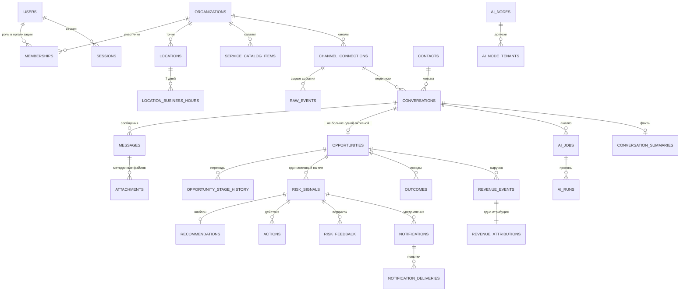
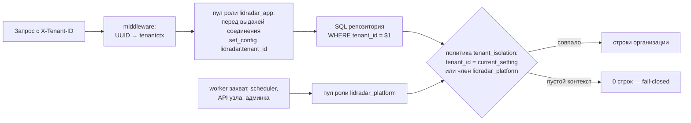
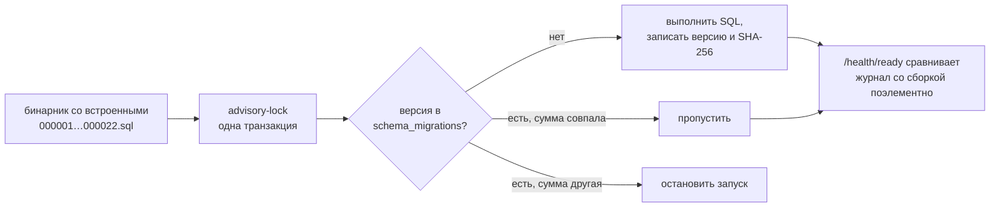

# 06 Модель данных

PostgreSQL 18 — единственный источник истины. Схема создаётся только
встроенными миграциями; ручных изменений и ORM нет.

## Основные сущности и связи

На схеме нет служебных таблиц очередей (`outbox_events`, `jobs`,
`scheduled_checks`), журналов аудита, настроек уведомлений, ключей
идемпотентности и платформенных администраторов — они описаны в таблицах
ниже. Всего в схеме 49 таблиц и 69 индексов.

## Принципы схемы

| Принцип | Как выражен |
|---|---|
| Организация — граница | `tenant_id` почти в каждой таблице; связи между таблицами организации — **составные внешние ключи**, включающие `tenant_id`, поэтому строка не может сослаться на объект другой организации |
| Идентификаторы и время | `UUID` (новые записи UUIDv7), `TIMESTAMPTZ` в UTC |
| Деньги | `NUMERIC(14,2)` для сумм, `NUMERIC(4,3)` для уверенности, агрегаты `numeric(20,2)`; в коде — десятичные строки |
| JSONB только для расширяемых данных | payload сырых событий, метаданные сообщений, payload заданий и событий, семантические факты; каждое поле проверено `CHECK (jsonb_typeof(...))` |
| Инварианты в базе | перечисления через `CHECK`, длины и форматы через `btrim`/regex, согласованность жизненного цикла через составные `CHECK` |
| Единственность активного объекта | частичные уникальные индексы: одна активная сделка на переписку, один активный риск на сделку и тип, одна `RECOVERED` на сделку, одно действующее согласие, один активный администратор, одно ожидающее AI-задание на переписку |
| Неизменяемость журналов | триггеры `BEFORE UPDATE OR DELETE`, отвергающие изменение |
| Изоляция строк | `FORCE ROW LEVEL SECURITY` на каждой таблице с `tenant_id` |

## Таблицы по областям

### Пользователи и организации

| Таблица | Назначение | Ключевые ограничения |
|---|---|---|
| `users` | пользователи | канонический `email` уникален; `status ∈ ACTIVE, DISABLED`; без `tenant_id` |
| `sessions` | серверные сессии | `token_hash CHAR(64) UNIQUE`, срок, отзыв; без `tenant_id` |
| `auth_rate_limits` | троттлинг входа | PK `(scope, subject_hash)`, четыре области, окно |
| `organizations` | организации | статус, часовой пояс, валюта по умолчанию `RUB` |
| `memberships` | членства | `UNIQUE (tenant_id, user_id)`; роль; `DISABLED ⇔ revoked_at`; удаление запрещено |
| `membership_invitations` | одноразовые коды приглашения | хранится только SHA-256 кода; срок действия; отметки принятия и отзыва взаимоисключающи |
| `locations` | точки | порог ответа 1…1440 (45); `UNIQUE (tenant_id, id)` для составных ключей |
| `location_business_hours` | расписание | `UNIQUE (tenant, location, weekday)`; открытый день `opens < closes` |
| `ml_consents` | согласия | одно действующее на организацию; только один отзыв |
| `service_catalog_items` | каталог | цены ≥ 0 и `price_from <= price_to`; составной ключ на точку |

### Каналы и переписки

| Таблица | Назначение | Ключевые ограничения |
|---|---|---|
| `channel_connections` | подключения | провайдер и статус из перечислений; хеш секрета 64 hex; шифротекст ≤ 8192 |
| `raw_events` | сырые события | `UNIQUE (connection_id, external_event_id)`; `FAILED` только с кодом и временем |
| `contacts` | контакты | имя 1…200; канонические телефон и почта |
| `external_identities` | личности в канале | уникальны в паре с подключением |
| `conversations` | переписки | `UNIQUE (connection_id, external_id)`; `revision ≥ 0`; согласованные границы |
| `messages` | сообщения | `UNIQUE (connection_id, external_id)`; ответ только внутри той же переписки; индекс `(tenant, conversation, sent_at DESC, id DESC)` |
| `attachments` | метаданные вложений | ключ объекта, MIME, размер, SHA-256 |

### Сделки, риски, реакция, деньги

| Таблица | Назначение | Ключевые ограничения |
|---|---|---|
| `opportunities` | сделки | 11 этапов; оценка только с уверенностью 0…1; `closed_at` ⇔ терминальный этап; одна активная на переписку |
| `opportunity_stage_history` | переходы | источник; `USER` с актором, `AI` с уверенностью; append-only |
| `risk_signals` | риски | тип, важность, статус, источник; `HYBRID` с уверенностью и прогоном; `due_at <= detected_at`; один активный на сделку и тип; индекс Radar |
| `risk_feedback` | вердикты | ложный только с причиной; снимок риска; `dataset_eligible`; append-only |
| `recommendations` | рекомендации | одна на риск, источник `TEMPLATE` |
| `actions` | действия | тип из шести; актор — участник; append-only |
| `outcomes` | исходы | статус из шести; append-only |
| `idempotency_keys` | ключи команд | PK `(tenant, key, operation)`; хеш запроса; сохранённый ответ; append-only |
| `revenue_events` | выручка | сумма > 0; `CONFIRMED`/`USER_CONFIRMED`; append-only |
| `revenue_attributions` | атрибуции | одна на событие; `RECOVERED` с полной цепочкой той же сделки и окном 30 дней (триггер); одна `RECOVERED` на сделку; append-only |
| `audit_log`, `auth_audit_log`, `admin_audit_log` | журналы | имена операций по regex; актор — участник; append-only |

### Очереди и уведомления

| Таблица | Назначение | Ключевые ограничения |
|---|---|---|
| `outbox_events` | события | тип и версия; `data` объект; попытки ≤ 5; аренда; `discarded_*` только при `DEAD` |
| `jobs` | задания | `UNIQUE (tenant, job_type, dedup_key)`; приоритет; аренда; индексы захвата |
| `scheduled_checks` | проверки | `UNIQUE (tenant, check_type, dedup_key)`; `ENQUEUED ⇔ job_id` |
| `notifications` | уведомления | `UNIQUE (tenant, dedup_key)`; вид; сводка без риска |
| `notification_deliveries` | попытки | `UNIQUE (tenant, notification, channel, attempt)`, `attempt 1…5` |
| `notification_preferences` | настройки | `UNIQUE (tenant, user, risk_type)`; тихие часы парой, не равны |
| `notification_digest_items` | очередь сводок | риск у получателя один раз; слот `YYYY-MM-DDTHH:MM` |
| `telegram_user_links`, `telegram_link_tokens`, `telegram_callback_commands` | Telegram | один пользователь — один чат; код хешем, срок, одноразовость; идемпотентность кнопок |

### AI и платформа

| Таблица | Назначение | Ключевые ограничения |
|---|---|---|
| `ai_nodes` | узлы | имя уникально; дайджест секрета 32 байта; статус; один слот |
| `ai_node_tenants` | допуски | PK `(node_id, tenant_id)` |
| `ai_node_request_nonces` | одноразовые запросы | PK `(node_id, request_id)`, срок |
| `ai_jobs` | задания анализа | статусы; попытки ≤ 5; аренда согласована со статусом; одно ожидающее на переписку; ключ на допуск узла |
| `ai_runs` | прогоны | статус и статус применения согласованы; один активный прогон на задание |
| `conversation_summaries` | факты | PK `(tenant, conversation)`; резюме ≤ 2000; массив фактов с булевым `trusted` |
| `platform_admins` | администраторы | один активный на пользователя; только один отзыв |
| `platform_metadata`, `schema_migrations` | служебные | журнал миграций с контрольными суммами |

## Row Level Security

| Элемент | Как устроено |
|---|---|
| Роли | `lidradar_app` (API), `lidradar_worker` (обработчики), `lidradar_platform` (очереди, узел, админка); все без права входа, выдаются пользователю миграций |
| Политика | на каждой таблице с `tenant_id`: строка видна, если `tenant_id` равен настройке сеанса или пользователь состоит в платформенной роли; `organizations` дополнительно видна участнику, `memberships` — самому пользователю, `membership_invitations` — по хешу кода на время приёма приглашения |
| Контекст | ставится хуком пула перед каждой выдачей соединения из контекста запроса, задания или события; пустой контекст — ноль строк |
| Без RLS | таблицы без `tenant_id`: пользователи, сессии, троттлинг, журнал входов, узлы AI, одноразовые запросы, миграции |
| Обход | только платформенная роль через предикат политики, без `BYPASSRLS`; владелец схемы (миграции, CLI) не ограничен |

Проверки: тест fail-closed по ролям (0 строк без контекста, запись в чужую
организацию отвергается), матрица межорганизационных атак, тест инвариантов
схемы (все связи включают `tenant_id`), форвард-тест миграций (≥ 30 политик).

## Миграции

| Миграция | Содержимое |
|---|---|
| `000001` | служебные метаданные |
| `000002` | пользователи, сессии, организации, членства, точки, расписания |
| `000003` | каталог услуг |
| `000004` | подключения каналов, сырые события |
| `000005` | контакты, личности, переписки, сообщения, вложения |
| `000006` | зашифрованные реквизиты Telegram |
| `000007` | задания, проверки по расписанию, outbox |
| `000008` | сделки и история этапов |
| `000009` | сигналы риска |
| `000010` | уведомления, доставки, Telegram-привязки |
| `000011` | рекомендации, действия, исходы, ключи идемпотентности, аудит |
| `000012` | выручка и атрибуция |
| `000013` | AI-узлы, задания, прогоны, сводки |
| `000014` | семантические факты, трассируемость HYBRID |
| `000015` | троттлинг входа, допуски узлов |
| `000016` | согласованность: составные ключи цепочки выручки, одна `RECOVERED`, отзыв членства, одно ожидающее AI-задание |
| `000017` | политика уведомлений и очередь сводок |
| `000018` | ML-согласия и вердикты |
| `000019` | платформенные администраторы, откладывание мёртвых элементов |
| `000020` | роли и политики RLS |
| `000021` | журнал входов |
| `000022` | коды приглашений в команду |

Правила: только вперёд, новая таблица с `tenant_id` получает RLS в своей
миграции, ожидаемая последняя версия в CI обновляется вместе с миграцией,
набор применяется идемпотентно (тесты применяют его дважды).

## Индексы под рабочие запросы

| Запрос | Индекс | Подтверждение |
|---|---|---|
| Radar и списки рисков | `risk_signals_radar_idx (tenant, status, severity, detected_at, id)` | индексный план на нагрузочном испытании |
| сообщения переписки, счётчики аналитики | `messages_conversation_time_idx (tenant, conversation, sent_at DESC, id DESC)` | без последовательного сканирования на 500 000 строк |
| списки переписок | `(tenant, updated_at DESC, id DESC)` | курсорная пагинация |
| очереди | частичные индексы по статусу и истёкшим арендам | захват `SKIP LOCKED` |
| каталог | `(tenant, active, normalized_name, id)` | поиск услуги |

## Что хранится вне PostgreSQL

Двоичные вложения — только метаданные (объектное хранилище пока не
подключено). Модели, наборы и отчёты измерений AI лежат файлами в `models/`.
Резервные копии — `pg_dump -Fc` (раздел 10).
