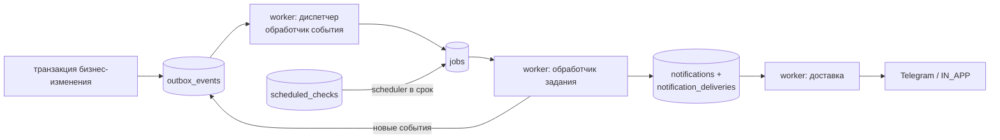
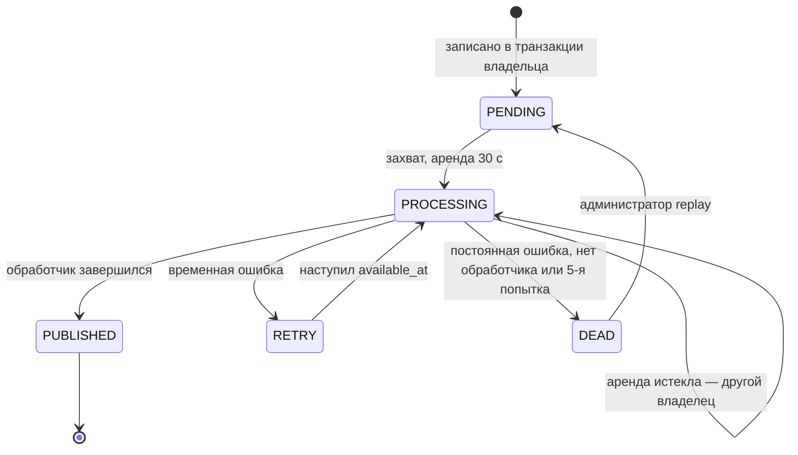
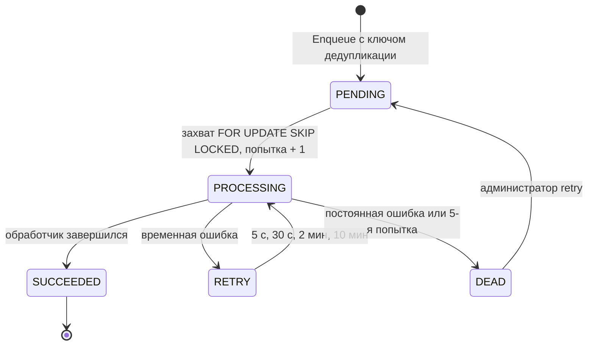
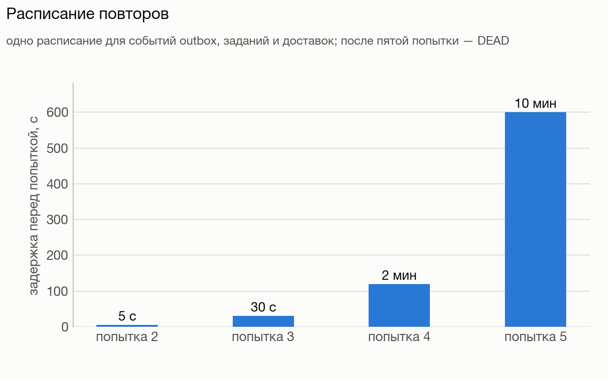
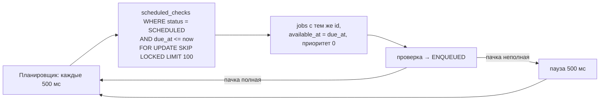
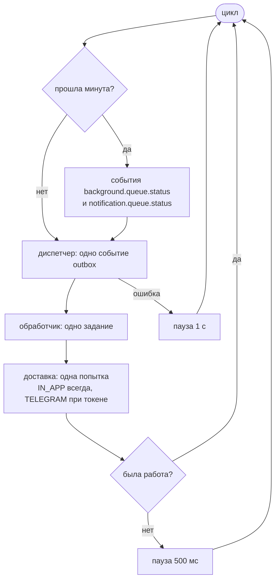
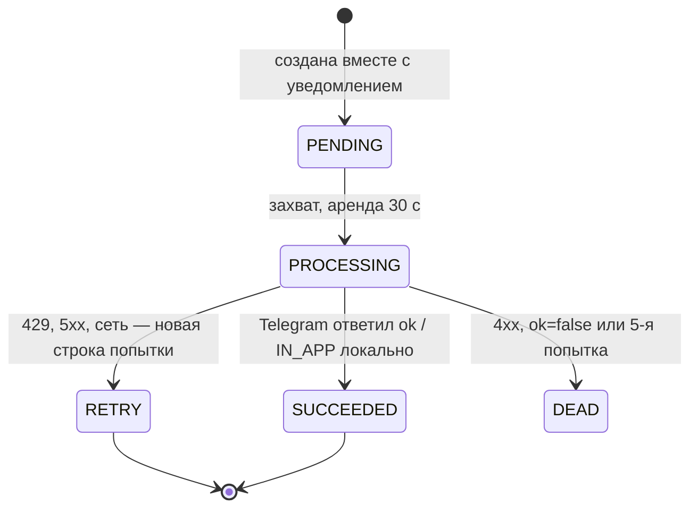
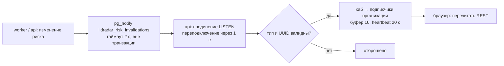

# 07 Фоновая обработка

Вся асинхронная работа живёт в PostgreSQL: транзакционный outbox, очередь
заданий с арендой, отложенные проверки, попытки доставки уведомлений и
очередь AI. Брокеров сообщений нет по решению: очередь в базе даёт
транзакционность с бизнес-изменением и переживает падение любого процесса.

## Outbox: события между модулями

Событие пишется в той же транзакции, что и изменение (сырое событие,
переписка, сделка, риск, прогон AI). Идентичность события — его `id`:
повтор с тем же содержимым не ошибка, с другим — конфликт. Ключ доставки —
`тип.vN`, например `conversation.changed.v1`.

Диспетчер берёт одно событие за вызов, находит обработчик по ключу (нет
обработчика — сразу `DEAD` с `UNSUPPORTED_EVENT_TYPE`), выполняет его в
контексте организации события и подтверждает. Несколько подписчиков одного
типа выполняются цепочкой по порядку. Глобальный порядок между разными
агрегатами не гарантируется.

| Событие | Кто пишет | Кто обрабатывает (по порядку) |
|---|---|---|
| `connector.raw-event.received.v1` | приём вебхука | постановка задания нормализации |
| `conversation.changed.v1` | применение канонического события | кандидат сделки → постановка AI-анализа → пересчёт планов риска |
| `opportunity.created.v1`, `opportunity.stage_changed.v1` | создание и переход сделки | пересчёт планов риска |
| `ai.analysis.applied.v1` | завершение прогона AI | переходы этапов по фактам → пересчёт планов риска |
| `risk.opened.v1` | открытие риска | политика уведомлений и постановка доставок |

## Очередь заданий

- **Постановка** идемпотентна по паре «тип + ключ дедупликации»: повтор с
  тем же payload возвращает существующее задание, с другим — конфликт.
  Ключ не истекает: выполненное задание навсегда занимает свой ключ.
- **Захват**: порядок `priority DESC, available_at, created_at, id`,
  аренда 30 с; истёкшие аренды с исчерпанными попытками помечаются `DEAD`.
- **Выполнение** в контексте организации задания; подтверждение проверяет
  владение — потерявший аренду процесс получает отказ и не может записать
  результат.
- **Классификация ошибок** — на обработчике: постоянные → сразу `DEAD`,
  временные → по расписанию; неизвестная ошибка считается временной. В базу
  пишется только код ошибки — текст мог бы содержать сообщение клиента.
- **Паника** обработчика не перехватывается: процесс завершается, задание
  вернётся по истечении аренды.

| Тип задания | Кто ставит (ключ дедупликации) | Что делает |
|---|---|---|
| `connector.normalize-raw-event.v1` | обработчик сырого события (`raw-event:{id}`) | нормализует событие в переписку |
| `opportunity.evaluate-commercial-candidate.v1` | `conversation.changed.v1` (`conversation:{id}:revision:{n}`) | ищет коммерческого кандидата по каталогу |
| `risk.refresh-no-response-plan.v1` | изменение переписки, событие сделки, применение AI | пересчитывает планы **всех пяти** правил |
| `risk.evaluate-no-response.v1` | проверка `NO_RESPONSE_DUE` | правило R1 |
| `risk.evaluate-booking-not-confirmed.v1` | `BOOKING_NOT_CONFIRMED_DUE` | правило R3 |
| `risk.evaluate-promise-not-fulfilled.v1` | `PROMISE_NOT_FULFILLED_DUE` | правило R4 |
| `risk.evaluate-customer-silent-after-price.v1` | `CUSTOMER_SILENT_AFTER_PRICE_DUE` | правило R2 (порог и эскалация) |
| `risk.evaluate-follow-up-candidate.v1` | `FOLLOW_UP_CANDIDATE_DUE` | правило R5 |
| `notification.digest.v1` | `NOTIFICATION_DIGEST_DUE` (`digest:user:{u}:{slot}`) | собирает сводку получателя |
| `notification.escalate.v1` | `NOTIFICATION_ESCALATION_DUE` (`risk:{id}:escalation`) | эскалирует владельцу |

Payload заданий риска содержит только идентификаторы; состояние
перечитывается при выполнении.

## Расписание повторов

| Попытка | Задержка перед ней | Накопленное ожидание |
|---|---|---|
| 1 | сразу | 0 |
| 2 | 5 с | 5 с |
| 3 | 30 с | 35 с |
| 4 | 2 мин | 2 мин 35 с |
| 5 | 10 мин | 12 мин 35 с |
| после 5-й | `DEAD` — в панель администратора | — |

Одно расписание для событий outbox, заданий, доставок уведомлений и (с
паузой 5 с) для AI-заданий.

## Отложенные проверки и планировщик

Проверка — запись «выполнить правило в срок» с типом, субъектом, будущим
заданием и ключом дедупликации. Повторное планирование того же основания с
другим сроком — конфликт; модуль уведомлений его поглощает (слот уже
запланирован).

| Тип проверки | Субъект | Задание |
|---|---|---|
| `NO_RESPONSE_DUE`, `BOOKING_NOT_CONFIRMED_DUE`, `PROMISE_NOT_FULFILLED_DUE`, `CUSTOMER_SILENT_AFTER_PRICE_DUE` (порог и эскалация), `FOLLOW_UP_CANDIDATE_DUE` | сделка | соответствующее `risk.evaluate-*.v1` |
| `NOTIFICATION_DIGEST_DUE` | пользователь | `notification.digest.v1` |
| `NOTIFICATION_ESCALATION_DUE` | риск | `notification.escalate.v1` |

Срок проверок риска считается в рабочем времени точки.

## Процесс worker

| Параметр | Значение |
|---|---|
| пулы | `lidradar_worker` для обработчиков (RLS по организации задания), `lidradar_platform` для захвата |
| владелец аренд | новый идентификатор на запуск процесса; после перезапуска старые аренды подхватываются по сроку |
| размер пачки | 1 событие, 1 задание, 1 доставка за итерацию |
| аренда | 30 с везде |
| масштабирование | числом процессов; параллелизм безопасен благодаря `SKIP LOCKED` и уникальным владельцам |
| измерено | 171 задание/с одним процессом, 480 — четырьмя |

## Доставка уведомлений

Повтор — **новая строка** с `attempt + 1` и `available_at` по расписанию,
текущая помечается `RETRY`; после пятой попытки `DEAD`. Ни один отказ не
меняет риск и не создаёт второе логическое уведомление. Повтора доставки в
панели администратора нет — только откладывание; риск остаётся в Radar и в
сводке.

## Ключи идемпотентности по цепочке

| Шаг | Что защищает от повтора |
|---|---|
| сырое событие | `UNIQUE (connection_id, external_event_id)` + сравнение хеша тела |
| событие outbox | `id` события |
| каноническое сообщение | уникальные внешние идентификаторы переписки и сообщения; повтор не меняет ревизию |
| кандидат сделки | ключ по ревизии + одна активная сделка на переписку |
| риск | один активный риск на сделку и тип; повтор `UPSERT` до трёх раз |
| уведомление | персональный ключ; риск в очереди сводки один раз |
| команды пользователя | таблица ключей идемпотентности |
| AI | одно ожидающее задание на переписку; уникальный снимок; один активный прогон |
| кнопки Telegram | идентификатор callback |

## Сигналы инвалидации (SSE)

Допустимые типы: `risk.changed`, `risk.acknowledged`, `risk.resolved`,
`risk.false_positive`. Потеря сигнала допустима — источник истины в базе,
клиент перечитывает по сигналу и по таймеру.

## Мёртвые элементы

Панель `dead-letters` показывает `DEAD` без отметки откладывания по четырём
очередям: задания, события outbox, AI-задания, доставки. `retry`/`replay`
возвращают элемент в `PENDING` с нулём попыток и снятой арендой, `discard`
лишь скрывает его. Каждая команда пишет аудит администратора в той же
транзакции.

| Код в панели | Что означает | Что делать |
|---|---|---|
| `RISK_PLAN_INVALID`, `RISK_EVALUATION_INVALID` | у точки нет семи строк расписания или у переписки нет значимого сообщения | настроить расписание точки, затем `retry` |
| `NORMALIZATION_INVALID` | payload провайдера не разобран | проверить формат события у провайдера |
| `COMMERCIAL_CANDIDATE_INVALID` | переписка исчезла или неактивна | обычно ничего |
| `INVALID_OUTBOX_PAYLOAD` | событие с неполными данными | ошибка кода производителя события |
| `UNSUPPORTED_JOB_TYPE`, `UNSUPPORTED_EVENT_TYPE` | обработчик не зарегистрирован в этой сборке worker | обновить worker |
| `LEASE_EXPIRED_MAX_ATTEMPTS` | пять аренд истекли без подтверждения | искать падение обработчика в логах |

## Сводка временных параметров

| Параметр | Значение |
|---|---|
| аренда события / задания / доставки | 30 с |
| попыток | 5 |
| расписание повторов | 5 с, 30 с, 2 мин, 10 мин |
| пауза worker без работы / после ошибки | 500 мс / 1 с |
| пачка планировщика | 100 |
| дебаунс AI-анализа | 60 с |
| аренда AI-задания / потолок | 120 с / 15 мин |
| heartbeat SSE | 20 с |
| переподключение LISTEN | 1 с |
| таймаут Telegram Bot API | 10 с |
