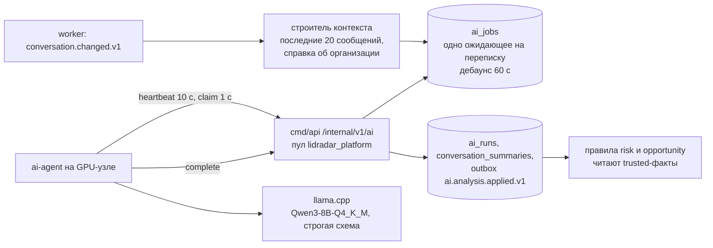
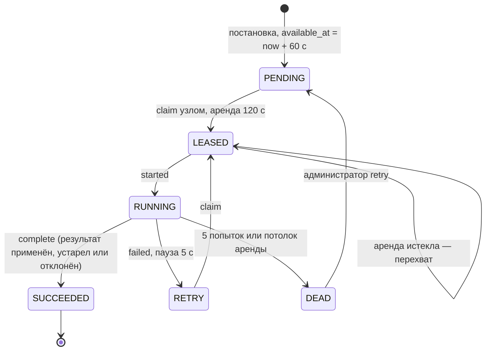
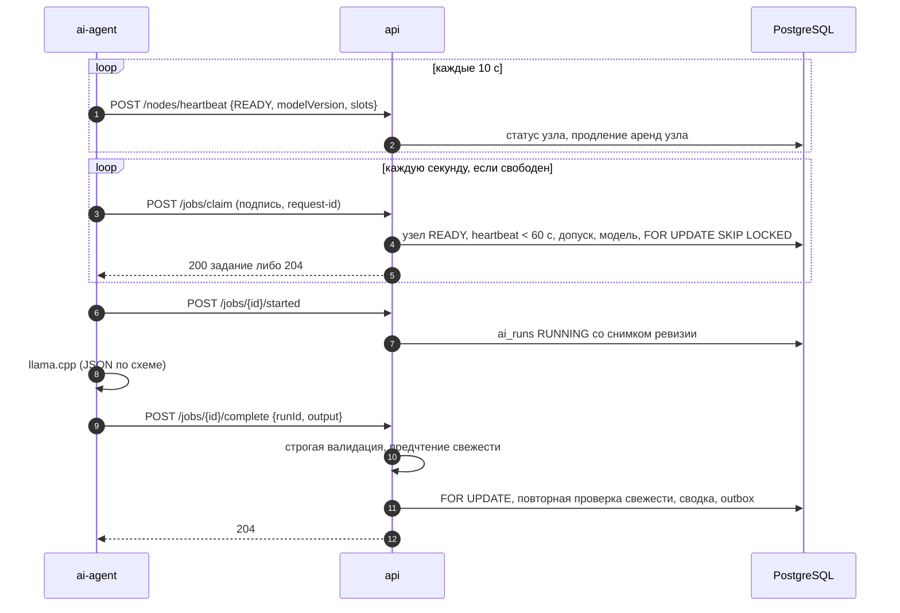
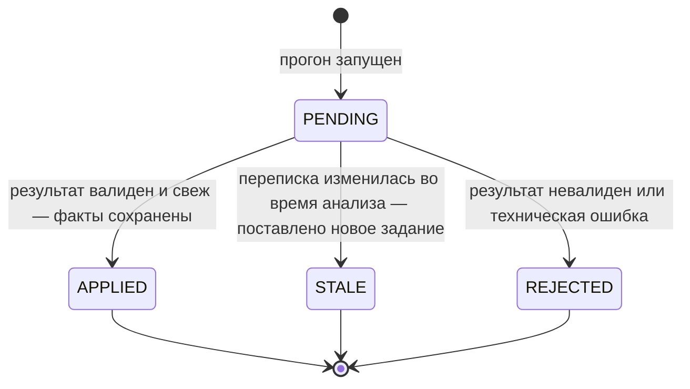
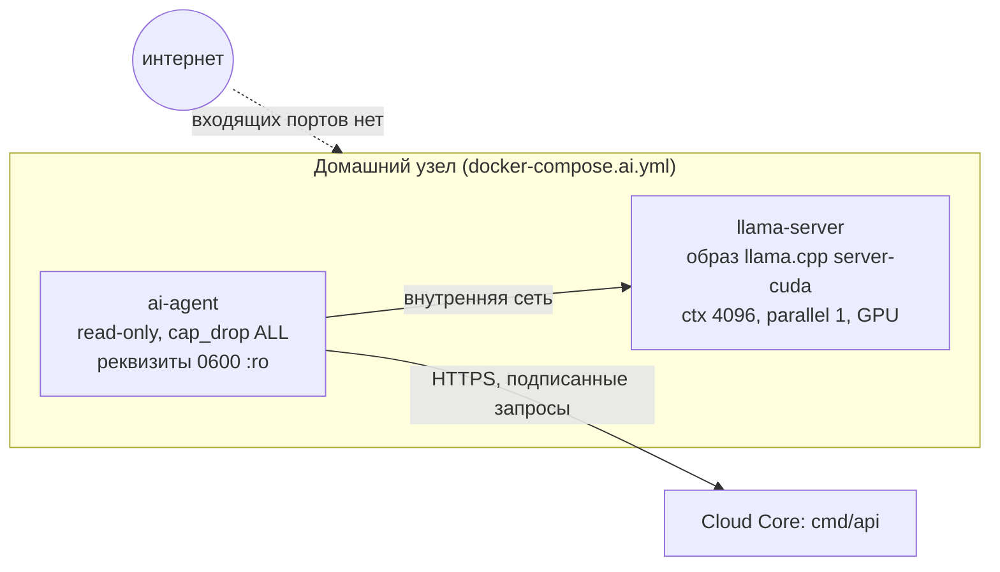

# 08 AI-контур

AI в LidRadar — **асинхронный источник семантических фактов**, а не участник
бизнес-логики. Модель читает переписку и говорит, что в ней есть намерение
записаться, обещание бизнеса, названная цена или повод напомнить; решение
об открытии риска и переводе сделки принимают те же детерминированные
правила, что работают без AI.

## Границы

| AI делает | AI не делает |
|---|---|
| анализирует последние сообщения переписки на домашнем GPU-узле | не пишет в сделки, риски, переписки и деньги |
| возвращает факты с уверенностью и ссылками на сообщения-доказательства | не назначает доверие факту — его вычисляет сервер по уверенности |
| хранит результат как проекцию переписки с привязкой к ревизии | не применяет устаревший или невалидный результат |
| работает по pull-модели за подписанными запросами | не имеет доступа к базе и не хранит данные клиентов на узле |

## Компоненты

## Постановка задания

- **Триггер** — событие `conversation.changed.v1`; обработчик отвергает
  неполные события как постоянную ошибку, а переписку без текстовых
  сообщений просто пропускает.
- **Одно ожидающее задание на переписку**: более свежий снимок заменяет
  инструкцию ожидающего задания, сохраняя его идентификатор; выполняемое
  задание постановке не мешает.
- **Дебаунс 60 с**: всплеск сообщений превращается в один анализ по
  последнему состоянию.
- **Инструкция** строится в одной read-only транзакции: название
  организации, часовой пояс и валюта, название и пояс точки, ревизия
  переписки, предыдущее резюме и до 20 последних сообщений (не больше 12 000
  символов). В инструкцию **не попадают** идентификатор организации, имена и
  телефоны клиентов, каталог, сделки, риски, выручка, вложения, служебные и
  удалённые сообщения.

## Протокол домашнего узла

Узел регистрируется на стороне сервера командой `ai-node-register`: секрет
из 32 случайных байт попадает в файл с правами `0600`, в базу — только его
SHA-256; узел сразу получает допуск к указанной организации. Команда
`ai-node-manage` ротирует секрет, отзывает узел и выдаёт допуски к другим
организациям.

**Подпись каждого запроса** — HMAC-SHA256 над методом, путём, временем,
одноразовым идентификатором запроса и хешем тела; окно ±60 с; повтор
идентификатора отвергается. Заголовки: `Authorization: Bearer <секрет>`,
`X-LidRadar-Node-ID`, `X-LidRadar-Timestamp`, `X-LidRadar-Request-ID`,
`X-LidRadar-Signature`. Тело ≤ 1 МиБ, JSON строгий, только `POST`.

| Конечная точка | Тело | Успех |
|---|---|---|
| `POST /internal/v1/ai/nodes/heartbeat` | `{status: READY или OFFLINE, modelVersion, availableSlots 0…1}` | `204` |
| `POST /internal/v1/ai/jobs/claim` | пустое | `200` с заданием либо `204` |
| `POST /internal/v1/ai/jobs/{id}/started` | пустое | `200 {runId}` |
| `POST /internal/v1/ai/jobs/{id}/complete` | `{runId, output}` | `204` |
| `POST /internal/v1/ai/jobs/{id}/failed` | `{runId, errorCode}` | `204` |

Ошибки: `401 UNAUTHENTICATED` (в том числе повтор request-id), `400
INVALID_ARGUMENT`, `404 NOT_FOUND`, `409 LEASE_LOST`, `409 CONFLICT`, `500
INTERNAL_ERROR`. Секреты, подписи и тела в текст ошибок не попадают.

### Аренды и восстановление

| Параметр | Значение |
|---|---|
| аренда | 120 с, продлевается каждым heartbeat |
| потолок аренды | 15 мин от захвата, heartbeat не двигает |
| узел считается недоступным | без heartbeat 60 с |
| попыток на задание | 5 |
| пауза перед повтором после ошибки | 5 с |

Истёкшую аренду перехватывает другой узел (или тот же после
восстановления), прежний прогон закрывается с кодом `LEASE_EXPIRED`;
зависший вывод при живом heartbeat перехватывается по потолку
(`LEASE_CAP_EXCEEDED`). Поздний ответ прежнего владельца отвергается
(`409 LEASE_LOST`). Допуск узла к организации проверяется до выдачи
инструкции и продублирован внешними ключами базы.

## Контракт результата

Ответ модели — JSON по строгой схеме `analyze-conversation.v1`: версия
схемы, идентификатор последнего проанализированного сообщения, резюме до
2000 символов и массив фактов. Факт — тип, булево значение, уверенность
0…1, непустой список сообщений-доказательств; `PRICE_MENTIONED` со
значением «да» обязан нести сумму и валюту, остальные факты денежных полей
не имеют. Серверный валидатор строже схемы: запрещает неизвестные поля,
требует совпадения идентификатора сообщения с прогоном, сливает повторы
одного типа (противоречие — ошибка).

| Уверенность | Полоса | Судьба факта |
|---|---|---|
| ≥ 0,85 | доверенный (`trusted`) | может двигать сделку и открывать риск через правила |
| 0,65 … 0,849 | наблюдение | хранится с `trusted = false` для метрик |
| < 0,65 | отбрасывается | в проекцию не попадает |

Свежесть проверяется дважды — до и внутри транзакции завершения: ревизия
переписки и последнее анализируемое сообщение должны совпадать со снимком
прогона. Проекция обновляется только если её ревизия не новее.

## Кто читает факты

| Факт | Доказательство | Потребитель | Результат |
|---|---|---|---|
| `BOOKING_INTENT` (только из свежей проекции) | входящее клиента | сделка → `BOOKING_INTENT`; правило записи | `BOOKING_NOT_CONFIRMED`, `CRITICAL`, 30 рабочих минут |
| `BUSINESS_COMMITMENT` | исходящее бизнеса | правило обещания | `PROMISE_NOT_FULFILLED`, `HIGH`, срок из текста или 60 мин |
| `PRICE_MENTIONED` | исходящее бизнеса | сделка → `PRICE_SENT` и оценка суммы; правило цены | `CUSTOMER_SILENT_AFTER_PRICE`: `MEDIUM` через 24 ч, `HIGH` через 48 ч |
| `FOLLOW_UP_CANDIDATE` | входящее клиента | сделка → `WAITING_CUSTOMER`; правило напоминания | `FOLLOW_UP_CANDIDATE`, `MEDIUM`, через 24 ч |

Риски, открытые по фактам, помечены источником `HYBRID` и ссылаются на
прогон — цепочку можно проследить до конкретного анализа.

## Агент и узел

| Настройка агента | По умолчанию | Смысл |
|---|---|---|
| `LIDRADAR_AI_CLOUD_URL` | обязателен | адрес API; вне разработки только HTTPS |
| `LIDRADAR_AI_CREDENTIALS_FILE` | обязателен | файл реквизитов узла, абсолютный путь в бою |
| `LIDRADAR_AI_PROVIDER` | `fake` | `llama` в бою; `fake` запрещён вне разработки и тестов |
| `LIDRADAR_AI_LLAMA_URL` | `http://llama-server:8080/v1/chat/completions` | OpenAI-совместимый вход llama.cpp |
| `LIDRADAR_AI_MODEL_VERSION` | `lidradar-main-v1` | должен совпадать с сервером, иначе задания не выдаются |
| `LIDRADAR_AI_POLL_INTERVAL` / `HEARTBEAT_INTERVAL` / `HTTP_TIMEOUT` | 1 с / 10 с / 5 мин | цикл и таймаут вывода |

Цикл агента: heartbeat с опросом готовности llama.cpp; опрос очереди, если
узел готов и свободен; задание выполняется в отдельной горутине, heartbeat
продолжается и продлевает аренду. Конкурентность строго 1 (один слот).
Запрос к llama.cpp: `temperature 0.7`, `top_p 0.8`, `top_k 20`,
`presence_penalty 1.5`, `seed 42`, без «мышления», ответ ограничен
JSON-схемой; системная инструкция объявляет текст сообщений данными и
запрещает выполнять команды из них. Агент ничего не хранит и не логирует
промпты и результаты.

## Модель и её фиксация

| Параметр | Значение |
|---|---|
| Модель | `lidradar-main-v1`: `Qwen3-8B-Q4_K_M.gguf`, статус `FROZEN` |
| Инструкция | `analyze-conversation.prompt.v5` |
| Пороги качества | precision ≥ 0,90, precision по типам ≥ 0,85, recall ≥ 0,90, F1 ≥ 0,90, точное совпадение ≥ 0,85, валидный JSON ≥ 0,99, точные доказательства ≥ 0,90 |
| Пороги производительности | p95 ≤ 8 000 мс, VRAM ≤ 7 500 МиБ, OOM = 0, ≥ 20 токенов/с |
| Измерено на RTX 4060 | p50/p95/p99 1 799 / 3 848 / 4 183 мс, 46,66 токена/с, ≤ 5 360 МиБ |
| Наборы | синтетические `golden` (400) и `dev` (100) с контрольной суммой; переписок клиентов нет; дообучения нет по замыслу |

Инструменты: генератор наборов, аудит наборов (входит в общую проверку),
бенчмарк с явными порогами (провал — ненулевой код выхода), использующий тот
же валидатор, что и рабочий контур.

## Отказы и что видит администратор

| Ситуация | Поведение | Где видно |
|---|---|---|
| узел без heartbeat > 60 с | помечается `OFFLINE`, задания ждут | `GET /admin/ai/nodes` |
| аренда истекла | перехват, старый прогон `FAILED` с `LEASE_EXPIRED` | `GET /admin/ai/runs` |
| вывод завис при живом heartbeat | перехват по потолку 15 мин | там же |
| исчерпаны попытки | задание `DEAD` | `dead-letters`, `retry`/`discard` |
| версия модели узла не совпадает | `claim` пуст, задания копятся | панель очередей, узлы |
| невалидный JSON модели | прогон завершён со статусом `REJECTED`, домен не тронут | прогоны с фильтром по статусу |
| ошибка или таймаут llama.cpp | `failed` → `RETRY` через 5 с или `DEAD` | код ошибки задания |
| переписка изменилась во время анализа | `STALE`, новое задание | прогоны |
| Cloud Core недоступен | API, `NO_RESPONSE`, Radar и деньги работают; семантические риски ждут | логи узла |

## Безопасность контура

- Секрет узла: CSPRNG, в базе только SHA-256, файл `0600` с проверкой прав
  при загрузке, ротация и отзыв через CLI.
- Транспорт: HMAC-подпись с окном 60 с и одноразовыми идентификаторами,
  HTTPS вне разработки, ограничение частоты 600 запросов в минуту на адрес.
- Изоляция: явный список допусков и составные внешние ключи; узел без
  допусков безопасно простаивает.
- Минимизация: модели не передаются идентификатор организации, контакты,
  каталог, сделки, вложения; сырой вывод хранится для разбора, но ни одна
  административная выборка его не отдаёт; резюме переписки в админке не
  раскрывается.
