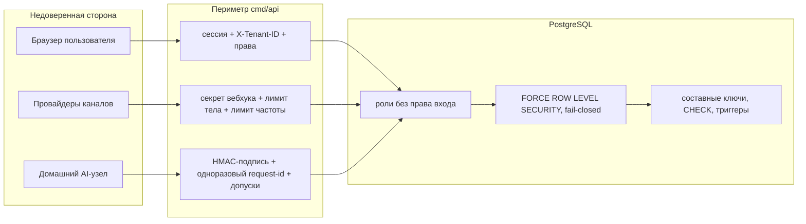
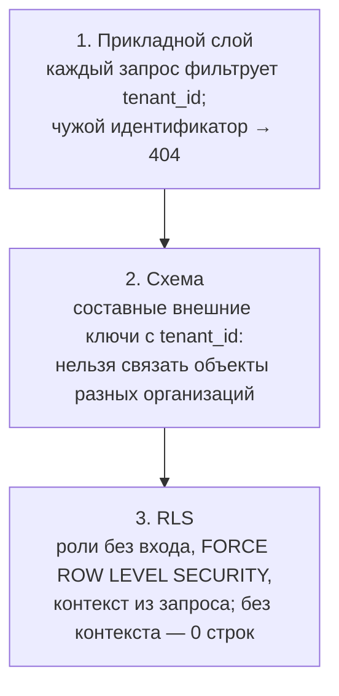

# 09 Защищённость

## Границы доверия

| Граница | Кто по ту сторону | Чем защищена |
|---|---|---|
| Браузер ↔ API | пользователи организаций, злоумышленник с чужой сессией или без неё | непрозрачные серверные сессии, `SameSite=Strict`, проверка `Origin`, права по членству, RLS, троттлинг входа |
| Провайдер ↔ вебхук | Telegram, произвольный отправитель на публичный URL | секрет подключения в заголовке (сравнение хешей в константное время), путь с идентификаторами организации и подключения, лимит тела 1 МиБ, лимит частоты, persist-first без интерпретации |
| AI-узел ↔ API | узел в чужой сети, перехваченный секрет | HMAC-подпись каждого запроса, окно 60 с, одноразовые идентификаторы, HTTPS вне разработки, допуски к организациям, лимит частоты |
| Приложение ↔ база | ошибка в прикладном коде | роли без права входа, RLS, составные внешние ключи с `tenant_id`, CHECK и триггеры |
| Платформа ↔ организации | администратор платформы | отдельное право `PLATFORM_ADMIN`, read-модели без содержимого, append-only аудит команд |
| Данные ↔ модель | подсказки в тексте клиента (prompt injection) | модель получает текст только как данные, строгая схема ответа, доверие вычисляет сервер, факты не меняют состояние |

## Аутентификация пользователей

- **Пароли** — Argon2id (64 МиБ памяти, 3 итерации, параллелизм 2, соль 16
  байт), сравнение в константное время; разбор хеша ограничивает параметры,
  чтобы чужой хеш не заставил сервер выделить гигабайты. Длина пароля
  12…1024 байт.
- **Сессии** — 32 случайных байта; в базе только SHA-256; cookie `HttpOnly`,
  `SameSite=Strict`, `Secure` (в staging и production конфигурация без
  этого флага не загрузится); 30 суток по умолчанию; ротация под блокировкой,
  отзыв при выходе. Токен никогда не возвращается в теле ответа.
- **Троттлинг** в PostgreSQL, а не в памяти процесса; субъекты хранятся
  отпечатками SHA-256; недоступность троттлера блокирует вход.

| Ограничение | Предел |
|---|---|
| регистрация с адреса | 5 в час |
| вход с адреса | 20 в минуту |
| неудачи по учётной записи | 5 за 15 минут, сброс при успехе |
| ротация сессии с адреса | 60 в минуту |

Ответ `429` с `Retry-After` не раскрывает существование учётной записи;
неизвестная почта проходит холостое хеширование. Известный компромисс: зная
почту, можно на 15 минут заблокировать вход этой учётной записи.

## Авторизация

- Организация — граница; каждый запрос организации несёт `X-Tenant-ID`,
  актор должен иметь `ACTIVE`-членство в `ACTIVE`-организации.
- Права по роли: OWNER — все 15, MANAGER — 7 рабочих. Проверка — первая
  операция сценария, до чтения данных; отказ `403` без раскрытия.
- Дополнительные проверки в SQL: действия, исходы, выручка и аудит пишутся
  только при активном членстве, актор аудита ограничен внешним ключом.
- Платформенный администратор — строка в отдельной таблице, не членство;
  первая выдача только через CLI на сервере; каждый вызов перепроверяет
  право и активность пользователя.

## Изоляция организаций

Три слоя, каждый достаточен сам по себе:

Обход политик — только у роли `lidradar_platform` для очередей, узла и
администрирования. Матрица межорганизационных атак закреплена тестом:
владелец организации A с идентификаторами организации B не читает и не
меняет её данные ни под своим, ни под чужим заголовком.

## Секреты

| Секрет | Хранение | Использование |
|---|---|---|
| пароли | Argon2id PHC | проверка при входе |
| токены сессий | SHA-256 | cookie |
| секреты вебхуков | SHA-256 hex | сравнение в константное время |
| токен бота канала Telegram | AES-256-GCM, ключ `LIDRADAR_INTEGRATION_ENCRYPTION_KEY` (32 байта), привязка шифротекста к организации, провайдеру и подключению | регистрация и удаление вебхука; расшифровка только на время вызова |
| токен бота уведомлений | только переменная окружения `LIDRADAR_TELEGRAM_TOKEN` у worker (прежнее имя `LIDAR_TELEGRAM_TOKEN` принимается) | Bot API; не читается API, не логируется |
| секрет AI-узла | SHA-256 в базе; открытый — файл `0600` на узле | HMAC подписи |
| коды привязки Telegram | SHA-256, срок 15 мин, одноразовые | `/start` |
| ключи идемпотентности | хеш запроса | сравнение содержимого повтора |

Правила: потеря ключа шифрования делает сохранённые токены нечитаемыми,
смена ключа требует перешифрования; файлы окружения и реквизиты узла в git
не попадают; помощник подключения Telegram передаёт токен через stdin и
временный файл, а не через аргументы командной строки.

## Периметр HTTP

Цепочка middleware: корреляция → перехват паники → заголовки безопасности →
проверка `X-Tenant-ID` → логирование → проверка `Origin` → ограничение
частоты.

| Механизм | Что делает |
|---|---|
| заголовки безопасности | `nosniff`, `X-Frame-Options: DENY`, `Referrer-Policy: no-referrer`, `Cache-Control: no-store`, CSP `default-src 'none'; frame-ancestors 'none'`, `Permissions-Policy`; HSTS при Secure cookie или TLS |
| CSRF | `SameSite=Strict` плюс проверка `Origin` для всех мутаций — same-origin или список `LIDRADAR_ALLOWED_ORIGINS`; иначе `403` |
| лимиты по адресу | вход 120/мин, вебхуки 1200/мин, API узла 600/мин; независимые правила; `429` с `Retry-After`; заголовки прокси намеренно не читаются |
| строгий JSON | 64 КиБ, неизвестные поля, второе значение, `\x00`, невалидный UTF-8 отвергаются; вебхуки и узел — 1 МиБ |
| таймауты сервера | заголовки 5 с, чтение и запись 30 с, простой 60 с |
| паника | `500 INTERNAL_ERROR` без деталей; в лог только идентификаторы запроса |

TLS-терминация — вне процесса; публичный адрес для Telegram обязан быть
`https` без пути.

## Вебхуки и внешние события

- Секрет не совпал → `401` и **ничего не пишется**; провайдер не совпал с
  подключением → `404`; отключённое подключение → `503`.
- Аутентифицированный, но невалидный payload сохраняется как `FAILED` —
  след остаётся, интерпретация не выполняется.
- Дедупликация по внешнему идентификатору и хешу тела делает повторы
  безопасными, а подмену тела под старым идентификатором — конфликтом.
- Служебные обновления Telegram принимаются только из личного чата
  привязанного пользователя той же организации и только для белого списка
  действий.

## Минимизация данных

- Логи не содержат текста сообщений, промптов, токенов, заголовков и тел
  запросов; обработчики очередей пишут только коды ошибок, идентификаторы и
  длительности.
- Уведомления не содержат переписки; сводка раскрывает только имя контакта
  (до 40 символов), тип, важность и время риска.
- Административные модели не отдают тексты сообщений, промпты, сырой вывод
  модели, тексты уведомлений.
- Ответы API не содержат `tenantId`, хешей, реквизитов, идентификаторов
  Telegram.
- Синтетические наборы AI не содержат переписок клиентов; согласие на
  использование данных организации явное и отзываемое.

## Аудит

| Журнал | Что фиксирует | Кто пишет |
|---|---|---|
| `auth_audit_log` | вход, выход, регистрация с IP | identity |
| `audit_log` | настройки организации, участники, ML-согласие, каналы, переходы этапов, подтверждение и закрытие рисков, вердикты, действия, исходы, выручка, политика уведомлений | tenant, connector, opportunity, risk, corrective, revenue, notification |
| `admin_audit_log` | выдача и отзыв прав, повтор и откладывание мёртвых элементов, источник `API`/`CLI` | admin |

Принципы: запись сразу после успешного изменения, ошибка записи возвращается
вызывающему; журналы append-only; актор аудита организации обязан быть
участником.

## Известные оговорки

- Ограничитель частоты — на процесс и по адресу соединения; за прокси без
  передачи реального адреса все клиенты выглядят одним адресом; перед
  выходом за прокси нужен явный список доверенных прокси.
- Соединение `LISTEN` для SSE открывается вне пула ролей; оно не читает
  таблиц.
- Подтверждения почты, второго фактора и политики паролей сложнее длины и
  блокировки нет — за рамками MVP.
