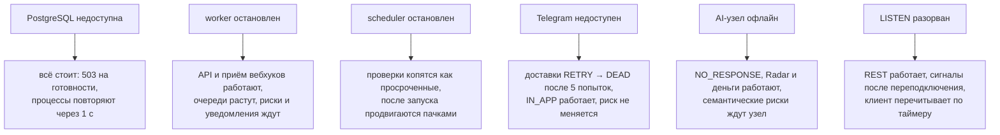
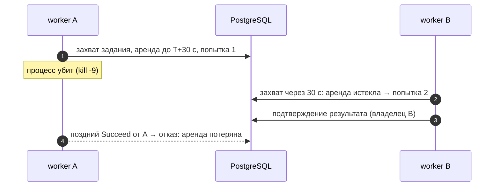
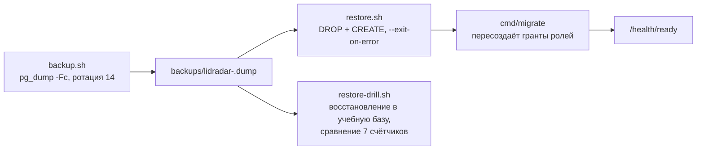

# 10 Отказоустойчивость

## Принципы

| Принцип | Что означает на практике |
|---|---|
| Один источник истины | всё долговременное состояние, очереди и расписания — в PostgreSQL; потеря процесса не теряет принятую работу |
| Сначала сохранить, потом обрабатывать | внешнее событие пишется до интерпретации; ответ `202` значит «сохранено», а не «обработано» |
| Как минимум один раз + идемпотентность | доставка повторяется; каждый обработчик опирается на ключ дедупликации или уникальное ограничение |
| Аренды вместо блокировок | захваченная работа привязана к владельцу на 30 с; павший процесс ничего не держит вечно |
| Fail-closed | недоступный троттлер блокирует вход; отсутствие контекста организации даёт пустую выборку; несовпадение миграций делает API не готовым; неполное расписание точки — ошибка, а не круглосуточный режим |
| Деградация без потери бизнес-состояния | отказ Telegram, AI-узла или SSE не меняет риски, сделки и деньги |

## Поведение при отказе зависимостей

| Отказ | Что продолжает работать | Что деградирует | Восстановление |
|---|---|---|---|
| PostgreSQL недоступна | ничего | всё; `/health/ready` → `503` | автоматически при возврате базы; аренды истекают |
| журнал миграций не совпал со сборкой | `/health/live` | `/health/ready` → `503`, оркестратор не пускает трафик | применить миграции той же сборкой |
| worker остановлен | API, приём вебхуков, Radar по имеющимся рискам | нормализация, риски, уведомления, постановка AI; очереди растут | запуск; накопленное обрабатывается по порядку |
| worker упал после захвата | всё остальное | одно задание задерживается на срок аренды | другой владелец подхватывает через 30 с; прежний не может подтвердить результат |
| scheduler остановлен | всё, кроме перевода проверок | риски по правилам не открываются вовремя | запуск; `available_at = due_at` сохраняет исходный срок |
| Telegram недоступен | всё, `IN_APP` доставляется | Telegram-доставки уходят в `RETRY`, затем `DEAD` | автоматически; мёртвые доставки видны администратору |
| токен бота не задан | всё | Telegram-канал не захватывается | задать `LIDRADAR_TELEGRAM_TOKEN`, перезапустить worker |
| AI-узел офлайн или версия модели не совпадает | API, `NO_RESPONSE`, Radar, деньги | семантические риски ждут; задания копятся | вернуть узел или выровнять версию |
| соединение `LISTEN` разорвано | REST | сигналы SSE до переподключения (1 с) | автоматически; клиент перечитывает REST |
| ошибка записи аудита | изменение уже совершено | вызывающий получает `500`, след отсутствует | разбор по логам; операции идемпотентны, где предусмотрено |
| паника в обработчике задания | остальные процессы | текущая работа задержана на аренду; процесс перезапускается оркестратором | автоматически |
| паника в HTTP-обработчике | остальные запросы | ответ `500` без деталей | — |

## Транзакционные границы

| Операция | В одной транзакции |
|---|---|
| приём вебхука | блокировка подключения, сырое событие, событие outbox, здоровье подключения |
| каноническое изменение | контакт, переписка, сообщение, вложения, ревизия, событие `conversation.changed` |
| создание сделки | сделка, история, событие; гонка кандидатов разрешается без ошибки |
| открытие риска | риск и событие `risk.opened`; сигнал SSE — вне транзакции, допускает потерю |
| действие, исход, выручка | ключ идемпотентности, факт, перевод риска (для действия), аудит |
| выдача и отзыв ML-согласия | согласие и аудит |
| завершение AI-прогона | прогон, задание, проекция фактов, событие, постановка замены |
| продвижение проверок | пачка проверок и создание заданий; расхождение откатывает всю пачку |
| команды администратора | изменение очереди и аудит администратора |
| миграции | все файлы одним коммитом под advisory-lock |

Побочные эффекты вне базы (Telegram, регистрация вебхука) выполняются
**после** коммита локального состояния и повторяемы: ошибка регистрации
оставляет подключение в `ERROR`, ошибка удаления позволяет повторить
отключение.

## Восстановление после сбоев процессов

- **Аренды.** События, задания, доставки и AI-задания несут владельца и
  срок; истёкшая аренда делает элемент доступным другому владельцу, при
  исчерпанных попытках — `DEAD`. Владелец — свежий идентификатор на запуск
  процесса, поэтому перезапуск не наследует чужие аренды. Сценарий проверен
  настоящим `kill -9` дочернего процесса в тестах.
- **Повторы.** 5 попыток по расписанию 5 с / 30 с / 2 мин / 10 мин;
  постоянные ошибки — сразу `DEAD`; неизвестная ошибка считается временной.
- **Мёртвые элементы.** Панель администратора, команды повтора и
  откладывания с аудитом.
- **Плавная остановка.** По `SIGINT`/`SIGTERM` API дренирует запросы в
  пределах `LIDRADAR_SHUTDOWN_TIMEOUT` (10 с), worker и scheduler завершают
  текущую итерацию; незавершённое задание освобождается по аренде.
- **Готовность.** `/health/ready` проверяет базу и совпадение журнала
  миграций со сборкой; Compose и CI пускают трафик только после этого.

## Пул соединений

Пулы по ролям: API — `lidradar_app` и `lidradar_platform`, worker —
`lidradar_worker` и `lidradar_platform`, scheduler — `lidradar_platform`;
размер `LIDRADAR_DATABASE_MAX_CONNS` (10 в Compose), таймаут подключения
5 с. Правило: репозиторий не обращается к пулу при открытом курсоре. Страница
сообщений раньше нарушала его — при конкуренции, равной размеру пула,
запросы висли навсегда; исправлено пакетной загрузкой и закреплено тестом с
пулом из двух соединений под шестью читателями. Держите размер пула не
меньше ожидаемого параллелизма API.

## Резервные копии и восстановление

- Копии снимаются `pg_dump -Fc` той же версии, что сервер (режимы
  `compose`, `container`, `local`); копия меньше 1 КиБ считается ошибкой;
  каталог копий вне git, перенос во внешнее хранилище — задача планировщика
  хоста.
- Восстановление пересоздаёт целевую базу; после восстановления в рабочую
  базу обязателен запуск миграций и проверка готовности.
- Учение восстановления сравнивает число таблиц, последнюю миграцию и
  счётчики организаций, сообщений, рисков, выручки и аудита; входит в
  чек-лист пилота и повторяется перед релизом.
- Форвард-совместимость миграций проверяется тестом: схема прежнего выпуска
  принимает следующие миграции, повтор ничего не меняет, подмена применённой
  миграции останавливает запуск.

## Гонки и целостность

| Гонка | Защита |
|---|---|
| два worker открывают один риск | частичный уникальный индекс + `ON CONFLICT` и повтор обновления до трёх раз |
| два кандидата на одну переписку | частичный уникальный индекс одной активной сделки, второй получает существующую |
| одинаковый переход этапа параллельно | блокировка строки сделки, одна запись истории |
| повтор команды с ключом идемпотентности параллельно | `INSERT … ON CONFLICT DO NOTHING`, второй читает сохранённый ответ |
| две ротации одной сессии | блокировка строки сессии и проверка числа затронутых строк |
| параллельные попытки входа | атомарный счётчик (40 параллельных попыток → ровно 5 разрешены) |
| два узла AI претендуют на задание | `FOR UPDATE SKIP LOCKED`, один активный прогон, проверка владения и свежести внутри транзакции |
| несколько экземпляров миграций | advisory-lock и транзакция |

## Что не гарантируется

- Ровно одна обработка — только идемпотентность.
- Порядок событий между разными агрегатами.
- Доставка уведомления после пяти неудачных попыток.
- Сигнал SSE — фронтенд обязан перечитывать REST.
- Регистрация вебхука Telegram зависит от внешнего сервиса.
- Изменения после последней резервной копии при потере сервера (RPO равен
  интервалу копий); репликации и PITR в MVP нет.
- Один экземпляр PostgreSQL и по одному процессу каждого типа до ста
  организаций — измеренные запасы в разделе 11.
