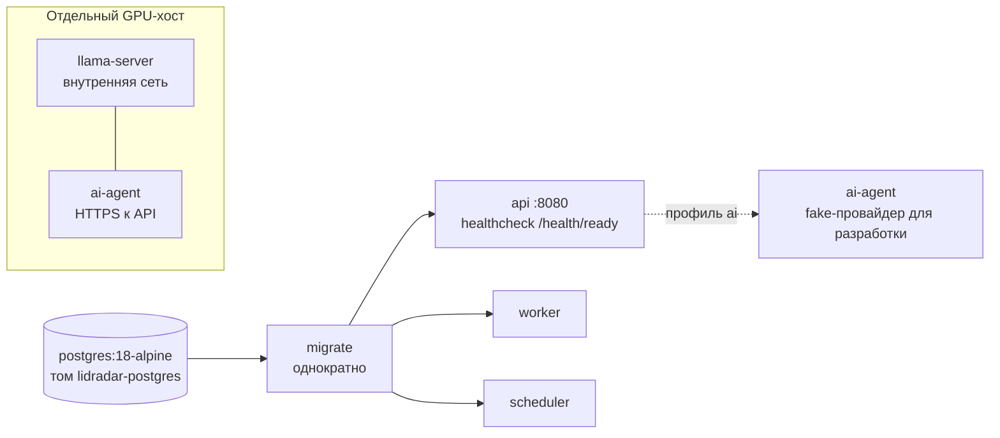
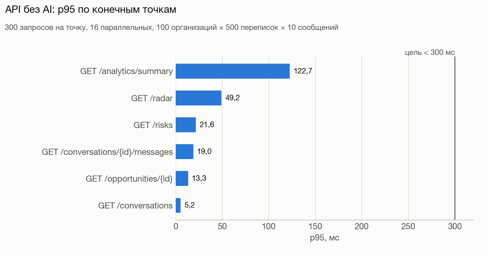
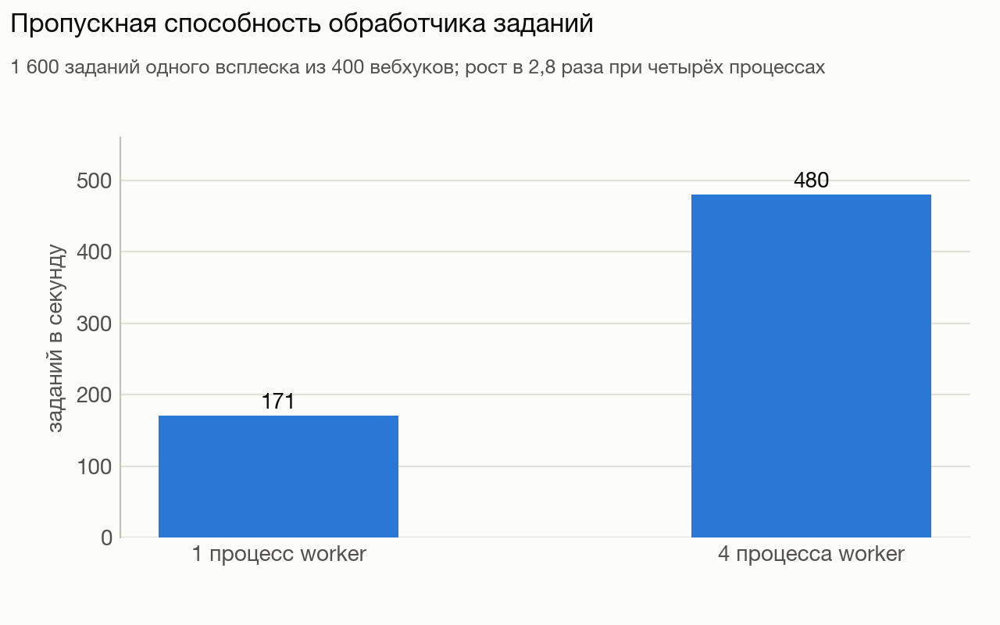
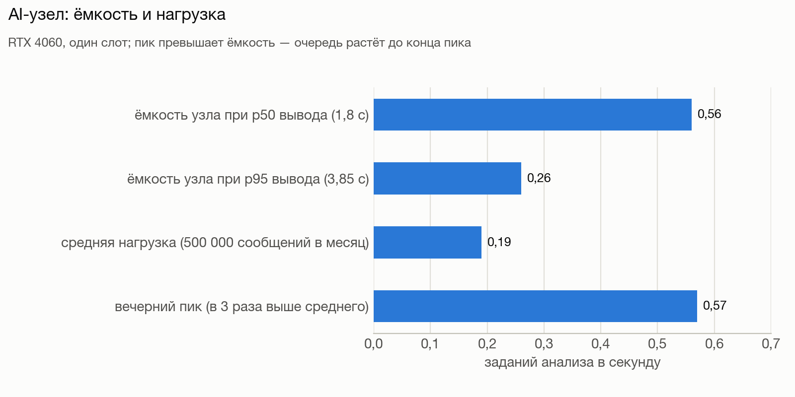

# 11 Эксплуатация и ёмкость

## Конфигурация

Все процессы читают переменные окружения и целиком валидируют их при
старте; единственная обязательная — `LIDRADAR_ENV`. Неверное значение —
код выхода 1 и событие `runtime.configuration_invalid`; значения секретов в
текст ошибки не попадают.

| Ключ | По умолчанию | Валидация | Кто использует |
|---|---|---|---|
| `LIDRADAR_ENV` | обязателен | `development`, `test`, `staging`, `production` | все |
| `LIDRADAR_HTTP_ADDRESS` | `:8080` | непустой | `api` |
| `LIDRADAR_HTTP_RATE_LIMIT_PER_MINUTE` | `120` | ≥ 0, ноль выключает | `api`: вход и регистрация |
| `LIDRADAR_HTTP_WEBHOOK_RATE_LIMIT_PER_MINUTE` | `1200` | ≥ 0 | `api`: вебхуки |
| `LIDRADAR_HTTP_AI_NODE_RATE_LIMIT_PER_MINUTE` | `600` | ≥ 0 | `api`: API узла |
| `LIDRADAR_SHUTDOWN_TIMEOUT` | `10s` | > 0 | `api` |
| `LIDRADAR_DATABASE_URL` | локальный адрес в `development`/`test`, иначе пусто | проверяется при подключении | все с базой |
| `LIDRADAR_DATABASE_MAX_CONNS` / `MIN_CONNS` | `10` / `1` | max > 0, min ≤ max | все с базой, на каждый пул |
| `LIDRADAR_DATABASE_TIMEOUT` | `5s` | > 0 | подключение и проверка |
| `LIDRADAR_ALLOWED_ORIGINS` | пусто | список `http(s)://host` без пути | `api` (CSRF) |
| `LIDRADAR_SESSION_TTL` | `720h` | > 0 | `api` |
| `LIDRADAR_COOKIE_SECURE` | `true` вне разработки | обязан быть `true` в staging и production | `api` |
| `LIDRADAR_PUBLIC_BASE_URL` | пусто | `https://host` без пути; только вместе с ключом шифрования | `api` (вебхук Telegram) |
| `LIDRADAR_INTEGRATION_ENCRYPTION_KEY` | пусто | base64 ровно 32 байт | `api` |
| `LIDRADAR_TELEGRAM_TOKEN` | пусто | формат токена бота; прежнее имя `LIDAR_TELEGRAM_TOKEN` принимается с меньшим приоритетом | `worker`, помощник подключения |
| `LIDRADAR_TELEGRAM_BOT_USERNAME` | `LidRadarDevBot` | 5…32 символа | `api` (ссылка привязки) |
| `LIDRADAR_NOTIFICATIONS_OWNER_ESCALATION` / `_AFTER` | `false` / `30m` | bool / > 0 | `worker` |
| `LIDRADAR_AI_MODEL_VERSION` | `lidradar-main-v1` | ≤ 200 | `api`, `worker`, `ai-agent` — должны совпадать |
| `LIDRADAR_AI_SIGNATURE_WINDOW` | `60s` | > 0 | `api` |
| `LIDRADAR_AI_CLOUD_URL`, `_CREDENTIALS_FILE`, `_PROVIDER`, `_LLAMA_URL`, `_POLL_INTERVAL`, `_HEARTBEAT_INTERVAL`, `_HTTP_TIMEOUT` | см. раздел 08 | HTTPS и абсолютный путь вне разработки; `fake` только в разработке | `ai-agent` |

Не выносятся в окружение: аренды 30 с, повторы 5 с…10 мин, пачка
планировщика 100, паузы 500 мс / 1 с, дебаунс AI 60 с, таймаут Telegram 10 с,
таймауты HTTP-сервера 5/30/30/60 с.

## Развёртывание

| Сервис Compose | Команда | Зависимости | Проверка |
|---|---|---|---|
| `postgres` | образ PostgreSQL 18 | — | `pg_isready` каждые 2 с |
| `migrate` | `COMMAND=migrate`, без перезапуска | база здорова | однократно |
| `api` | `COMMAND=api` | миграции завершились | `wget /health/ready` каждые 3 с |
| `worker` | `COMMAND=worker` | миграции | без портов |
| `scheduler` | `COMMAND=scheduler` | миграции | без портов |
| `ai-agent` | профиль `ai`, `fake`-провайдер | API здоров | только разработка |

Сборка: один `Dockerfile` (двухстадийная, статический бинарник без CGO,
непривилегированный пользователь), команда выбирается аргументом `COMMAND`;
версия и ревизия сборки видны в `/health/ready`. Порядок обновления: собрать
образы → выполнить `migrate` → перезапустить `api`, `worker`, `scheduler`
той же ревизии (миграции только вперёд; старая сборка с новой схемой не
готова).

### Первый запуск в новом окружении

1. Задать `LIDRADAR_ENV`, `LIDRADAR_DATABASE_URL`, `LIDRADAR_COOKIE_SECURE=true`
   (вне разработки); при необходимости публичный URL и ключ шифрования
   (`openssl rand -base64 32`), токен бота уведомлений, доверенные origin
   фронтенда.
2. Применить миграции (`migrate`).
3. Запустить `api`, `worker`, `scheduler`; проверить, что `/health/ready`
   называет ожидаемую последнюю миграцию.
4. Зарегистрировать первого пользователя через API и выдать ему право
   администратора: `platform-admin grant --email <почта>`.
5. Подключить Telegram через серверный помощник (токен не проходит через
   браузер) и убедиться, что здоровье канала `ACTIVE`.
6. Для AI: зарегистрировать узел (`ai-node-register`), перенести файл
   реквизитов на GPU-хост, запустить узел, проверить его в панели.

### Командная строка

| Команда | Назначение |
|---|---|
| `migrate` | применить встроенные миграции |
| `platform-admin grant` / `revoke` / `list` | права платформенного администратора; единственный способ выдать первое |
| `ai-node-register` | регистрация узла и файл реквизитов |
| `ai-node-manage allow-tenant` / `rotate` / `revoke` | допуски и секреты узла |
| `load-generate` | синтетический набор для staging; отказывается работать в production |
| `ai-dataset-generate`, `ai-dataset-audit`, `ai-benchmark` | наборы и измерение модели |

## Наблюдаемость

| Источник | Что даёт |
|---|---|
| логи (`slog`, JSON) | `service`, `environment`, `event`, `request_id`, `trace_id`; ключевые события: старт и остановка, завершение HTTP-запроса с длительностью, `outbox.failed`, `job.failed` (тип, организация, попытка, код ошибки, длительность), `notification.delivery_failed`, `scheduler.failed`, переподключение SSE |
| ежеминутная диагностика worker | `background.queue.status` (ожидающие, выполняемые, повторы, мёртвые, истёкшие аренды, просроченные проверки) и `notification.queue.status` — без содержимого |
| `/health/ready` | версия сборки, применённая и ожидаемая миграция |
| панель администратора | очереди по статусам, мёртвые элементы, узлы AI и их heartbeat, прогоны, потребление по организациям, трасса от сообщения до выручки, здоровье каналов |

Метрик Prometheus и трассировки OpenTelemetry нет; при добавлении экспортёр
должен переиспользовать запросы панели.

| На что смотреть | Что это значит |
|---|---|
| рост `jobs_pending`, `scheduled_checks_overdue` | worker или scheduler отстают |
| рост `deliveries_dead` | проблемы с Telegram |
| `aiJobs.pending` растёт, `nodesReady = 0` | узел офлайн или версия модели не совпала |
| доля `429` на вебхуках | предел частоты ниже пика провайдера |
| `503` на `/health/ready` после деплоя | миграции не применены |
| p95 сводки аналитики | растёт с числом сообщений организации |

## Ёмкость

Baseline измерен нагрузочным испытанием на наборе 100 организаций × 500
переписок × 10 сообщений (500 000 сообщений) в процессе без сети, под
ролями с RLS.

| Конечная точка | p50, мс | p95, мс | p99, мс |
|---|---|---|---|
| `GET /radar` | 5,0 | 49,2 | 52,0 |
| `GET /risks` | 11,9 | 21,6 | 24,4 |
| `GET /conversations` | 4,2 | 5,2 | 5,7 |
| `GET /conversations/{id}/messages` | 11,0 | 19,0 | 21,7 |
| `GET /opportunities/{id}` | 7,6 | 13,3 | 14,5 |
| `GET /analytics/summary` | 32,1 | 122,7 | 151,8 |

Цель — p95 меньше 300 мс; итого 1 800 запросов, 983 запроса в секунду при
16 параллельных. База: 17 380 запросов с общим p95 1,7 мс, индексные планы
без последовательного сканирования сообщений.

| Показатель | Измерено | Цель |
|---|---|---|
| сохранение вебхука p95 | 21 мс при 32 параллельных | < 200 мс |
| worker: заданий в секунду | 171 одним процессом, 480 четырьмя | — |
| риск по правилу после срока p95 | 3,1 с | < 10 с |
| очередь AI при имитированном узле | 179 заданий в секунду | предел — вывод модели |

### Первое узкое место — вывод модели

| Величина | Значение |
|---|---|
| вывод одной переписки на RTX 4060 | p50 1,8 с, p95 3,85 с, один слот |
| ёмкость узла | 0,26–0,56 задания в секунду, 22–48 тысяч в сутки |
| средняя нагрузка при 500 000 сообщений в месяц | ≈ 0,19 задания в секунду (не больше одного на входящее изменение) |
| занятость узла | 35–75 % в среднем; вечерний пик в 3–4 раза выше среднего превышает ёмкость |

Триггеры масштабирования: ожидание в очереди AI p95 больше 60 с стабильно
или GPU около 100 % при накопленной очереди → добавлять AI-ёмкость. До этого
есть дешёвые рычаги: окно тишины перед постановкой, приоритет переписок с
открытыми сделками, отложенный анализ исходящих. API, worker, scheduler и
PostgreSQL до ста организаций масштабировать не требуется (запас больше чем
в сто раз); при росте — несколько экземпляров worker (безопасно) и один-два
API за балансировщиком (помнить про лимит частоты на процесс).

## Регламентные процедуры

| Процедура | Как | Когда |
|---|---|---|
| резервная копия | `scripts/backup.sh` | по расписанию хоста, например 03:00 UTC |
| учение восстановления | `scripts/restore-drill.sh` | перед релизом и в чек-листе пилота |
| нагрузочное испытание | тест с тегом `load` | перед пилотом и при росте нагрузки |
| ротация секрета узла | `ai-node-manage rotate` и замена файла на узле | при подозрении на утечку |
| разбор мёртвых элементов | панель администратора | ежедневно в пилоте |
| проверка Telegram | здоровье канала, `deliveries_dead` | после смены токена или URL |
