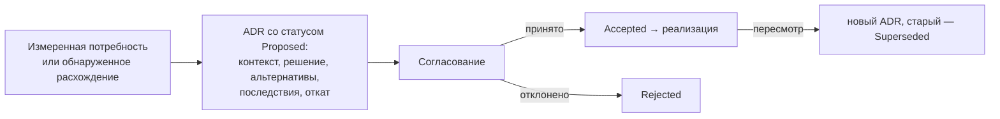

# 13 Архитектурные решения (ADR)

Каждое решение о форме системы, границах модулей, направлении зависимостей,
источнике истины и способе общения модулей записано как ADR до реализации.
Старые решения не переписываются: их заменяет новый ADR. Полные тексты — в
репозитории, каталог `docs/adr/`.

## Форма системы и платформа

| ADR | Решение | Суть |
|---|---|---|
| 0001 | Модульный монолит | одна кодовая база, явные модули, общий процесс не даёт права на связность внутренностей |
| 0002 | Отдельные процессы из одного репозитория | `api`, `worker`, `scheduler`, `migrate`, `ai-agent` собираются из одного кода |
| 0003 | PostgreSQL — источник истины | кэши, индексы и очереди не могут стать авторитетными |
| 0011 | Платформа Go | Go 1.26, `slog`, минимум зависимостей |
| 0012 | REST на `net/http` и chi | без GraphQL и фреймворков |
| 0013 | pgx и SQL без ORM | инварианты и очереди средствами базы |
| 0014 | Направление зависимостей внутрь | transport → application → domain ← infrastructure; проверяется archcheck |
| 0015 | UUIDv7 и время в UTC | сортируемые идентификаторы, `TIMESTAMPTZ` |
| 0016 | Точные деньги | десятичные типы и строки, без плавающей точки |
| 0017 | JSONB только для расширяемых данных | бизнес-поля — колонки с ограничениями |

## Организации и доступ

| ADR | Решение | Суть |
|---|---|---|
| 0018 | Организация — граница арендатора | `tenant_id` в каждой бизнес-таблице |
| 0019 | Целостность арендатора в PostgreSQL | составные внешние ключи с `tenant_id`, RLS как второй уровень |
| 0020 | Непрозрачные серверные сессии | cookie с токеном, в базе только хеш |
| 0021 | Авторизация через разрешения членства | роли OWNER и MANAGER, именованные права |
| 0032 | Троттлинг входа в PostgreSQL | лимиты по адресу и учётной записи переживают перезапуск |
| 0034 | Роли PostgreSQL и fail-closed контекст RLS | три роли, пустой контекст — ноль строк; реализация уточнена ADR 0041 |
| 0041 | Реализация RLS через роли пула и усиление периметра | контекст хуком пула, обход предикатом политики, заголовки безопасности, лимиты частоты, аудит, резервные копии |

## Приём данных и переписки

| ADR | Решение | Суть |
|---|---|---|
| 0004 | Сначала сохранить внешнее событие | persist-first: ответ провайдеру после записи |
| 0005 | Сырые данные отдельно от интерпретации | `raw_events` неизменны, канонические сущности — отдельно |
| 0006 | Переписки отдельно от сделок | переписка — факт общения, сделка — коммерческая интерпретация |
| 0024 | Канало-независимые коннекторы | общий контракт канонических событий |
| 0025 | Короткая атомарная транзакция вебхука | сырое событие и намерение обработать в одной транзакции |

## Фоновая обработка и контракты

| ADR | Решение | Суть |
|---|---|---|
| 0022 | OpenAPI как контракт REST | один файл для фронтенда и бэкенда, проверка в CI |
| 0023 | Записи идемпотентности для критических команд | ключ, хеш запроса, сохранённый ответ |
| 0026 | Очередь заданий с арендой в PostgreSQL | `SKIP LOCKED`, аренда 30 с, повторы, `DEAD` |
| 0027 | Версионированные события через транзакционный outbox | доставка как минимум один раз |
| 0028 | SSE только как сигнал инвалидации | без бизнес-данных, клиент перечитывает REST |
| 0029 | Уведомления отдельно от попыток доставки | логический факт и попытки с повторами |
| 0037 | Политика уведомлений | получатели, режимы, тихие часы, сводки, эскалация |

## Риски и деньги

| ADR | Решение | Суть |
|---|---|---|
| 0007 | Этап сделки отдельно от риска | риск не двигает этап, этап не закрывает риск напрямую |
| 0035 | Явная единица порога риска | заменён ADR 0043 |
| 0038 | Обратная связь, окно точности и ML-согласие | вердикты append-only, precision по типам, `dataset_eligible` по согласию |
| 0039 | Аналитика читает необработанные факты | одна read-only транзакция, без витрин |
| 0043 | Пороги правил в бизнес-времени без таблицы конфигурации | пороги — константы кода, порог ответа — поле точки, таблица отложена до измеренной потребности |

## AI

| ADR | Решение | Суть |
|---|---|---|
| 0008 | AI ограничен семантическими фактами | никакого прямого изменения состояния |
| 0009 | Асинхронный вывод | очередь, а не запрос-ответ |
| 0010 | Одноразовые неавторитетные узлы | узел можно потерять без потери данных |
| 0030 | Исходящая pull-модель | узел сам забирает задания по HTTPS, входящих портов нет |
| 0031 | Проверка результата и свежесть | строгая схема, статусы `APPLIED`/`STALE`/`REJECTED` |
| 0033 | Явный список организаций для узла | допуски и составные ключи |
| 0036 | Одно ожидающее задание на переписку и дебаунс | замена снимка, 60 с |

## Эксплуатация

| ADR | Решение | Суть |
|---|---|---|
| 0040 | Платформенное администрирование | отдельное право, read-модели без содержимого, правка очередей с аудитом |
| 0042 | Нагрузочное испытание в процессе | синтетический набор, те же обработчики, отчёт JSON, найденные узкие места чинятся в том же этапе |

## Статусы

Все решения приняты (`Accepted`), кроме ADR 0035 — заменён ADR 0043. ADR
0034 несёт примечание о реализации, закреплённой ADR 0041 (контекст через
`set_config` в хуке пула вместо `SET LOCAL`, обход предикатом `pg_has_role`
вместо `BYPASSRLS`).
