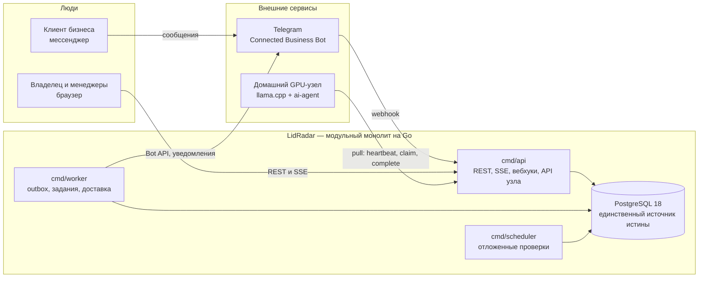

# LidRadar Backend

Техническая документация серверной части LidRadar: что система делает, как
устроена, где её границы и как ею управлять. Описание соответствует коду по
состоянию на 3 сентября 2026 года и не привязано к этапам разработки.

## Как читать

| Роль | С чего начать |
|---|---|
| Новый разработчик | 01 Обзор → 03 Архитектура → 04 Модули, затем 05 API и 06 Модель данных по мере работы |
| Фронтенд | 05 HTTP API (конвенции и каталог), раздел SSE в 07, 02 Глоссарий |
| Эксплуатация и DevOps | 11 Эксплуатация → 10 Отказоустойчивость → 09 Защищённость |
| Безопасность | 09 Защищённость, затем 06 (RLS) и 10 (границы отказов) |
| Продукт и аналитика | 01 Обзор, 02 Глоссарий, разделы «Правила риска» в 04 и «Ёмкость» в 11 |

## Содержание

| № | Страница | О чём |
|---|---|---|
| 01 | [Обзор системы](01%20Обзор%20системы.md) | назначение, действующие лица, сквозные сценарии, гарантии |
| 02 | [Глоссарий](02%20Глоссарий.md) | все термины с точными значениями из кода, по темам |
| 03 | [Архитектура](03%20Архитектура.md) | модульный монолит, слои, процессы, контракты, правила изменений |
| 04 | [Модули и зоны ответственности](04%20Модули%20и%20зоны%20ответственности.md) | что каждый модуль владеет, его правила, события, таблицы |
| 05 | [HTTP API](05%20HTTP%20API.md) | сессии, организация, ошибки, идемпотентность, каталог конечных точек, SSE |
| 06 | [Модель данных](06%20Модель%20данных.md) | сущности и связи, таблицы, ограничения, RLS, миграции |
| 07 | [Фоновая обработка](07%20Фоновая%20обработка.md) | outbox, очередь заданий, планировщик, доставка уведомлений, сигналы |
| 08 | [AI-контур](08%20AI-контур.md) | домашний узел, протокол, модель, свежесть, применение фактов |
| 09 | [Защищённость](09%20Защищённость.md) | аутентификация, права, изоляция организаций, секреты, периметр, аудит |
| 10 | [Отказоустойчивость](10%20Отказоустойчивость.md) | гарантии, поведение при отказах, восстановление, резервные копии |
| 11 | [Эксплуатация и ёмкость](11%20Эксплуатация%20и%20ёмкость.md) | конфигурация, развёртывание, наблюдаемость, ёмкость и масштабирование |
| 12 | [Тестирование и качество](12%20Тестирование%20и%20качество.md) | пирамида проверок, инфраструктура тестов, CI |
| 13 | [Архитектурные решения (ADR)](13%20Архитектурные%20решения%20ADR.md) | все принятые решения с краткой сутью, по темам |

## Система на одной схеме

## Система одним абзацем

LidRadar принимает сообщения клиентов из каналов (Telegram Connected Business
Bot, универсальный вебхук, импорт), хранит их как канонические переписки,
распознаёт коммерческие возможности по каталогу услуг организации и
детерминированными правилами находит риски потери сделки: нет ответа
менеджера, не подтверждена запись, не выполнено обещание, клиент замолчал
после цены, пора напомнить. Риски попадают в Radar и в уведомления с учётом
личной политики получателя, к каждому риску есть шаблонная рекомендация,
зафиксированные действия и исходы, а подтверждённая выручка атрибутируется к
цепочке «риск → действие → исход». Асинхронный AI на домашнем GPU-узле
добавляет только семантические факты для тех же детерминированных правил и
не меняет состояние сделки сам. Всё это — один Go-монолит из процессов
`api`, `worker`, `scheduler`, `ai-agent` и `migrate` поверх PostgreSQL с
построчной изоляцией организаций.

## Ключевые числа

| Показатель | Значение |
|---|---|
| Модулей бизнес-логики | 16 |
| Таблиц PostgreSQL | 49 (22 миграции) |
| Конечных точек HTTP | 60 (включая API узла и администрирование) |
| Типов риска | 5, все правила детерминированы |
| Ролей в организации | 2 (OWNER, MANAGER), 15 разрешений |
| API p95 без AI на целевой нагрузке | 5–123 мс при цели < 300 мс |
| Сохранение вебхука p95 | 21 мс при цели < 200 мс |
| Внешних зависимостей Go | 4 (chi, pgx, decimal, x/crypto) |

## Как читать схемы

- Прямоугольники — процессы и модули, цилиндр — PostgreSQL, стрелки —
  направление вызова или потока данных, подпись на стрелке — протокол или
  событие.
- Диаграммы состояний показывают допустимые переходы; переход без подписи
  выполняет система, с подписью — команда пользователя или событие.
- Диаграммы последовательности читаются сверху вниз; пунктир — ответ.
- Имена в моноширинном шрифте (`conversation.changed.v1`, `risk_signals`)
  совпадают с идентификаторами в коде и базе.
